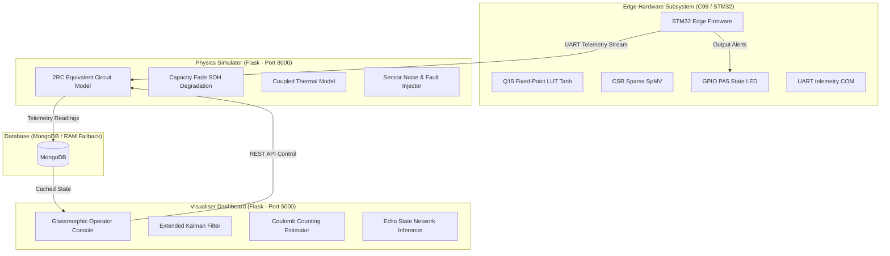

# Advanced Edge & Cyber-Physical Battery State Estimator

A state-of-the-art cyber-physical platform combining high-fidelity electro-thermal battery simulations, traditional state observers (Extended Kalman Filter & Coulomb Counting), and modern data-driven machine learning (**Reservoir Computing / Echo State Networks**) to estimate battery states in real time.

This project is fully modular and comprises independent edge hardware firmware and software simulation/monitoring modules.

---

## 🏗️ System Architecture & Modularity

The system is split into three decoupled components that communicate via standard web APIs, databases, or serial links:



### 1. Edge Hardware Diagnostics (`hardware/`)
- A highly optimized C99 implementation designed for low-power microcontrollers (ARM Cortex-M core).
- Implements a sparse reservoir Echo State Network (ESN) classifier executing at the edge.
- **High-Performance Math Options**:
  - **Floating-Point Path**: High-precision inference using hardware FPU.
  - **Q15 Fixed-Point Path**: Pure integer implementation for low-cost microcontrollers lacking an FPU. Uses a 33-point lookup table with linear interpolation for high-speed `tanh` approximations, and CSR (Compressed Sparse Row) sparse matrix multiplication (achieving a **6.7× speedup**).
- Drives visual alerts via GPIO (`PA5` LED) indicating battery state: **NORMAL** (LED Off), **WARNING** (LED Blinking at 20Hz), **CRITICAL** (LED Solid On).

### 2. Standalone Physics Simulator (`software/simulator/`)
- A Python Flask service (running on Port `8000` by default) modeling real-world cell physics.
- **Equivalent Circuit Model**: First-order ECM with 2RC branches simulating slow/fast polarization diffusion.
- **Degradation & Aging**: Models capacity fade and ohmic resistance growth based on temperature (Arrhenius equation) and current load. Toggling **Accelerated Aging** scales degradation by $1500\times$ for rapid testing.
- **Fault Injector**: Supports remote fault injection (Thermal Runaway, Sensor Dropout, Micro-Short Circuit) via API to test diagnostic safety loops.

### 3. Operator Comparative Dashboard (`software/visualiser/`)
- A Flask-based glassmorphic comparison console (running on Port `5000` by default).
- Compares traditional estimators (**Extended Kalman Filter** for SOC, temperature-compensated observers for SOH) side-by-side with data-driven **Echo State Network (Reservoir Computing)** models against the **True Physical Ground Truth** generated by the simulator.
- **Stateless/Serverless Mode**: Fully compliant with Vercel deployment requirements. If the standalone simulator server is offline, the visualiser runs the physics engine locally on-demand based on elapsed real-world time and hydrates state variables from MongoDB or memory.

---

## 📂 Repository Structure

```text
Battery_State_Estimator_BE_Project_2026_2027/
├── README.md                      # [THIS FILE] Unified project documentation
├── docs/                          # Project specifications and literature survey
│   ├── literature_survey.md       # Equations, state observers, and ESN theory
│   └── system_specification.md    # Pin mappings, schemas, and API documentation
│
├── hardware/                      # STM32 C Firmware & Python training scripts
│   ├── main.c                     # Edge ESN firmware & C simulation entry point
│   ├── main.h                     # Mock definitions for desktop compiling
│   ├── train.py                   # Core ESN Python class
│   ├── train_classifier.py        # Offline classifier training pipeline
│   ├── train_estimator.py         # Offline estimator training pipeline
│   ├── esn_classifier_weights.h   # CSR-optimized weights for edge classification
│   ├── esn_estimator_weights.h    # Dense weights for edge estimators
│   ├── original_ev_battery_dataset_multiclass.csv # EV time-series dataset
│   └── run_c_simulator.bat/.sh    # Platform scripts to compile/test main.c
│
└── software/                      # Software simulation & comparative visualizer
    ├── simulator/                 # Standalone physics engine server (Port 8000)
    │   ├── app.py                 # Flask server and simulation loops
    │   ├── battery_simulator.py   # ECM cell equations & drive cycles (UDDS/US06)
    │   └── traditional_estimator.py # EKF observer & SOH resistance tracker
    │
    └── visualiser/                # Comparative dashboard server (Port 5000)
        ├── app.py                 # Dashboard server with local simulator fallback
        ├── config.py              # Visualiser hyperparameters & database configurations
        ├── model_rc.pkl           # Pickled pre-trained ESN SOC/SOH model package
        ├── vercel.json            # Vercel serverless compliance configurations
        ├── datasets/              # Dataset files for comparative retraining
        ├── training/              # ESN training scripts & feature extraction
        └── tests/                 # Unit tests for estimators, physics, and filters
```

---

## ⚡ Setup & Execution Guide

### 1. Prerequisites
Ensure you have Python 3.8+ installed. Install the required Python packages:
```bash
pip install -r software/visualiser/requirements.txt
```
*(Optional) Start a local MongoDB service on Port 27017. If MongoDB is not running, the system automatically falls back to secure in-memory/RAM arrays for logging telemetry.*

### 2. Running Locally (Segregated Mode)
In this configuration, the simulator handles physics, and the visualizer handles observers and the frontend dashboard.

1. **Start the Simulator Server**:
   ```bash
   python software/simulator/app.py
   ```
   *The simulator will start on `http://localhost:8000`.*

2. **Start the Visualiser Server**:
   ```bash
   python software/visualiser/app.py
   ```
   *The dashboard will start on `http://localhost:5000`.*

3. Open `http://localhost:5000` in your browser. The dashboard will automatically detect the simulator on Port 8000 and stream comparative charts in real time.

### 3. Running Locally (Standalone Mode)
If you want to run the visualiser on its own without running the simulator server:
- Simply start the visualiser (`python software/visualiser/app.py`).
- The dashboard will detect that Port 8000 is offline, transition the "Sim Service" badge to `Offline`, and fall back to its internal simulator thread to run calculations locally.

### 4. Running the Edge C Simulator
You can compile and run the STM32 edge diagnostic code directly on your local computer to verify compilation and reservoir outputs:
- **Windows**:
  Run the batch script:
  ```bash
  hardware/run_c_simulator.bat
  ```
- **Unix / macOS / Linux**:
  Make the shell script executable and run:
  ```bash
  chmod +x hardware/run_c_simulator.sh
  hardware/run_c_simulator.sh
  ```
To toggle between floating-point and Q15 fixed-point execution, modify line 51 of `hardware/main.c`:
- `#define ESN_FIXED_POINT 0` for floating point.
- `#define ESN_FIXED_POINT 1` for fixed point (integer arithmetic).

---

## ☁️ Independent Production Deployment

Both software components are fully decoupled and can be deployed to separate hosts in production.

### A. Deploying the Simulator (e.g., Render)
1. Deploy `software/simulator` as a Web Service.
2. Set the build command to:
   ```bash
   pip install -r software/simulator/requirements.txt
   ```
3. Set the start command to:
   ```bash
   gunicorn --bind 0.0.0.0:$PORT --chdir software/simulator app:app --timeout 120
   ```
4. Expose the environment variable:
   - `PORT=8000` (or leave it to Render's default).

### B. Deploying the Visualiser (e.g., Vercel / Render)
1. Deploy `software/visualiser` as a Web Service.
2. Set the build command to:
   ```bash
   pip install -r software/visualiser/requirements.txt
   ```
3. Set the start command to:
   ```bash
   gunicorn --bind 0.0.0.0:$PORT --chdir software/visualiser app:app --timeout 120
   ```
4. Expose the environment variables:
   - `SIMULATOR_URL`: The public URL of your deployed simulator service (e.g., `https://battery-simulator.onrender.com`).
   - `MONGODB_URI`: Connection string to your production database (e.g., MongoDB Atlas).

*Note: For Vercel, the `vercel.json` file in `software/visualiser` handles serverless configuration automatically. Simply hook the repository up to Vercel and direct the root directory to `software/visualiser`.*

---

## 🧠 Training & Exporting ESN Models

If you wish to retrain the models on new datasets:

### Retraining Visualiser ESN:
```bash
python software/visualiser/training/train_rc.py
```
This trains the SOC and SOH ESNs on the CSV dataset under `datasets/` and saves the serialized models to `model_rc.pkl`.

### Retraining Edge ESN Classifier:
```bash
python hardware/train_classifier.py
```
This trains the 3-state temperature classifier and generates the header file `hardware/esn_classifier_weights.h` using CSR sparse compression.

### Retraining Edge ESN Estimators:
```bash
python hardware/train_estimator.py
```
This trains the dense SOC and SOH estimators and generates the header file `hardware/esn_estimator_weights.h`.

---

## 🛠️ Verification & Test Suite
To verify the observers, equivalent circuit models, and ESN quantization operations:
```bash
python -m unittest software/visualiser/tests/test_estimators.py
```
All 40 assertions in the test suite validate numerical accuracy and system integrity.
