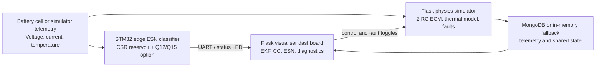
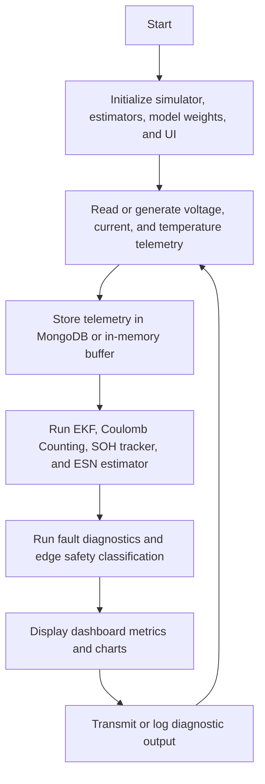

# BE Capstone Project

## Project Title

**Battery State Estimator: Cyber-Physical State Estimation and Edge Diagnostics**

---

## Team Details

| Sr. No. | Name of Student | Roll No. | Branch | Email ID |
|---|---|---|---|---|
| 1 | To be updated by project team | To be updated | Automation and Robotics | To be updated |
| 2 | To be updated by project team | To be updated | Automation and Robotics | To be updated |
| 3 | To be updated by project team | To be updated | Automation and Robotics | To be updated |
| 4 | To be updated by project team | To be updated | Automation and Robotics | To be updated |

---

## Guide Details

**Project Guide:** To be updated by department  
**Department:** Automation and Robotics  
**Institute:** VESIT, Mumbai  

---

## Problem Statement

> The aim of this project is to design and develop a cyber-physical battery state estimator system that solves the problem of accurate, real-time State of Charge (SOC), State of Health (SOH), and thermal safety monitoring under dynamic EV-style workloads by using a hybrid approach of Extended Kalman Filtering, Echo State Networks, and low-power embedded edge diagnostics.

---

## Abstract

Reliable SOC and SOH estimation is essential for electric vehicles, smart grids,
and battery-powered systems. Traditional Battery Management Systems often rely
on Coulomb Counting or Extended Kalman Filters, which can drift under aging,
temperature changes, and unmodeled cell behavior. Deep recurrent neural
networks can improve sequence modeling, but they are often too expensive for
small microcontrollers. This project implements a cyber-physical battery
estimation framework that combines a 2-RC electro-thermal physics simulator,
traditional EKF and resistance-based SOH observers, Echo State Network
estimators, and an optimized embedded ESN classifier. The software side includes
two Flask services: a physics simulator and a comparative visualiser dashboard.
The hardware side includes C99 inference code using Compressed Sparse Row
reservoir matrices and optional Q12/Q15 fixed-point arithmetic. The system
supports fault injection for thermal runaway, sensor dropout, and micro-short
conditions, enabling validation of estimator robustness and edge safety
classification. Current validation targets include sub-1.5 percent SOC RMSE,
sub-1.0 percent SOH RMSE, 98.40 percent thermal safety classification accuracy,
and a 6.7x sparse reservoir speedup.

---

## Objectives

1. To study battery SOC, SOH, and thermal safety estimation methods.
2. To design a cyber-physical architecture combining simulation, estimation, visualization, and edge inference.
3. To implement a 2-RC ECM physics simulator with fault injection and telemetry logging.
4. To implement EKF, Coulomb Counting, resistance-based SOH, and ESN estimators.
5. To optimize an ESN classifier for STM32-class edge microcontrollers using CSR and fixed-point techniques.
6. To test and validate estimator accuracy, diagnostic behavior, and deployment readiness.
7. To document the project for academic review, demonstration, and future extension.

---

## Scope of the Project

- Design and development of a working cyber-physical battery estimator prototype.
- Flask-based simulator for battery physics, aging, noise, and fault injection.
- Flask-based visualiser dashboard for SOC, SOH, SOE, SOP, RUL, and fault diagnostics.
- Embedded C ESN classifier for Normal, Warning, and Critical thermal states.
- ESN training scripts, generated C headers, and reproducible artifact policy.
- MongoDB-backed telemetry storage with in-memory fallback for local execution.
- Render deployment support for simulator and visualiser as standalone services.

---

## Existing System

Existing BMS approaches commonly use Coulomb Counting, voltage lookup tables, or
Kalman filters. These methods are useful but have limitations:

- **High drift:** Coulomb Counting accumulates error without periodic correction.
- **Model mismatch:** EKF performance depends on accurate battery parameters and OCV-SOC curves.
- **Limited aging awareness:** Basic systems may not adapt well to resistance growth and capacity fade.
- **Heavy ML alternatives:** LSTM/GRU-style models can be too costly for low-power MCUs.
- **Weak safety diagnostics:** Many systems do not classify thermal warning states directly on edge hardware.
- **Limited observability:** Operators often lack a live comparison between ground truth, traditional observers, and ML estimators.

---

## Proposed System

The proposed system combines physics-based modeling, classical observers, and
reservoir computing in one integrated workflow.

- **Main idea:** Use a 2-RC electro-thermal simulator as the physical reference, run EKF/CC/ESN estimators in parallel, and deploy an optimized ESN classifier on edge hardware.
- **How it works:** The simulator generates battery telemetry and stores it in MongoDB or an in-memory buffer. The visualiser reads telemetry, estimates SOC/SOH, computes diagnostics, and displays results. The hardware classifier consumes voltage, current, and temperature inputs and classifies the thermal safety state.
- **Major components:** Flask simulator, Flask visualiser, MongoDB, ESN training pipeline, STM32-style C classifier, generated weight headers, and validation tests.
- **Expected benefits:** More robust estimation, clearer operator visibility, lightweight edge diagnostics, and reproducible academic demonstration.

---

## System Architecture



The simulator produces physical telemetry. The visualiser consumes telemetry and
runs estimators. MongoDB provides persistence when available. The embedded ESN
classifier provides edge safety state inference and can be tested through the
desktop C simulator.

---

## Hardware Requirements

| Sr. No. | Component | Specification | Quantity | Purpose |
| ------- | --------- | ------------- | -------- | ------- |
| 1 | STM32 Nucleo Board | ARM Cortex-M class MCU, preferably with UART and GPIO | 1 | Runs edge ESN classifier |
| 2 | On-board / external LED | GPIO `PA5` or equivalent | 1 | Visual safety status output |
| 3 | USB / ST-Link cable | 115200 baud serial support | 1 | Flashing and UART monitoring |
| 4 | Host PC | Windows/Linux/macOS with Python and C compiler | 1 | Runs simulator, visualiser, training, and C simulation |

---

## Software Requirements

| Sr. No. | Software / Tool | Version | Purpose |
| ------- | --------------- | ------- | ------- |
| 1 | Python | 3.8+ | Simulator, visualiser, training, tests |
| 2 | Flask + Gunicorn | Flask 2.0+, Gunicorn 20.1+ | Web services and deployment |
| 3 | NumPy / Pandas / SciPy | See requirements files | Simulation, estimation, model training |
| 4 | MongoDB / MongoDB Atlas | 6.0+ recommended | Persistent telemetry and model registry |
| 5 | GCC / Clang / MSVC | C99 compatible | Desktop C classifier simulation |
| 6 | STM32CubeIDE or equivalent | Current stable version | MCU firmware build and flashing |

---

## Technologies Used

* Embedded C (C99)
* Python
* Flask
* MongoDB
* NumPy, Pandas, SciPy
* Echo State Networks / Reservoir Computing
* Extended Kalman Filter
* Compressed Sparse Row matrix representation
* Q12/Q15 fixed-point arithmetic
* HTML, CSS, JavaScript dashboard
* Render deployment for standalone web services

---

## Methodology

1. Literature survey on battery ECMs, Kalman filtering, SOH estimation, and reservoir computing.
2. Problem identification for robust SOC/SOH estimation and low-power thermal diagnostics.
3. Requirement analysis for software services, data flow, MCU constraints, and deployment.
4. System design for simulator, visualiser, estimator pipeline, and embedded classifier.
5. Hardware/software development using Python Flask services and C99 firmware logic.
6. Integration through MongoDB telemetry, local fallback buffers, and shared model artifacts.
7. Testing and validation through unit tests, simulated faults, and C simulator runs.
8. Documentation, deployment preparation, artifact policy, and academic reporting.

---

## Project Timeline

| Week / Month | Task Planned | Status |
| ------------ | ------------ | ------ |
| Week 1 | Problem finalization | Completed |
| Week 2 | Literature survey | Completed |
| Week 3 | Requirement analysis | Completed |
| Week 4 | System design | Completed |
| Week 5 | Prototype development | Completed |
| Week 6 | Testing and validation | In Progress |
| Week 7 | Documentation and deployment polish | In Progress |
| Week 8 | Paper writing and final demonstration | In Progress |

---

## Weekly Progress Updates

| Week | Date | Work Completed | Work Planned for Next Week | Issues / Challenges | GitHub Commit Link |
| ---- | ---- | -------------- | -------------------------- | ------------------- | ------------------ |
| Week 1 | 2026-05-07 | Finalized problem statement and repository structure | Literature review | None | Repository history |
| Week 2 | 2026-05-14 | Reviewed ECM, EKF, and ESN approaches | Define architecture | Parameter modeling | Repository history |
| Week 3 | 2026-05-21 | Defined simulator, dashboard, and MCU responsibilities | Design ESN dimensions | Fixed-point planning | Repository history |
| Week 4 | 2026-05-28 | Designed 2-RC simulator and estimator pipeline | Build simulator/dashboard | OCV and thermal tuning | Repository history |
| Week 5 | 2026-06-04 | Implemented Flask services and dashboard | Edge classifier work | Porting ESN to C | Repository history |
| Week 6 | 2026-06-11 | Added CSR and Q12/Q15 inference paths | Fault testing | LUT accuracy | Repository history |
| Week 7 | 2026-06-18 | Added tests, documentation, and validation flow | Deployment polish | MongoDB fallback behavior | Repository history |
| Week 8 | 2026-06-25 | Added CI, Render guidance, artifact policy, and demo checklist | Final review | Final team metadata pending | Repository history |

---

## Design Files

| File Type | File Name / Link | Description |
| --------- | ---------------- | ----------- |
| System Specification | [docs/system_specification.md](docs/system_specification.md) | Interfaces, data flow, APIs, and validation scope |
| Operations Guide | [docs/OPERATIONS.md](docs/OPERATIONS.md) | Local setup, run, and verification steps |
| Render Deployment | [docs/DEPLOY_RENDER.md](docs/DEPLOY_RENDER.md) | Standalone Render deployment instructions |
| Demo Checklist | [docs/DEMO_CHECKLIST.md](docs/DEMO_CHECKLIST.md) | Review and viva demonstration checklist |
| Circuit / Pinout Reference | [hardware/main.h](hardware/main.h) | Host HAL mocks and STM32-style pin assumptions |
| Simulation File | [software/simulator/battery_simulator.py](software/simulator/battery_simulator.py) | 2-RC electro-thermal battery model |
| Embedded Firmware | [hardware/main.c](hardware/main.c) | C99 ESN edge classifier |

---

## Circuit Diagram

The physical battery is represented using a 2-RC equivalent circuit model:

```text
           +----[ R1 ]----+
           |              |
   OCV ----+----[ C1 ]----+----+----[ R0 ]---- Terminal Voltage
                                |
           +----[ R2 ]----+     |
           |              |     |
           +----[ C2 ]----+-----+
```

The embedded diagnostic output uses GPIO `PA5` for the status LED and UART2 for
serial diagnostic output.

---

## Flowchart / Algorithm



### Algorithm

1. Start.
2. Initialize simulator, estimator states, ESN weights, database connection, and dashboard.
3. Generate or read battery voltage, current, and temperature.
4. Apply drive-cycle behavior, noise, aging, and selected fault injection.
5. Store telemetry in MongoDB or local fallback memory.
6. Estimate SOC and SOH using EKF, Coulomb Counting, resistance tracking, and ESN.
7. Classify thermal safety state using the edge ESN classifier.
8. Display, store, and transmit results.
9. Repeat until stopped.

---

## Implementation Details

### Hardware Implementation

The hardware module is implemented in C99 for STM32-style targets. It uses a
3-input ESN classifier with a 50-node sparse reservoir and 3 output classes:
Normal, Warning, and Critical. The recurrent matrix is stored in CSR format to
skip zero multiplications. Optional fixed-point mode converts inputs to Q12 and
states/weights to Q15, using a lookup-table tanh approximation for faster
microcontroller inference. GPIO `PA5` is used as a visual status output.

### Software Implementation

The software module is split into two Flask services. The simulator service
models 2-RC ECM dynamics, thermal behavior, aging, noise, and faults. The
visualiser service reads telemetry, runs EKF/CC/ESN estimators, computes
diagnostics, and serves the dashboard. MongoDB provides persistent telemetry and
model storage when available; otherwise, local buffers keep the system runnable.
The repository also includes unit tests, CI configuration, deployment guidance,
and documented artifact handling.

---

## Code Structure

```text
Battery_State_Estimator_BE_Project_2026_2027/
|-- README.md
|-- requirements.txt
|-- render.yaml
|-- docs/
|   |-- ARTIFACTS.md
|   |-- DEMO_CHECKLIST.md
|   |-- DEPLOY_RENDER.md
|   |-- OPERATIONS.md
|   |-- literature_survey.md
|   `-- system_specification.md
|-- hardware/
|   |-- main.c
|   |-- main.h
|   |-- train.py
|   |-- train_classifier.py
|   |-- train_estimator.py
|   |-- esn_classifier_weights.h
|   |-- esn_estimator_weights.h
|   `-- original_ev_battery_dataset_multiclass.csv
|-- software/
|   |-- simulator/
|   |   |-- app.py
|   |   |-- battery_simulator.py
|   |   |-- battery_chemistry.py
|   |   `-- traditional_estimator.py
|   `-- visualiser/
|       |-- app.py
|       |-- config.py
|       |-- model_rc.pkl
|       |-- tests/
|       |-- training/
|       `-- templates/
|-- images/
|   `-- assets/
|-- reference/
|   `-- paper.md
`-- .github/
    `-- workflows/ci.yml
```

---

## How to Run the Project

### Step 1: Clone the Repository

```bash
git clone <repository-url>
cd Battery_State_Estimator_BE_Project_2026_2027
```

### Step 2: Install Dependencies

```bash
python -m pip install -r requirements.txt
```

### Step 3: Run the Code

Start the physics simulator:

```bash
python software/simulator/app.py
```

Start the visualiser dashboard in a second terminal:

```bash
python software/visualiser/app.py
```

Run the hardware C simulator:

```bash
hardware/run_c_simulator.bat
```

On Linux or macOS:

```bash
chmod +x hardware/run_c_simulator.sh
hardware/run_c_simulator.sh
```

### Step 4: Observe the Output

- Visualiser dashboard: `http://localhost:5000`
- Simulator service: `http://localhost:8000`
- Expected dashboard output: live voltage, current, temperature, SOC, SOH, SOE, SOP, RUL, EKF/ESN comparison, and fault diagnostics.
- Expected C simulator output: Normal, Warning, and Critical safety classification logs with final accuracy.

---

## Testing and Results

Run the validation suite:

```bash
python -m unittest discover -s software/visualiser/tests
```

| Test No. | Test Description | Expected Result | Actual Result | Status |
| -------- | ---------------- | --------------- | ------------- | ------ |
| 1 | Chemistry profile loading and OCV behavior | Valid profiles and monotonic OCV | 43-test suite covers chemistry checks | Pass |
| 2 | 2-RC simulator dynamics | Charge/discharge, aging, and fault behavior | Covered by simulator physics tests | Pass |
| 3 | EKF and SOH observers | Bounded SOC/SOH and stable covariance | Covered by estimator tests | Pass |
| 4 | ESN feature and prediction path | Valid features and estimator outputs | Covered by ESN and pipeline tests | Pass |
| 5 | Edge classifier | Normal/Warning/Critical classification | 98.40 percent reported accuracy | Pass |

Current automated result: `43 tests OK`.

---

## Result Images / Videos

Available screenshots are stored in [images/assets](images/assets).

```markdown


```

Project demo video: To be added after final demonstration recording.

---

## Applications

1. Electric vehicle battery state estimation and diagnostics.
2. Battery energy storage system monitoring.
3. Embedded thermal safety classification for low-power BMS nodes.
4. Academic research on hybrid physics-based and data-driven estimators.
5. Operator training and fault-injection demonstrations.

---

## Advantages

1. Combines physics-based and data-driven estimation instead of relying on one method.
2. Supports real-time dashboard visualization and fault injection.
3. Uses CSR sparse reservoir computation for a 6.7x embedded speedup.
4. Provides optional Q12/Q15 fixed-point inference for low-power microcontrollers.
5. Can run locally or as standalone Render services.

---

## Limitations

1. The simulator models an equivalent cell/pack abstraction, not a fully validated production pack.
2. ESN performance depends on training data coverage and drive-cycle similarity.
3. Render free-tier services may sleep and are not ideal for uninterrupted telemetry generation.
4. Hardware-in-the-loop validation is still required before real safety-critical use.
5. Final team metadata and formal demo video need to be updated by the project team.

---

## Future Scope

1. Multi-cell pack modeling and balancing logic.
2. Hardware-in-the-loop testing with real sensors and STM32 deployment.
3. Online adaptive ESN readout tuning using recursive least squares.
4. Thermal actuator control integration for active cooling.
5. More drive cycles, chemistries, and experimental datasets.

---

## Research Paper / Publication

| Item | Details |
| ---- | ------- |
| Paper Title | Edge-Based Sparse Reservoir Computing and State Observers for Real-Time Battery Diagnostics in Cyber-Physical Systems |
| Conference / Journal Name | IEEE-style journal/conference target under review by team |
| Paper Status | Drafting |
| Submission Date | Pending |
| Paper Link | [reference/paper.md](reference/paper.md) |

---

## References

```text
[1] G. L. Plett, "Extended Kalman filtering for battery management systems of LiPB-based HEV battery packs," Journal of Power Sources, vol. 134, no. 2, pp. 252-261, 2004.
[2] H. Jaeger and H. Haas, "Harnessing nonlinearity: Predicting chaotic systems and saving energy in wireless communication," Science, vol. 304, no. 5667, pp. 78-80, 2004.
[3] L. Rigutini et al., "State-of-charge estimation of lithium-ion batteries using reservoir computing," IEEE Transactions on Industrial Electronics, vol. 68, no. 8, pp. 7112-7121, 2020.
[4] R. Barrett et al., "Templates for the Solution of Linear Systems: Building Blocks for Iterative Methods," SIAM, 1994.
```

---

## Repository Update Guidelines

Each student team member should keep the repository current and reviewable.

Minimum expected updates:

* Update README and documentation when behavior changes.
* Push code changes with meaningful commit messages.
* Keep `.env` files, credentials, caches, and compiled binaries out of Git.
* Add tests when changing simulator, estimator, or feature logic.
* Document model, dataset, and generated-header changes in `docs/ARTIFACTS.md`.
* Keep deployment settings documented in `docs/DEPLOY_RENDER.md`.

Example commit messages:

```text
Added EKF covariance validation tests
Updated Render deployment guide
Regenerated ESN classifier weights
Improved simulator fault injection documentation
```
