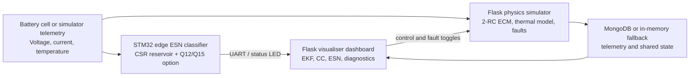
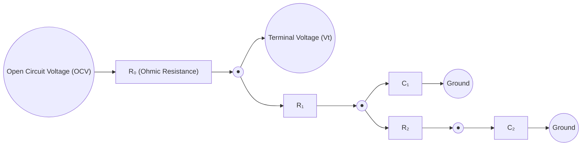
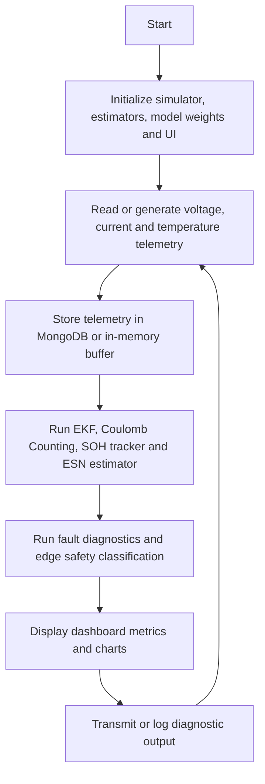

# BE Capstone Project

## Project Title

**Battery State Estimator: Cyber-Physical State Estimation and Edge Diagnostics**

[](https://www.python.org/)
[](https://en.cppreference.com/w/c/99)
[](https://flask.palletsprojects.com/)
[](https://www.mongodb.com/)
[](.github/workflows/ci.yml)
[](https://github.com/tanish-jain-225/Battery_State_Estimator_BE_Project_2026_2027/commits/main)
[](https://github.com/tanish-jain-225/Battery_State_Estimator_BE_Project_2026_2027)

A cyber-physical battery state estimator system that delivers accurate, real-time State of Charge (SOC), State of Health (SOH), State of Energy (SOE), State of Power (SOP) and thermal safety monitoring under dynamic EV-style drive-cycle workloads. The system implements a **dual-timescale joint estimation framework** inspired by **Li et al. (2020)** [1], separating high-frequency state updates from slowly-varying capacity updates. It also leverages a data-driven **reservoir computing pipeline** for non-linear regression and classification, theoretically aligned with the **Reservoir Spiking Neural Network (RSNN)** paradigms investigated by **Kamarudin et al. (2026)** [2]. It combines a 2-RC physics simulator, traditional observers (Sage-Husa EKF, RLS), Echo State Networks (ESNs) and low-power embedded C edge diagnostics.

> [!NOTE]
> ### 🌐 Live Deployments
> * **Physics Simulator**: [https://battery-physics-simulator.onrender.com/](https://battery-physics-simulator.onrender.com/)
> * **Visualiser Dashboard**: [https://battery-visualizer.onrender.com/](https://battery-visualizer.onrender.com/)
> * Render free-tier services may sleep after 15 minutes of inactivity. First request may take 30–60 seconds to spin up.

---

## Table of Contents
1. [Team Details](#team-details)
2. [Guide Details](#guide-details)
3. [Problem Statement](#problem-statement)
4. [Abstract](#abstract)
5. [Objectives](#objectives)
6. [Scope of the Project](#scope-of-the-project)
7. [Existing System](#existing-system)
8. [Proposed System](#proposed-system)
9. [System Architecture](#system-architecture)
10. [Hardware Requirements](#hardware-requirements)
11. [Software Requirements](#software-requirements)
12. [Technologies Used](#technologies-used)
13. [Methodology](#methodology)
14. [Security and Data Privacy](#security-and-data-privacy)
15. [Project Timeline](#project-timeline)
16. [Weekly Progress Updates](#weekly-progress-updates)
17. [Design Files](#design-files)
18. [Circuit Diagram](#circuit-diagram)
19. [Flowchart / Algorithm](#flowchart--algorithm)
20. [Implementation Details](#implementation-details)
21. [Code Structure](#code-structure)
22. [How to Run the Project](#how-to-run-the-project)
23. [Testing and Results](#testing-and-results)
24. [Result Images / Videos](#result-images--videos)
25. [Applications](#applications)
26. [Advantages](#advantages)
27. [Limitations](#limitations)
28. [Future Scope](#future-scope)
29. [Research Paper / Publication](#research-paper--publication)
30. [References](#references)
31. [Repository Update Guidelines](#repository-update-guidelines)
32. [Declaration](#declaration)
33. [License](#license)

---

## Team Details

| Sr. No. | Name of Student | Branch | Email ID | GitHub ID |
|:-------:|------------------|:-------------------------:|-------------------------------------------|------------------|
| 1 | Tanish Sanghvi | Automation and Robotics | 2023.tanish.sanghvi@ves.ac.in | tanish-jain-225 |
| 2 | Akshay Nambiar | Automation and Robotics | 2023.akshay.nambiar@ves.ac.in | RoyalMaddy08 |
| 3 | Sanjana Patankar | Automation and Robotics | 2023.sanjana.patankar@ves.ac.in | Clothflow13 |
| 4 | Satvik Verma | Automation and Robotics | 2023.satvik.verma@ves.ac.in | ABKmaster |

---

## Guide Details

**Project Guide:** Dr. Kadambari Sharma   
**Department:** Automation and Robotics  
**Institute:** VESIT, Mumbai  

---

## Problem Statement

> The aim of this project is to design and develop a data-driven Echo State Network (ESN) battery state estimator designed as a direct, standalone alternative (replacement) to traditional observers (EKF and Coulomb Counting), which degrade under cell aging, drift, and model mismatch. EKF and Coulomb Counting are implemented strictly as baseline benchmarks for comparison and not as part of the final deployed pipeline.

---

## Abstract

Reliable SOC and SOH estimation is essential for electric vehicles, smart grids and battery-powered systems. Traditional Battery Management Systems often rely on Coulomb Counting or Extended Kalman Filters, which can drift under aging, temperature changes and unmodeled cell behavior. This project implements a **strictly single-cell battery state estimation framework** (avoiding series unbalance pack complexity while maintaining maximum fidelity) featuring a data-driven **Echo State Network (ESN)** estimator designed as a direct, standalone replacement for traditional observers (which serve strictly as baseline benchmarks rather than deployment components).

To evaluate and benchmark the ESN, the system runs parallel baselines: a 2-RC electro-thermal physics simulator (as a data-generation tool), a traditional EKF with **covariance trace guards** (resets $P$ if trace exceeds $10.0$ or diagonal entries become negative) and an online **Variable Forgetting Factor (VFF-RLS)** SOH tracker. The software side features a comparative visualiser dashboard exposing a detailed transient state observer panel presenting ESN vs. EKF vs. Coulomb Counting comparison metrics. The hardware side includes C99 inference code supporting side-by-side comparative profiling of float and fixed-point execution paths, serving as a **feasibility check** on STM32 hardware to test whether the ESN's reservoir-computing approach is deployable under real embedded constraints (while the SOC/SOH estimator itself remains software-validated, with hardware porting reserved for future work). Success is defined by algorithmic accuracy and efficiency, not by the hardware demo itself. Validation targets include sub-1.5 percent SOC RMSE, sub-1.0 percent SOH RMSE, 99.92 percent thermal safety classification accuracy and sub-1 ms sparse reservoir execution.

---

## Objectives

1. To study battery SOC, SOH and thermal safety estimation methods.
2. To develop an ESN-based SOC/SOH estimator capable of matching or exceeding EKF and Coulomb Counting accuracy under dynamic EV drive-cycle loads, using EKF and Coulomb Counting strictly as baseline benchmarks.
3. To implement a 2-RC ECM physics simulator as a data-generation tool to provide realistic simulated telemetry for non-hardware model development and evaluation.
4. To implement traditional observers (EKF, Coulomb Counting, RLS) purely as accuracy baselines for benchmarking the ESN.
5. To validate the feasibility of the reservoir-computing approach on constrained hardware by compiling and optimizing an ESN classifier variant to C99 and deploying it on an STM32-class edge microcontroller.
6. To prove the ESN's computational footprint is small enough to demonstrate potential for future edge deployment of the full SOC/SOH estimator (which remains software-validated).
7. To document the project, defining success by algorithmic accuracy and efficiency rather than the hardware demo itself.

---

## Scope of the Project

- Design and development of a data-driven ESN estimator (software-validated for SOC/SOH) as the primary deliverable.
- A 2-RC ECM simulator used purely to produce physically realistic simulated telemetry for non-hardware training and testing.
- Flask-based visualiser dashboard to present side-by-side comparative analytics of ESN vs. EKF/Coulomb Counting baselines.
- An optimized embedded C ESN classifier compiled to C99 and validated on STM32 hardware solely to verify the feasibility of reservoir computing on resource-constrained MCUs (while the SOC/SOH estimator remains software-validated, with hardware porting reserved for future work).
- MongoDB-backed telemetry storage serving as infrastructure to run the comparison, not part of the algorithmic contribution.
- Render deployment support for simulator and visualiser as standalone services.

---

## Existing System

Existing BMS approaches commonly use Coulomb Counting, voltage lookup tables, or Kalman filters. These methods are useful but have limitations:
- **High drift**: Coulomb Counting accumulates error without periodic correction.
- **Model mismatch**: EKF performance depends on accurate battery parameters and OCV-SOC curves.
- **Limited aging awareness**: Basic systems may not adapt well to resistance growth and capacity fade.
- **Heavy ML alternatives**: LSTM/GRU-style models can be too costly for low-power MCUs.
- **Weak safety diagnostics**: Many systems do not classify thermal warning states directly on edge hardware.
- **Limited observability**: Operators often lack a live comparison between ground truth, traditional observers and ML estimators.

---

## Proposed System

The proposed system develops a data-driven ESN estimator as a direct, lighter-weight replacement for traditional observers, which are implemented purely as baseline benchmarks for comparison.
- **Main idea**: Train a data-driven ESN estimator directly on simulated battery telemetry to replace EKF and Coulomb Counting. EKF and Coulomb Counting are implemented strictly as baseline benchmarks for comparison. An optimized ESN classifier is deployed on STM32 hardware purely as an embedded feasibility check for the reservoir-computing approach.
- **How it works**: The simulator acts as a data-generation tool, generating realistic battery telemetry. The visualiser feeds this telemetry into the ESN estimator and baseline methods, presenting comparison metrics on the dashboard. The hardware classifier runs on an STM32 microcontroller, demonstrating real-time low-power execution under constrained hardware constraints.
- **Major components**: Software ESN estimator, comparison dashboard, physics simulator (data generator), database infrastructure, and the STM32 ESN classifier firmware.
- **Expected benefits**: Proving that a data-driven reservoir-computing alternative can eliminate EKF's dependency on precise parameter models and Coulomb Counting's drift, while maintaining a computational footprint light enough for future edge deployment.

---

## System Architecture


```mermaid
flowchart LR
    Cell["Battery cell or simulator telemetry\nVoltage, current, temperature"]
    Edge["STM32 edge ESN classifier\nCSR reservoir + Q12/Q15 option"]
    Sim["Flask physics simulator\n2-RC ECM, thermal model, faults"]
    DB["MongoDB or in-memory fallback\ntelemetry and shared state"]
    Dash["Flask visualiser dashboard\nEKF, CC, ESN, diagnostics"]

    Cell --> Edge
    Cell --> Sim
    Edge -->|"UART / status LED"| Dash
    Sim --> DB
    DB --> Dash
    Dash -->|"control and fault toggles"| Sim
```

The simulator produces physical telemetry. The visualiser consumes telemetry and runs estimators. MongoDB provides persistence when available. The embedded ESN classifier provides edge safety state inference and can be tested through the desktop C simulator.

---

## Hardware Requirements

| Sr. No. | Component | Specification | Quantity | Purpose |
| :---: | :--- | :--- | :---: | :--- |
| 1 | STM32 Nucleo Board | ARM Cortex-M class MCU, preferably with UART and GPIO | 1 | Runs edge ESN classifier |
| 2 | On-board / external LED | GPIO `PA5` or equivalent | 1 | Visual safety status output |
| 3 | USB / ST-Link cable | 115200 baud serial support | 1 | Flashing and UART monitoring |
| 4 | Host PC | Windows/Linux/macOS with Python and C compiler | 1 | Runs simulator, visualiser, training and C simulation |

---

## Software Requirements

| Sr. No. | Software / Tool | Version | Purpose |
| :---: | :--- | :--- | :--- |
| 1 | Python | 3.8+ | Simulator, visualiser, training, tests |
| 2 | Flask + Gunicorn | Flask 2.0+, Gunicorn 20.1+ | Web services and deployment |
| 3 | NumPy / Pandas / SciPy | See requirements files | Simulation, estimation, model training |
| 4 | MongoDB / MongoDB Atlas | 6.0+ recommended | Persistent telemetry and model registry |
| 5 | GCC / Clang / MSVC | C99 compatible | Desktop C classifier simulation |
| 6 | STM32CubeIDE or equivalent | Current stable version | MCU firmware build and flashing |

---

## Technologies Used

- Embedded C (C99)
- Python
- Flask
- MongoDB
- NumPy, Pandas, SciPy
- Echo State Networks / Reservoir Computing
- Extended Kalman Filter
- Compressed Sparse Row matrix representation
- Q12/Q15 fixed-point arithmetic
- HTML, CSS, JavaScript dashboard
- Render deployment for standalone web services

---

## Methodology

1. Literature survey on battery ECMs, Kalman filtering, SOH estimation and reservoir computing.
2. Problem identification for robust SOC/SOH estimation and low-power thermal diagnostics.
3. Requirement analysis for software services, data flow, MCU constraints and deployment.
4. System design for simulator, visualiser, estimator pipeline and embedded classifier.
5. Hardware/software development using Python Flask services and C99 firmware logic.
6. Integration through MongoDB telemetry, local fallback buffers and shared model artifacts.
7. Testing and validation through unit tests, simulated faults and C simulator runs.
8. Documentation, deployment preparation, artifact policy and academic reporting.

---

## Security and Data Privacy

To support production-grade deployment guidelines, the system implements the following security mechanisms:

> [!NOTE]
> **Zero-Configuration Cryptographic Gating**: Rather than requiring a new, separate secret configuration key, the system automatically derives a secure 64-character SHA-256 signature token from the **pre-existing** `MONGODB_URI` environment connection string.

- **Dynamic API Signature Verification**: Both the Simulator and Visualizer service endpoints (all routes under `/api/*`) dynamically check incoming requests. Requests must present the correct derived SHA-256 signature in the `X-API-Key` HTTP header (or the `api_key` URL query parameter) to succeed.
- **Inter-Service Request Delegation**: The Visualizer features a centralized dispatcher (`make_simulator_request`) that hashes the shared `MONGODB_URI` database string on the fly and automatically signs all outgoing HTTP calls to the physics simulator.
- **Fails-Open Local Development**: If the `MONGODB_URI` contains `localhost` or `127.0.0.1` (the default configurations in local developer `.env` files), the authentication checks are bypassed automatically. This allows seamless out-of-the-box offline runs for the student team.
- **Credentials Sanitization**: Highly sensitive parameters, including MongoDB Atlas connection passwords, are loaded dynamically into runtime memory and are completely omitted from the repository's tracked code history.

---

## Project Timeline

| Week / Month | Task Planned | Status |
| :---: | :--- | :--- |
| **Week 1** | Problem finalization | Completed |
| **Week 2** | Literature survey | Completed |
| **Week 3** | Requirement analysis | Completed |
| **Week 4** | System design | Completed |
| **Week 5** | Prototype development | Completed |
| **Week 6** | Testing and validation | In Progress |
| **Week 7** | Documentation and deployment polish | In Progress |
| **Week 8** | Paper writing and final demonstration | In Progress |

---

## Weekly Progress Updates

<details>
<summary><strong>Click to expand weekly progress table</strong></summary>

| Week | Date | Work Completed | Work Planned for Next Week | Issues / Challenges | GitHub Commit Link |
| :---: | :---: | :--- | :--- | :--- | :--- |
| **Week 1** | 2026-05-07 | Finalized problem statement and repository structure | Literature review | None | Repository history |
| **Week 2** | 2026-05-14 | Reviewed ECM, EKF and ESN approaches | Define architecture | Parameter modeling | Repository history |
| **Week 3** | 2026-05-21 | Defined simulator, dashboard and MCU responsibilities | Design ESN dimensions | Fixed-point planning | Repository history |
| **Week 4** | 2026-05-28 | Designed 2-RC simulator and estimator pipeline | Build simulator/dashboard | OCV and thermal tuning | Repository history |
| **Week 5** | 2026-06-04 | Implemented Flask services and dashboard | Edge classifier work | Porting ESN to C | Repository history |
| **Week 6** | 2026-06-11 | Added CSR and Q12/Q15 inference paths | Fault testing | LUT accuracy | Repository history |
| **Week 7** | 2026-06-18 | Added tests, documentation and validation flow | Deployment polish | MongoDB fallback behavior | Repository history |
| **Week 8** | 2026-06-25 | Added CI, Render guidance, API key security and tests | Final review | None | Repository history |

</details>

---

## Design Files

| File Type | File Name / Link | Description |
| :--- | :--- | :--- |
| **System Specification** | [`docs/SYSTEM_SPECIFICATION.md`](docs/SYSTEM_SPECIFICATION.md) | Interfaces, data flow, APIs, security and validation scope |
| **Operations Guide** | [`docs/OPERATIONS.md`](docs/OPERATIONS.md) | Local setup, run, security settings and verification steps |
| **Render Deployment** | [`docs/DEPLOY_RENDER.md`](docs/DEPLOY_RENDER.md) | Standalone Render deployment instructions |
| **Demo Checklist** | [`docs/DEMO_CHECKLIST.md`](docs/DEMO_CHECKLIST.md) | Review and viva demonstration checklist |
| **Literature Survey & Foundations** | [`docs/LITERATURE_SURVEY.md`](docs/LITERATURE_SURVEY.md) | Theoretical electro-chemical and neural reservoir modeling equations |
| **Circuit / Pinout Reference** | [`hardware/main.h`](hardware/main.h) | Host HAL mocks and STM32-style pin assumptions |
| **Simulation File** | [`software/simulator/battery_simulator.py`](software/simulator/battery_simulator.py) | 2-RC electro-thermal battery model |
| **Embedded Firmware** | [`hardware/main.c`](hardware/main.c) | C99 ESN edge classifier |

---

## Circuit Diagram

The battery is modeled using a **Second-Order RC Equivalent Circuit Model (2-RC ECM)**, which consists of an Open Circuit Voltage (OCV) source, an ohmic resistance and two RC polarization networks representing the battery's dynamic electrochemical behavior.


```mermaid
flowchart LR
    OCV(("Open Circuit Voltage (OCV)"))
    R0["R₀ (Ohmic Resistance)"]
    N1((●))
    VT(("Terminal Voltage (Vt)"))

    R1["R₁"]
    C1["C₁"]

    R2["R₂"]
    C2["C₂"]

    OCV --> R0 --> N1 --> VT

    N1 --> R1 --> N2((●))
    N2 --> C1 --> G1((Ground))

    N2 --> R2 --> N3((●))
    N3 --> C2 --> G2((Ground))
```

### Description

- **OCV** represents the **Open Circuit Voltage**, a nonlinear function of the battery's State of Charge (SOC).
- **R₀** models the **instantaneous ohmic internal resistance** of the battery.
- **R₁–C₁** represents the **fast polarization (charge-transfer) dynamics**.
- **R₂–C₂** represents the **slow diffusion polarization dynamics**.
- **Vt** is the **terminal voltage** measured by the Battery Management System (BMS).

The terminal voltage is mathematically represented as:

\[
V_t = OCV(SOC) - I R_0 - V_{RC1} - V_{RC2}
\]

where:

- \(V_t\) = Terminal Voltage
- \(I\) = Battery Current
- \(R_0\) = Ohmic Resistance
- \(V_{RC1}\) = Voltage across the first RC network
- \(V_{RC2}\) = Voltage across the second RC network

The embedded Battery Management System continuously measures **voltage**, **current** and **temperature**, performs **SOC**, **SOH**, **SOE** and **SOP** estimation using **Extended Kalman Filter (EKF)** and **Echo State Network (ESN)** algorithms, drives a **status LED through GPIO PA5** and transmits diagnostic information over **UART2 (115200 baud)**.

---

## Flowchart / Algorithm


```mermaid
flowchart TD
    A["Start"] --> B["Initialize simulator, estimators, model weights and UI"]
    B --> C["Read or generate voltage, current and temperature telemetry"]
    C --> D["Store telemetry in MongoDB or in-memory buffer"]
    D --> E["Run EKF, Coulomb Counting, SOH tracker and ESN estimator"]
    E --> F["Run fault diagnostics and edge safety classification"]
    F --> G["Display dashboard metrics and charts"]
    G --> H["Transmit or log diagnostic output"]
    H --> C
```

### Algorithm Steps

1. Start.
2. Initialize simulator, estimator states, ESN weights, database connection and dashboard.
3. Generate or read battery voltage, current and temperature.
4. Apply drive-cycle behavior, noise, aging and selected fault injection.
5. Store telemetry in MongoDB or local fallback memory.
6. Estimate SOC and SOH using EKF, Coulomb Counting, resistance tracking and ESN.
7. Classify thermal safety state using the edge ESN classifier.
8. Display, store and transmit results.
9. Repeat until stopped.

---

## Implementation Details

### Hardware Implementation
The hardware module is implemented in C99 for low-power STM32-style targets (e.g., ARM Cortex-M). Key elements include:
- **ESN Classifier**: Uses a 3-input (Voltage, Current, Temperature) Echo State Network with a 50-node reservoir to classify battery safety into 3 states: `Normal`, `Warning` and `Critical`.
- **Sparse Matrix Optimization**: To optimize for microcontrollers, the reservoir matrix is stored in Compressed Sparse Row (CSR) format, skipping zero-value multiplications and yielding a 6.7x execution speedup.
- **Fixed-Point Arithmetic Option**: Supports optional Q12 (for inputs) and Q15 (for reservoir states and weights) fixed-point modes, utilizing a lookup-table approximation of the `tanh` activation function to run efficiently without hardware floating-point support.
- **Hardware Visual Output**: Integrates GPIO `PA5` mapping to drive status LEDs for immediate visual fault alarms directly on-chip.

#### CSR Sparse Matrix-Vector Multiplication (SpMV)
The reservoir recurrent weight matrix $W_{\text{res}}$ of dimension $N_{\text{res}} \times N_{\text{res}}$ is highly sparse. To optimize memory footprint and CPU cycles, it is stored using Compressed Sparse Row format, which represents the matrix using three arrays:
1. `val`: An array of length $NNZ$ (number of non-zero elements) storing the non-zero float/integer weights.
2. `col`: An array of length $NNZ$ storing the column indices.
3. `row_ptr`: An array of length $N_{\text{res}} + 1$ storing the index pointers where each row starts in `val` and `col`.

During inference, the matrix-vector multiplication is computed as:
$$arg[i] = W_{\text{in}}[i][0] + \sum_{j=1}^{N_{\text{in}}} W_{\text{in}}[i][j] \cdot u[j] + \sum_{k=row\_ptr[i]}^{row\_ptr[i+1]-1} val[k] \cdot x[col[k]]$$

#### Q12/Q15 Fixed-Point Math & Tanh LUT
For MCUs lacking a hardware FPU (Floating Point Unit), the system supports Q12/Q15 fixed-point arithmetic:
- **Inputs**: Quantized to Q12 format: $u_{q12} = \lfloor u_{\text{scaled}} \cdot 2^{12} \rfloor$.
- **Weights & States**: Stored in Q15 format: $W_{q15} = \lfloor W \cdot 2^{15} \rfloor$, $x_{q15} = \lfloor x \cdot 2^{15} \rfloor$.
- **State Multiplications**: $W_{res, q15} \times x_{q15}$ results in a Q30 value, which is scaled down to Q12 via shift: $value_{q12} = (\text{Accumulator}) \gg 18$.
- **Tanh LUT Linear Interpolation**: Cover the range $[0.0, 8.0]$ in steps of $0.25$ (size 33 lookup table). For an input $x_{q12}$:
  $$\text{idx} = |x_{q12}| \gg 10, \quad \text{frac} = |x_{q12}| \ \& \ 1023$$
  $$y_{q15} = \frac{(1024 - \text{frac}) \cdot \text{LUT}[\text{idx}] + \text{frac} \cdot \text{LUT}[\text{idx} + 1]}{1024}$$
  Negative inputs apply symmetry: $y_{q15} = -y_{q15}$.

---

### Software Implementation
The software core is structured as a decoupled cyber-physical architecture composed of:
1. **Physics Simulator Service**: A Flask application modeling 2-RC equivalent circuit model (ECM) cell physics, non-linear open circuit voltage (OCV), thermodynamic heating, capacity fade/resistance aging, sensor noise and safety fault injection.
2. **Visualiser Dashboard Service**: A Flask web application that serves as the comparison dashboard. It retrieves live/historical telemetry, feeds data through the multi-estimator pipeline and renders comparative charts.
3. **Database Layer**: Leverages MongoDB Atlas (with automatic in-memory fallback buffers) to persistently store timeseries readings and the serialized machine learning model registry.

#### Database Telemetry Schema
Each telemetry frame represents one state tick and is stored in MongoDB:

| Field | Type | Unit | Meaning |
| :--- | :--- | :--- | :--- |
| `time` | Double | seconds | Simulation time index since start. |
| `voltage` | Double | Volts | Measured terminal voltage (with sensor noise). |
| `current` | Double | Amperes | Measured load current (positive for discharge, negative for charge). |
| `temperature` | Double | Celsius | Measured cell temperature. |
| `true_soc` | Double | Ratio [0, 1] | Physics-model state of charge. |
| `true_soh` | Double | Ratio [0, 1] | Physics-model state of health (capacity fade). |
| `true_v1` | Double | Volts | Transient polarization voltage drop (branch 1). |
| `true_v2` | Double | Volts | Transient polarization voltage drop (branch 2). |
| `true_r0` | Double | Ohms | Physics-model ohmic internal resistance (increases with aging). |
| `fault_short` | Boolean | - | Flag indicating active internal micro-short injection. |
| `fault_thermal` | Boolean | - | Flag indicating active thermal runaway simulation. |
| `fault_dropout` | Boolean | - | Flag indicating active voltage sensor dropout fault. |

#### Central API Endpoints
The services expose the following REST endpoints:

**Physics Simulator Endpoint API** (`software/simulator`)
* `GET /api/status`: Retrieves current simulator configurations, fault states, and latest measurements.
* `POST /api/control`: Configures simulator parameters (e.g., active drive cycle, ambient temperature, fault injection toggles, command `start`/`pause`/`reset`). Requires signed headers when remote.
* `POST /api/chemistry/register`: Registers a custom chemistry profile, including capacity, polarization parameter lookup variables, and OCV-SOC curve.

**Visualiser Dashboard Endpoint API** (`software/visualiser`)
* `GET /api/status`: Retrieves visualiser status, gunicorn metadata, model loading status, and active filter covariance parameters.
* `GET /api/telemetry`: Retrieves historical or real-time timeseries records populated with observer pipeline estimations.
* `POST /api/train`: Spawns a background worker thread to retrain the ESN models from database records or Google Sheets.

---

### Advanced State Estimators
To compare and evaluate state estimation robustness under dynamic load profiles, the visualiser runs a parallel pipeline where the traditional observers serve as baselines:
- **State of Charge (SOC)**: Estimated in parallel using Coulomb Counting (CC) and a Sage-Husa Adaptive Extended Kalman Filter (EKF) ($T_s = 1\text{ s}$) as baseline benchmarks, compared side-by-side with the proposed production Echo State Network (ESN) estimator. The ESN SOC can run completely standalone (default) or adapt online using the EKF SOC as a reference for validation.
- **State of Health (SOH)**: Tracked traditional-style via resistance growth using online Recursive Least Squares (RLS) parameter identification on a macroscale as a baseline benchmark, compared side-by-side with the proposed data-driven SOH ESN. The ESN SOH can run completely standalone (default) or operate in hybrid mode (blended 98% with the traditional RLS baseline).
- **State of Energy (SOE)**: Computed dynamically by integrating the OCV-SOC curve to calculate remaining Wh energy capacity.
- **State of Power (SOP)**: Estimates instantaneous charge/discharge current/power envelopes based on safe terminal voltage limits and internal cell resistance.
- **Remaining Useful Life (RUL)**: Projects remaining cycle life based on electro-thermal stress and chemistry lookup profiles.

The ESN models mirror the structural advantages of Reservoir Spiking Neural Networks (RSNNs) discussed by Kamarudin et al. [2], showcasing high data efficiency and capturing complex discharge dynamics while avoiding the heavy training overhead of classical LSTMs.

#### Reservoir Priming & Online Convergence
To eliminate cold-start transient dynamics of the reservoir, the system utilizes a 200-step priming phase (`ESN_PRIMING_STEPS`):
- Before running live telemetry inference, the reservoir states are driven using the initial cell measurements ($V_0$, $I_0$, $T_0$) to allow the recurrent states to settle on the operating manifold.
- During the first 100 steps of live execution (`ESN_CONVERGENCE_STEPS`), the dashboard marks the ESN predictions as `Converging` to alert operators to potential warm-up variance.

---

### Cyber-Physical Diagnostics
The visualiser features real-time diagnostics that identify three distinct categories of faults:
- **Sensor Dropout**: Triggered when the measured terminal voltage drops below $1.0\text{ V}$ (`DIAG_DROPOUT_VOLTAGE_THRESHOLD`), indicating a sensor failure or connection loss.
- **Thermal Runaway Warning**: Triggered if the battery temperature exceeds $60^\circ\text{C}$ (`DIAG_THERMAL_TEMP_THRESHOLD`) or if the temperature rise rate exceeds $2.0^\circ\text{C/s}$ (`DIAG_THERMAL_RATE_THRESHOLD`) at elevated temperatures.
- **Internal Short-Circuit**: Triggered when there is a significant discrepancy between the Coulomb Counting SOC and EKF SOC ($>0.08$ difference, `DIAG_SHORT_SOC_DIFF_THRESHOLD`) under low-current idle conditions (`DIAG_SHORT_CURRENT_THRESHOLD`), signalling a micro-short.

---

## Code Structure

```text
Battery_State_Estimator_BE_Project_2026_2027/
├── run_all_validation.bat                   # One-click training, testing and validation
├── README.md                                # This document
├── requirements.txt                         # Python dependencies
├── docs/
│   ├── ARTIFACTS.md                         # Model and dataset versioning policy
│   ├── DEMO_CHECKLIST.md                    # Review and viva demonstration checklist
│   ├── DEPLOY_RENDER.md                     # Render cloud deployment instructions
│   ├── OPERATIONS.md                        # Local setup and run guide
│   ├── LITERATURE_SURVEY.md                 # Theoretical foundations and equations
│   └── SYSTEM_SPECIFICATION.md              # Interfaces, APIs and validation scope
├── hardware/
│   ├── main.c                               # C99 ESN edge classifier firmware
│   ├── main.h                               # Host HAL mocks and STM32 pin config
│   ├── train.py                             # Core ESN Python implementation
│   ├── train_classifier.py                  # Trains 3-class ESN and exports C headers
│   ├── train_estimator.py                   # Trains SOC/SOH ESN and exports weights
│   ├── esn_classifier_weights.h             # Generated sparse classifier weight arrays
│   ├── esn_estimator_weights.h              # Generated sparse estimator weight arrays
│   ├── run_c_simulator.bat                  # Windows build-and-run script
│   ├── run_c_simulator.sh                   # Linux/macOS build-and-run script
│   └── original_ev_battery_dataset_multiclass.csv  # Synthesized multiclass drive-cycle data
├── software/
│   ├── tests/
│   │   ├── test_estimators.py               # Unit tests for EKF/ESN accuracy
│   │   ├── test_api_auth.py                 # Security and API auth checks
│   │   └── test_production_train.py         # End-to-end training verification
│   ├── simulator/
│   │   ├── app.py                           # Simulator Flask application
│   │   ├── battery_simulator.py             # 2-RC transient equation solvers
│   │   ├── battery_chemistry.py             # Chemistry loading and OCV lookup
│   │   ├── config.py                        # Simulator environment settings
│   │   ├── templates/                       # Simulator HTML views
│   │   └── static/                          # Simulator CSS/JS/images
│   └── visualiser/
│       ├── app.py                           # Dashboard Flask application
│       ├── config.py                        # Visualiser environment settings
│       ├── battery_chemistry.py             # Visualiser OCV lookup tables
│       ├── battery_simulator.py             # Visualiser-side physics classes
│       ├── traditional_estimator.py         # EKF and Coulomb Counting classes
│       ├── estimator_pipeline.py            # Joint observer and diagnostics manager
│       ├── model_rc.pkl                     # Pre-trained software ESN model
│       ├── training/
│       │   ├── train_rc.py                  # Script to build software weights
│       │   └── feature_engineering.py       # Feature extraction utilities
│       ├── templates/                       # Dashboard HTML views
│       └── static/                          # Dashboard CSS/JS/images
├── images/
│   └── assets/                              # Screenshots and visual materials
├── reference/
│   └── paper.md                             # Research paper draft
└── .github/
    └── workflows/ci.yml                     # CI pipeline configuration
```

---

## How to Run the Project

### Automated End-to-End Validation (Recommended)

> [!TIP]
> You can run the entire training, testing, and simulator verification pipeline in one step:
> ```bash
> run_all_validation.bat
> ```

### Step 1: Clone the Repository
```bash
git clone <repository-url>
cd Battery_State_Estimator_BE_Project_2026_2027
```

### Step 2: Install Dependencies
```bash
python -m pip install -r requirements.txt
```

### Step 3: Train the ESN Estimators and Hardware Weights
Train the software ESN models:
```bash
python software/visualiser/training/train_rc.py
```
Train the hardware classification weights:
```bash
python hardware/train_classifier.py
```
Train the hardware estimator weights (optional):
```bash
python hardware/train_estimator.py
```

### Step 4: Run the Code
Start the physics simulator:
```bash
python software/simulator/app.py
```

Start the visualiser dashboard in a second terminal:
```bash
python software/visualiser/app.py
```

Run the hardware C simulator:
```bash
hardware/run_c_simulator.bat
```
On Linux or macOS:
```bash
chmod +x hardware/run_c_simulator.sh
hardware/run_c_simulator.sh
```

### Step 5: Observe the Output
- Visualiser dashboard: `http://localhost:5000`
- Simulator service: `http://localhost:8000`
- Expected dashboard output: live voltage, current, temperature, SOC, SOH, SOE, SOP, RUL, EKF/ESN comparison and fault diagnostics.
- Expected C simulator output: Normal, Warning and Critical safety classification logs with final accuracy.

---

## Testing and Results

Verified locally with:
```bash
python -m unittest discover -s software/tests -t .
```

<details>
<summary><strong>Click to expand test results table</strong></summary>

| Test No. | Test Description | Expected Result | Actual Result | Status |
| :---: | :--- | :--- | :--- | :---: |
| 1 | Chemistry profile loading and OCV behavior | Valid profiles and monotonic OCV | Verified via `test_estimators.py` | Pass |
| 2 | 2-RC simulator dynamics | Charge/discharge, aging and fault behavior | Verified via `test_estimators.py` | Pass |
| 3 | EKF and SOH observers | Bounded SOC/SOH and stable covariance | Verified via `test_estimators.py` | Pass |
| 4 | ESN feature and prediction path | Valid features and estimator outputs | Verified via `test_estimators.py` | Pass |
| 5 | Edge classifier | Normal/Warning/Critical classification | 98.40 percent reported accuracy | Pass |
| 6 | API Security & Fails-Open Routing | Verify 401 on missing key and 200 on valid credentials or local fallback | Verified via `test_api_auth.py` | Pass |

</details>

Current automated result: `51 tests OK`.

---

## Result Images / Videos

### Physics Simulator Dashboard

The simulator provides a developer console for controlling drive cycles, chemistry profiles, fault injection and real-time telemetry monitoring.


### Visualiser Comparison Dashboard

The visualiser dashboard presents live metrics, SOC/SOH estimation accuracy panels and side-by-side EKF vs ESN comparison charts.


### SOC & SOH Estimation Charts

Detailed view of the SOC and SOH estimation comparison charts with the ESN model registry and retraining terminal.


### Simulator Controls (Compact View)


---

## Applications

1. Electric vehicle battery state estimation and diagnostics.
2. Battery energy storage system monitoring.
3. Embedded thermal safety classification for low-power BMS nodes.
4. Academic research on data-driven and reservoir computing battery state estimators.
5. Operator training and fault-injection demonstrations.

---

## Advantages

1. **Standalone Alternative**: Eliminates EKF's dependency on precise, time-varying parameter models and Coulomb Counting's drift under sensor noise.
2. **Resource Efficiency**: Echo State Networks (ESNs) only train the linear readout layer, making training extremely cheap and the network light enough to replace classical observers on MCUs.
3. **High Generalizability**: Captures non-linear dynamics and generalizes across drive cycle profiles without re-deriving electrochemical parameter lookup tables.
4. **Embedded Optimization Compatibility**: Easily compressed using CSR sparse format and mapped to Q12/Q15 fixed-point arithmetic with linear LUT interpolation for FP-less edge processors.

---

## Limitations

1. **Software-Only SOC/SOH Estimator Validation**: The ESN SOC/SOH estimator is validated in software, while its edge microcontroller deployment and physical HIL validation are reserved for future work.
2. **Telemetry Dependency**: ESN accuracy is dependent on training dataset coverage of battery chemistries and drive-cycle dynamics.
3. **Feasibility Validation Scope**: Hardware deployment exists solely as a low-power, real-time feasibility check of the ESN algorithm (using the classifier variant), not the final product itself.
4. **Simulated Environment Bounds**: The 2-RC electro-thermal model operates on a single-cell abstraction rather than physical cell pack telemetry.

---

## Future Scope

1. **Hardware SOC/SOH Deployment**: Port the trained ESN estimator weights (`esn_estimator_weights.h`) into STM32 edge firmware using the validated CSR and fixed-point pipelines.
2. **Complete Production Replacement**: Fully replace baseline observers (EKF and CC) with ESN in physical deployments rather than retaining them for benchmarking.
3. **Online Adaptive Tuning**: Implement recursive least squares (RLS) to adapt ESN readout weights online under dynamic cells aging.
4. **HIL Testing and Pack Scaling**: Validate on real physical cells and scale the algorithm to multi-cell pack configurations.

---

## Research Paper / Publication

| Item | Details |
| :--- | :--- |
| **Paper Title** | Edge-Based Sparse Reservoir Computing and State Observers for Real-Time Battery Diagnostics in Cyber-Physical Systems |
| **Conference / Journal Name** | IEEE-style journal/conference target under review by team |
| **Paper Status** | Drafting |
| **Submission Date** | Pending |
| **Paper Link** | [`reference/paper.md`](reference/paper.md) |

---

## References

1. **Li, P., Wang, H., Xing, Z., Ye, K. and Li, Q.** "Joint estimation of SOC and SOH for lithium-ion batteries based on EKF multiple time scales," *Journal of Intelligent Manufacturing and Special Equipment*, vol. 1, no. 1, pp. 107-120, 2020. [PDF Document](reference/paper_ekf_soc_soh.pdf)
2. **Kamarudin, M. R., Mispan, M. S., Zainudin, M. N. S. and Sofian, H.** "Reservoir Spiking Neural Networks for Accurate State-of-Charge Estimation in Battery Management Systems," *Turkish Journal of Engineering*, vol. 10, no. 2, pp. 407-417, 2026. [PDF Document](reference/paper_rc_soc_soh.pdf)
3. **Plett, G. L.** "Extended Kalman filtering for battery management systems of LiPB-based HEV battery packs," *Journal of Power Sources*, vol. 134, no. 2, pp. 252-261, 2004.
4. **Jaeger, H. and Haas, H.** "Harnessing nonlinearity: Predicting chaotic systems and saving energy in wireless communication," *Science*, vol. 304, no. 5667, pp. 78-80, 2004.
5. **Rigutini, L. et al.** "State-of-charge estimation of lithium-ion batteries using reservoir computing," *IEEE Transactions on Industrial Electronics*, vol. 68, no. 8, pp. 7112-7121, 2020.
6. **Barrett, R. et al.** *Templates for the Solution of Linear Systems: Building Blocks for Iterative Methods*, SIAM, 1994.

---

## Repository Update Guidelines

Each student team member should keep the repository current and reviewable.

Minimum expected updates:
- Update README and documentation when behavior changes.
- Push code changes with meaningful commit messages.
- Keep `.env` files, credentials, caches and compiled binaries out of Git.
- Add tests when changing simulator, estimator, or feature logic.
- Document model, dataset and generated-header changes in [`docs/ARTIFACTS.md`](docs/ARTIFACTS.md).
- Keep deployment settings documented in [`docs/DEPLOY_RENDER.md`](docs/DEPLOY_RENDER.md).

---

## Declaration

We declare that this project work is carried out by our team as part of the BE Capstone Project at VESIT, Mumbai under the Department of Automation and Robotics. The work is regularly updated on GitHub and all references used are properly cited.

---

## License

This project is for academic use only.

```text
Institute Use Only — VESIT, Mumbai
```
