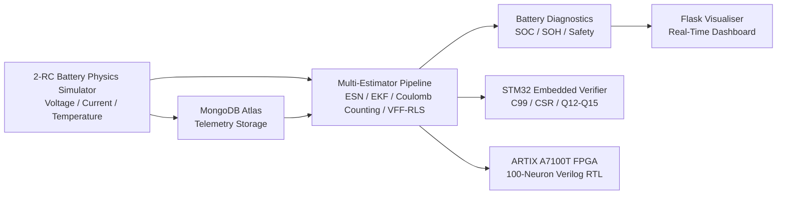
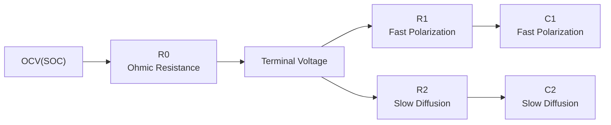
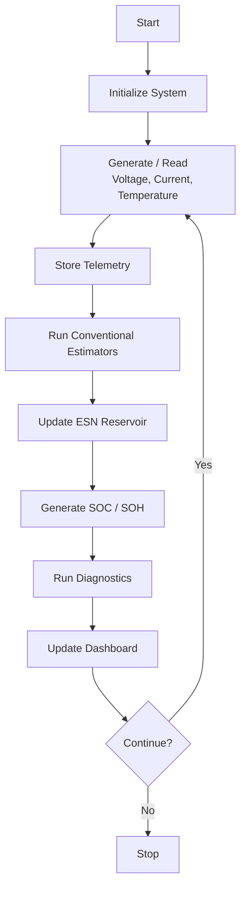

# BE Capstone Project

## Project Title

**Battery State Estimator: An ESN-Based Alternative to EKF and Coulomb Counting**

---

## Team Details

| Sr. No. | Name of Student | Roll No.              | Branch                  | Email ID                                                                  |
| ------- | --------------- | --------------------- | ----------------------- | ------------------------------------------------------------------------- |
| 1       | Sanjna Patankar | 2023.sanjana.patankar | Automation and Robotics | [2023.sanjana.patankar@ves.ac.in](mailto:2023.sanjana.patankar@ves.ac.in) |
| 2       | Akshay Nambiar  | 2023.akshay.nambiar   | Automation and Robotics | [2023.akshay.nambiar@ves.ac.in](mailto:2023.akshay.nambiar@ves.ac.in)     |
| 3       | Satvik Verma    | 2023.satvik.verma     | Automation and Robotics | [2023.satvik.verma@ves.ac.in](mailto:2023.satvik.verma@ves.ac.in)         |
| 4       | Tanish Sanghvi  | 2023.tanish.sanghvi   | Automation and Robotics | [2023.tanish.sanghvi@ves.ac.in](mailto:2023.tanish.sanghvi@ves.ac.in)     |

---

## Guide Details

**Project Guide:** Dr. Kadambari Sharma
**Department:** Automation and Robotics
**Institute:** Vivekanand Education Society's Institute of Technology (VESIT), Mumbai

---

## Problem Statement

Battery State of Charge (SOC) and State of Health (SOH) are critical parameters for the safe and efficient operation of Battery Management Systems (BMS). Conventional estimation techniques such as Coulomb Counting and Extended Kalman Filter (EKF) have limitations including cumulative integration drift, dependence on battery-model parameters, calibration requirements, and computational overhead.

The problem addressed by this project is to develop a lightweight, data-driven battery state estimation system that can estimate SOC and SOH from battery voltage, current, and temperature measurements while reducing the limitations associated with conventional model-based and integration-based methods.

The proposed system uses an Echo State Network (ESN) based Reservoir Computing approach and compares its performance with conventional estimation methods. The system is also designed with embedded hardware validation using an STM32-class microcontroller and FPGA-based RTL implementation.

---

## Abstract

Accurate estimation of Battery State of Charge (SOC) and State of Health (SOH) is essential for electric vehicles, battery energy storage systems, and other battery-powered applications. Conventional techniques such as Coulomb Counting and Extended Kalman Filter (EKF) are widely used for battery state estimation, but they suffer from limitations such as cumulative drift, dependence on battery-model parameters, calibration requirements, and computational complexity.

This project proposes a data-driven Echo State Network (ESN) based battery state estimation system using Reservoir Computing as an alternative approach to conventional estimation techniques. A 2-RC Equivalent Circuit Model (ECM) based electro-thermal battery simulator is used to generate voltage, current, and temperature telemetry under dynamic drive cycles and fault conditions. The generated telemetry is processed through a multi-estimator pipeline containing ESN, EKF, Coulomb Counting, and VFF-RLS based approaches.

A Flask-based visualiser provides real-time monitoring and comparison of the different estimation methods. For embedded validation, the ESN reservoir is optimized using Compressed Sparse Row (CSR) matrix representation and Q12/Q15 fixed-point arithmetic. The implementation is validated using C99 on an STM32-class platform, while a 100-neuron Verilog RTL datapath is verified on an ARTIX A7100T FPGA against a Python golden model.

The proposed system aims to provide an efficient and lightweight approach for battery state estimation suitable for embedded Battery Management System applications.

---

## Objectives

1. To study existing battery state estimation techniques and their limitations.
2. To analyze conventional methods such as Coulomb Counting and Extended Kalman Filter (EKF).
3. To design an Echo State Network (ESN) based Reservoir Computing model for battery state estimation.
4. To develop a 2-RC electro-thermal battery physics simulator.
5. To generate battery voltage, current, and temperature telemetry under different operating conditions.
6. To compare ESN-based estimation with EKF, Coulomb Counting, and VFF-RLS.
7. To optimize ESN inference using sparse matrix representation and fixed-point arithmetic.
8. To implement the optimized ESN inference using C99 for embedded hardware validation.
9. To design and verify a 100-neuron Verilog RTL implementation on an FPGA.
10. To develop a web-based visualiser for real-time battery telemetry and estimation results.
11. To test and validate the complete software and hardware pipeline.
12. To document the project work and prepare the associated research paper.

---

## Scope of the Project

The scope of the project includes:

* Development of a battery state estimation system.
* SOC and SOH estimation using ESN/Reservoir Computing.
* Implementation of conventional battery estimation techniques for comparison.
* Development of a 2-RC equivalent circuit battery model.
* Electro-thermal battery simulation.
* Generation of synthetic battery telemetry.
* Simulation using DST, US06, and FUDS drive-cycle profiles.
* Battery aging and fault-condition simulation.
* Real-time telemetry visualization.
* MongoDB-based telemetry storage.
* Embedded C99 implementation of ESN inference.
* CSR-based sparse matrix-vector multiplication.
* Q12/Q15 fixed-point implementation.
* Tanh lookup-table based activation approximation.
* FPGA-based RTL verification.
* Automated software testing.
* Performance and accuracy analysis.
* Future integration with physical battery hardware and BMS systems.

---

## Existing System

Battery state estimation is traditionally performed using methods such as:

* Coulomb Counting
* Open Circuit Voltage (OCV)
* Equivalent Circuit Models (ECM)
* Extended Kalman Filter (EKF)
* Other model-based observers

### Limitations of Existing Methods

#### Coulomb Counting

Coulomb Counting estimates SOC by integrating the battery current over time.

Its major limitations include:

* Cumulative integration error.
* Sensor offset accumulation.
* Sensitivity to current measurement noise.
* Dependence on an accurate initial SOC.
* No direct compensation for battery aging.

#### Extended Kalman Filter

EKF combines battery models and measurements to estimate battery states.

Its limitations include:

* Requirement for battery-model parameters.
* Need for model calibration.
* Matrix calculations during each estimation cycle.
* Increased computational requirements.
* Sensitivity to model mismatch.
* Performance degradation when battery characteristics change.

#### Equivalent Circuit Models

ECM-based methods provide useful battery approximations but require parameter identification and calibration for different battery conditions, temperatures, and aging states.

---

## Proposed System

The proposed system uses an **Echo State Network (ESN)** based Reservoir Computing architecture for battery SOC and SOH estimation.

The system combines a physics-based battery simulator, conventional estimators, an ESN estimator, embedded validation, FPGA verification, and a web-based visualiser.

### Main Working Principle

1. The 2-RC battery physics simulator generates battery telemetry.
2. Voltage, current, and temperature data are generated under different drive cycles.
3. The telemetry is stored in MongoDB Atlas or an in-memory fallback.
4. The visualiser retrieves the telemetry.
5. Conventional estimators such as EKF and Coulomb Counting process the input data.
6. The ESN reservoir processes the temporal battery telemetry.
7. The ESN readout generates SOC and SOH estimates.
8. The different estimators are compared through the visualiser.
9. Battery diagnostic logic evaluates operating conditions.
10. The optimized ESN implementation is validated using C99.
11. A 100-neuron FPGA RTL implementation is verified against a Python golden model.

### Major Components

#### 1. Battery Physics Simulator

* 2-RC Equivalent Circuit Model.
* Electro-thermal modeling.
* OCV-SOC relationship.
* Battery aging simulation.
* Sensor noise.
* Drive-cycle generation.
* Fault injection.

#### 2. ESN Estimator

* Echo State Network reservoir.
* Reservoir state update.
* Sparse reservoir representation.
* Linear readout.
* SOC/SOH estimation.

#### 3. Conventional Estimators

* Extended Kalman Filter.
* Coulomb Counting.
* VFF-RLS.

#### 4. STM32 Embedded Verifier

* C99 implementation.
* CSR sparse matrix representation.
* Sparse Matrix-Vector Multiplication.
* Q12/Q15 fixed-point arithmetic.
* Tanh lookup table.

#### 5. FPGA Verifier

* Verilog RTL.
* 100-neuron ESN datapath.
* BRAM-based storage.
* Fixed-point arithmetic.
* Python golden-model verification.

#### 6. Web Visualiser

* Flask-based application.
* Real-time telemetry visualization.
* SOC/SOH comparison.
* Estimator comparison.
* Battery diagnostic information.

---

## System Architecture



```mermaid
flowchart LR

    A["2-RC Battery Physics Simulator
    Voltage / Current / Temperature"]

    B["MongoDB Atlas
    Telemetry Storage"]

    C["Multi-Estimator Pipeline
    ESN / EKF / Coulomb Counting / VFF-RLS"]

    D["Battery Diagnostics
    SOC / SOH / Safety"]

    E["Flask Visualiser
    Real-Time Dashboard"]

    F["STM32 Embedded Verifier
    C99 / CSR / Q12-Q15"]

    G["ARTIX A7100T FPGA
    100-Neuron Verilog RTL"]

    A --> B
    A --> C
    B --> C
    C --> D
    D --> E
    C --> F
    C --> G
```

### Architecture Description

The proposed system consists of multiple interconnected modules.

The **2-RC Battery Physics Simulator** generates voltage, current, and temperature telemetry. The telemetry is stored in **MongoDB Atlas** and supplied to the multi-estimator pipeline.

The **multi-estimator pipeline** executes ESN, EKF, Coulomb Counting, and VFF-RLS estimation methods. The results are passed to the diagnostic and visualization layers.

The optimized ESN implementation is separately validated using **STM32 C99 firmware** and a **100-neuron Verilog RTL FPGA implementation**.

---

## Hardware Requirements

| Sr. No. | Hardware                | Specification                          | Purpose                                             |
| ------- | ----------------------- | -------------------------------------- | --------------------------------------------------- |
| 1       | STM32 Development Board | ARM Cortex-M based                     | Embedded ESN validation                             |
| 2       | ARTIX A7100T FPGA       | Xilinx 7-Series FPGA                   | FPGA RTL verification                               |
| 3       | USB / UART Interface    | Serial communication                   | Debugging and data transfer                         |
| 4       | Development PC          | Multi-core processor, minimum 8 GB RAM | Simulation, training, testing, and FPGA development |

---

## Software Requirements

| Sr. No. | Software           | Purpose                                            |
| ------- | ------------------ | -------------------------------------------------- |
| 1       | Python 3.8+        | Simulation, training, testing, and data processing |
| 2       | Flask              | Simulator and visualiser                           |
| 3       | Gunicorn           | Web application deployment                         |
| 4       | NumPy              | Numerical computation                              |
| 5       | SciPy              | Scientific computing                               |
| 6       | Pandas             | Data processing                                    |
| 7       | MongoDB Atlas      | Telemetry storage                                  |
| 8       | GCC / Clang / MSVC | C99 compilation                                    |
| 9       | Xilinx Vivado      | FPGA synthesis and RTL simulation                  |
| 10      | XSim               | FPGA simulation                                    |
| 11      | Git / GitHub       | Version control and project collaboration          |

---

## Technologies Used

### Programming Languages

* Python
* C99
* Verilog HDL
* JavaScript
* HTML
* CSS

### Machine Learning

* Echo State Network
* Reservoir Computing
* Linear Readout

### Battery Modeling

* 2-RC Equivalent Circuit Model
* Electro-Thermal Modeling
* OCV-SOC Modeling

### Battery Estimation

* Extended Kalman Filter
* Coulomb Counting
* VFF-RLS
* ESN-Based Estimation

### Embedded Optimization

* CSR Sparse Matrix Representation
* Sparse Matrix-Vector Multiplication
* Q12/Q15 Fixed-Point Arithmetic
* Tanh Lookup Table

### Hardware

* STM32 ARM Cortex-M
* ARTIX A7100T FPGA
* Verilog HDL
* BRAM

### Web and Database

* Flask
* Gunicorn
* MongoDB Atlas
* Chart.js

---

## Methodology

### Step 1: Literature Survey

A literature survey is performed on:

* Battery SOC estimation.
* Battery SOH estimation.
* Equivalent Circuit Models.
* Coulomb Counting.
* Kalman Filter based estimation.
* Reservoir Computing.
* Echo State Networks.
* Embedded ML.
* Sparse matrix computation.
* FPGA-based neural network implementation.

### Step 2: Battery Model Development

A 2-RC Equivalent Circuit Model is developed to represent battery electrical behavior.

The model includes:

* Open Circuit Voltage.
* Ohmic resistance.
* Fast polarization branch.
* Slow diffusion branch.
* Temperature effects.
* Aging effects.

### Step 3: Data Generation

The simulator generates:

* Voltage.
* Current.
* Temperature.
* SOC.
* SOH.
* Battery aging conditions.
* Fault conditions.

Drive-cycle profiles include:

* DST.
* US06.
* FUDS.

### Step 4: Conventional Estimation

Conventional estimators are implemented for comparison:

* Coulomb Counting.
* Extended Kalman Filter.
* VFF-RLS.

### Step 5: ESN Development

The ESN is trained using battery telemetry.

The ESN consists of:

* Input layer.
* Random recurrent reservoir.
* Nonlinear activation.
* Linear readout layer.

The reservoir captures temporal relationships in battery voltage, current, and temperature.

### Step 6: Embedded Optimization

The ESN is optimized for embedded deployment using:

* Sparse reservoir matrices.
* CSR representation.
* Sparse Matrix-Vector Multiplication.
* Fixed-point Q12/Q15 arithmetic.
* Tanh lookup-table interpolation.

### Step 7: STM32 Validation

The optimized ESN inference is implemented using C99 and evaluated for:

* Numerical correctness.
* Execution time.
* Memory usage.
* Sparse computation performance.

### Step 8: FPGA Implementation

A 100-neuron ESN datapath is implemented using Verilog HDL.

The implementation is tested using:

* Vivado.
* XSim.
* Python golden model.
* Bit-exact comparison.

### Step 9: Dashboard Development

A Flask-based dashboard is developed to display:

* Battery telemetry.
* SOC.
* SOH.
* Estimator comparison.
* Diagnostic information.

### Step 10: Testing

Automated tests are performed for:

* Battery simulator.
* Battery chemistry.
* ESN model.
* Estimator pipeline.
* Traditional estimators.
* Flask APIs.
* Embedded implementation.
* FPGA verification.

---

## Circuit Diagram



```mermaid
flowchart LR

    OCV["OCV(SOC)"]

    R0["R0
    Ohmic Resistance"]

    V["Terminal Voltage"]

    R1["R1
    Fast Polarization"]

    C1["C1
    Fast Polarization"]

    R2["R2
    Slow Diffusion"]

    C2["C2
    Slow Diffusion"]

    OCV --> R0 --> V

    V --> R1
    R1 --> C1

    V --> R2
    R2 --> C2
```

### Circuit Description

The battery is represented using a second-order RC Equivalent Circuit Model.

The model contains:

* **OCV(SOC):** Open-circuit voltage as a function of SOC.
* **R0:** Ohmic internal resistance.
* **R1-C1:** Fast polarization dynamics.
* **R2-C2:** Slow diffusion dynamics.

The terminal voltage is represented by:

[
V_t = OCV(SOC) - IR_0 - V_{RC1} - V_{RC2}
]

---

## Flowchart / Algorithm



```mermaid
flowchart TD

    A["Start"]

    B["Initialize System"]

    C["Generate / Read
    Voltage, Current, Temperature"]

    D["Store Telemetry"]

    E["Run Conventional Estimators"]

    F["Update ESN Reservoir"]

    G["Generate SOC / SOH"]

    H["Run Diagnostics"]

    I["Update Dashboard"]

    J{"Continue?"}

    K["Stop"]

    A --> B
    B --> C
    C --> D
    D --> E
    E --> F
    F --> G
    G --> H
    H --> I
    I --> J

    J -- Yes --> C
    J -- No --> K
```

---

## Algorithm

1. Start the system.
2. Initialize the battery simulator and estimation modules.
3. Generate or receive battery voltage, current, and temperature.
4. Store the generated telemetry.
5. Run conventional estimation algorithms.
6. Normalize the input features for the ESN.
7. Update the ESN reservoir state.
8. Generate SOC and SOH estimates using the ESN readout.
9. Execute battery diagnostic logic.
10. Display the results on the web dashboard.
11. Continue processing until the system is stopped.

---

## Implementation Details

### Physics Simulator

The physics simulator implements a 2-RC electro-thermal battery model.

It supports:

* Battery voltage calculation.
* Current profiles.
* Temperature behavior.
* SOC calculation.
* SOH/aging behavior.
* Sensor noise.
* Drive cycles.
* Fault injection.

---

### ESN Implementation

The ESN uses a fixed reservoir with recurrent connections.

The reservoir state is updated using the incoming telemetry:

[
x_t = f(W_{in}u_t + W_{res}x_{t-1})
]

where:

* (u_t) = input telemetry.
* (x_t) = current reservoir state.
* (x_{t-1}) = previous reservoir state.
* (W_{in}) = input weight matrix.
* (W_{res}) = reservoir weight matrix.
* (f) = nonlinear activation function.

The output is calculated using a trained linear readout:

[
y_t = W_{out}[1;u_t;x_t]
]

where (y_t) represents the estimated battery state.

---

### STM32 Implementation

The embedded implementation uses:

* C99.
* CSR sparse matrix representation.
* Sparse Matrix-Vector Multiplication.
* Q12/Q15 fixed-point arithmetic.
* Tanh lookup table.
* Embedded timing measurement.

The project documentation reports a **6.7× execution speedup** using the CSR-based sparse implementation.

---

### FPGA Implementation

The FPGA implementation contains a 100-neuron ESN datapath.

The implementation uses:

* Verilog HDL.
* Fixed-point arithmetic.
* BRAM-based storage.
* Reservoir state registers.
* Tanh lookup table.
* Dedicated datapath modules.

The RTL implementation is compared against a Python golden model.

The project documentation reports **200/200 bit-exact stage matches** during verification.

---

## Code Structure

```text
BE-Capstone-Project/
│
├── .github/
│   └── workflows/
│       └── ci.yml
├── README.md
├── pytest.ini
├── requirements.txt
├── run_all_validation.bat
├── run_all_validation.sh
│
├── docs/

│   ├── literature_survey.md
│   └── Resources/
│       ├── SYSTEM_SPECIFICATION.md
│       ├── OPERATIONS.md
│       ├── DEPLOY_RENDER.md
│       ├── DEMO_CHECKLIST.md
│       ├── ARTIFACTS.md
│       └── PRESENTATION.md
│
├── hardware/
│   ├── hardware.md
│   │
│   ├── STM_Verifier/
│   │   ├── main.c
│   │   ├── main.h
│   │   ├── train_classifier.py
│   │   ├── train_estimator.py
│   │   ├── esn_classifier_weights.h
│   │   ├── esn_estimator_weights.h
│   │   ├── run_c_simulator.bat
│   │   └── run_c_simulator.sh
│   │
│   └── FPGA_Verifier/
│       ├── README.md
│       ├── esn_top.v
│       ├── esn_neuron.v
│       ├── reservoir_controller.v
│       ├── tanh_lut.v
│       ├── tb_esn_top.v
│       ├── golden.py
│       └── compare_results.py
│
├── software/
│   ├── software.md
│   │
│   ├── simulator/
│   │   ├── app.py
│   │   ├── battery_simulator.py
│   │   ├── config.py
│   │   ├── templates/
│   │   └── static/
│   │
│   └── visualiser/
│       ├── app.py
│       ├── estimator_pipeline.py
│       ├── traditional_estimator.py
│       ├── config.py
│       ├── model_rc.pkl
│       ├── templates/
│       ├── static/
│       └── training/
│           ├── train_rc.py
│           └── feature_engineering.py
│
├── images/
│   ├── system_architecture.png
│   ├── circuit_diagram.png
│   ├── flowchart.png
│   ├── prototype_photo.jpg
│   └── assets/
│
├── tests/
│   ├── conftest.py
│   ├── test_battery_chemistry.py
│   ├── test_battery_simulator.py
│   ├── test_esn_model.py
│   ├── test_estimator_pipeline.py
│   ├── test_flask_api.py
│   └── test_traditional_estimator.py
│
└── reference/
    └── paper.md
```

---

## How to Run the Project

### 1. Clone the Repository

```bash
git clone https://github.com/tanish-jain-225/Battery_State_Estimator_BE_Project_2026_2027.git

cd Battery_State_Estimator_BE_Project_2026_2027
```

### 2. Install Dependencies

```bash
pip install -r requirements.txt
```

If individual component requirements are present:

```bash
pip install -r software/simulator/requirements.txt
pip install -r software/visualiser/requirements.txt
pip install -r hardware/STM_Verifier/requirements.txt
```

### 3. Start the Battery Simulator

```bash
python software/simulator/app.py
```

The simulator is available at:

```text
http://localhost:8000
```

### 4. Start the Visualiser

Open a new terminal:

```bash
python software/visualiser/app.py
```

The visualiser is available at:

```text
http://localhost:5000
```

### 5. Run the STM32 C99 Verification

#### Windows

```bash
hardware/STM_Verifier/run_c_simulator.bat
```

#### Linux / macOS

```bash
chmod +x hardware/STM_Verifier/run_c_simulator.sh
./hardware/STM_Verifier/run_c_simulator.sh
```

### 6. Run FPGA Verification

```bash
python hardware/FPGA_Verifier/compare_results.py
```

### 7. Run Automated Tests

```bash
pytest -q
```

### 8. Run Complete Validation

#### Windows

```bash
run_all_validation.bat
```

#### Linux / macOS

```bash
chmod +x run_all_validation.sh
./run_all_validation.sh
```

---

## Testing and Validation

The project contains automated tests covering the major software components.

### Software Testing

The test suite covers:

* Battery chemistry.
* Battery simulator.
* ESN model.
* Estimator pipeline.
* Traditional estimators.
* Flask API.

Run:

```bash
pytest -q
```

The project documentation reports **31 automated pytest cases**.

### Embedded Testing

The STM32 C99 implementation is tested for:

* Correct ESN computation.
* Fixed-point numerical behavior.
* Sparse matrix-vector multiplication.
* Tanh approximation.
* Execution performance.

### FPGA Testing

The FPGA implementation is tested using:

* Verilog testbench.
* Vivado/XSim.
* Python golden model.
* Bit-exact comparison.

Reported result:

```text
200 / 200 bit-exact stage matches
```

---

## Results

The project documentation reports the following implementation and validation results:

| Parameter              | Result                    |
| ---------------------- | ------------------------- |
| Automated Python Tests | 31 cases                  |
| STM32 CSR Speedup      | 6.7×                      |
| FPGA RTL Verification  | 200/200 bit-exact matches |
| ESN Reservoir Size     | 100 neurons               |
| FPGA Datapath          | Verilog RTL               |
| Fixed-Point Arithmetic | Q12/Q15                   |
| Battery Model          | 2-RC ECM                  |
| Drive Cycles           | DST, US06, FUDS           |

### Target Performance Metrics

The project specifications define the following targets:

| Metric                        | Target |
| ----------------------------- | ------ |
| SOC RMSE                      | < 1.5% |
| SOH RMSE                      | < 1.0% |
| Inference Latency             | < 1 ms |
| Thermal Safety Classification | > 99%  |

> The values in the target-performance table represent project targets and should not be presented as experimentally achieved results unless supported by final experimental data.

---

## Results / Screenshots

### System Architecture


### Battery Simulator


### Visualiser Dashboard


### SOC / SOH Estimation


### Prototype


---

## Applications

The proposed system can be applied to:

1. **Electric Vehicle Battery Management Systems**

   * Real-time SOC and SOH estimation.
   * Battery monitoring.
   * Fault detection.

2. **Battery Energy Storage Systems**

   * Battery state monitoring.
   * Aging analysis.
   * Safety diagnostics.

3. **Embedded Battery Monitoring**

   * Low-power edge inference.
   * Microcontroller-based battery estimation.

4. **Battery Research and Development**

   * Comparison of different estimation algorithms.
   * Hardware-in-the-loop experimentation.

5. **Industrial Battery Systems**

   * Battery condition monitoring.
   * Predictive maintenance.
   * Safety monitoring.

---

## Advantages

* Data-driven battery state estimation.
* Reduced dependence on conventional model-based estimation.
* Reduced cumulative drift compared with open-loop Coulomb Counting.
* Sparse ESN implementation for efficient computation.
* Fixed-point implementation suitable for embedded platforms.
* FPGA-based hardware verification.
* Real-time web-based visualization.
* Modular software and hardware architecture.
* Supports comparison between multiple estimation methods.
* Suitable for future BMS integration.

---

## Limitations

* The current system primarily uses simulated battery telemetry.
* The ESN performance depends on the quality and diversity of training data.
* Physical battery Hardware-in-the-Loop validation is not yet the primary validation method.
* The FPGA implementation is focused on ESN datapath verification.
* Multi-cell battery-pack implementation is outside the current scope.
* Battery chemistry-specific physical characterization can be required for deployment on real cells.

---

## Future Scope

1. Integrate the system with a physical lithium-ion battery.
2. Connect the system to a programmable electronic load.
3. Implement real-time data acquisition from voltage, current, and temperature sensors.
4. Deploy the complete ESN estimator on STM32 hardware.
5. Add CAN communication for BMS integration.
6. Extend SOC/SOH estimation to multi-cell battery packs.
7. Implement online adaptive ESN readout training.
8. Add Hardware-in-the-Loop validation.
9. Improve thermal-state estimation.
10. Optimize the FPGA implementation for real-time deployment.
11. Evaluate the system using real-world battery datasets.
12. Extend the system toward a complete embedded Battery Management System.

---

## Project Timeline

| Phase    | Work                                 | Status      |
| -------- | ------------------------------------ | ----------- |
| Phase 1  | Problem Definition                   | Completed   |
| Phase 2  | Literature Survey                    | Completed   |
| Phase 3  | System Specification                 | Completed   |
| Phase 4  | 2-RC Battery Simulator               | Completed   |
| Phase 5  | ESN Model Development                | Completed   |
| Phase 6  | Visualiser Development               | Completed   |
| Phase 7  | STM32 Embedded Validation            | Completed   |
| Phase 8  | FPGA RTL Verification                | Completed   |
| Phase 9  | Integrated Testing                   | In Progress |
| Phase 10 | Hardware-in-the-Loop Validation      | Planned     |
| Phase 11 | Research Paper                       | In Progress |
| Phase 12 | Final Documentation and Presentation | Planned     |

---

## Research Paper

**Title:**
**Edge-Based Sparse Reservoir Computing and State Observers for Real-Time Battery Diagnostics in Cyber-Physical Systems**

**Paper Status:** Drafting

**Reference File:**

```text
reference/paper.md
```

---

## References

1. Plett, G. L., "Extended Kalman filtering for battery management systems of LiPB-based HEV battery packs," *Journal of Power Sources*, 2004.

2. Jaeger, H. and Haas, H., "Harnessing Nonlinearity: Predicting Chaotic Systems and Saving Energy in Wireless Communication," *Science*, 2004.

3. Li, P., Wang, H., Xing, Z., Ye, K., and Li, Q., "Joint estimation of SOC and SOH for lithium-ion batteries based on EKF multiple time scales," *Journal of Intelligent Manufacturing and Special Equipment*, 2020.

4. Rigutini, L. et al., "State-of-charge estimation of lithium-ion batteries using reservoir computing," *IEEE Transactions on Industrial Electronics*, 2020.

5. Kamarudin, M. R. et al., "Reservoir Spiking Neural Networks for Accurate State-of-Charge Estimation in Battery Management Systems," *Turkish Journal of Engineering*, 2026.

---

## Repository Guidelines

The project repository should be maintained throughout the development period.

### Guidelines

* Keep the README updated.
* Commit code regularly.
* Use meaningful commit messages.
* Keep source code organized.
* Store diagrams inside the `images/` directory.
* Store documentation inside the `docs/` directory.
* Store test cases inside the `tests/` directory.
* Do not commit unnecessary temporary files.
* Maintain separate hardware and software modules.

### Example Commit Messages

```text
Added 2-RC battery simulator
Implemented ESN estimator
Added EKF baseline
Added Flask visualiser
Implemented CSR sparse SpMV
Added STM32 C99 verifier
Added FPGA RTL implementation
Added FPGA golden model verification
Added automated tests
Updated project documentation
```

---

## Team Contributions

| Team Member     | Major Contribution                                                |
| --------------- | ----------------------------------------------------------------- |
| Sanjna Patankar | Battery modeling, simulation, and documentation                   |
| Akshay Nambiar  | ESN development, estimation pipeline, and testing                 |
| Satvik Verma    | Embedded implementation and hardware validation                   |
| Tanish Sanghvi  | Software architecture, visualiser, integration, and documentation |

---

## Conclusion

The project presents an ESN-based approach for battery SOC and SOH estimation as an alternative to conventional techniques such as EKF and Coulomb Counting. The system combines a 2-RC electro-thermal battery simulator, multiple estimation methods, a Flask-based visualiser, embedded C99 validation, and FPGA-based RTL verification.

The use of sparse reservoir representation and fixed-point arithmetic demonstrates the feasibility of optimizing ESN inference for resource-constrained embedded platforms. The FPGA implementation provides an additional hardware-level verification platform for the ESN datapath.

The developed architecture provides a foundation for future physical battery integration, Hardware-in-the-Loop testing, and deployment as an embedded Battery Management System.

---

## Declaration

We declare that this project is being developed as part of the **BE Capstone Project** under the **Department of Automation and Robotics, Vivekanand Education Society's Institute of Technology (VESIT), Mumbai**.

The project work, implementation, testing, documentation, and research activities are carried out as part of the academic requirements of the institute.

---

## License

This project is developed for **academic and educational purposes** as part of the BE Capstone Project.

**Usage:** Institute / Academic Use Only

---

## Project Repository

**GitHub Repository:**

```text
https://github.com/tanish-jain-225/Battery_State_Estimator_BE_Project_2026_2027
```
