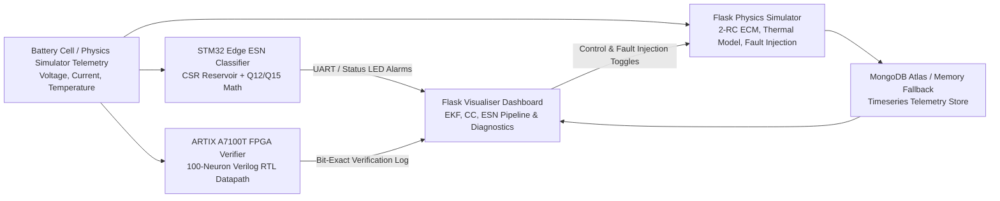
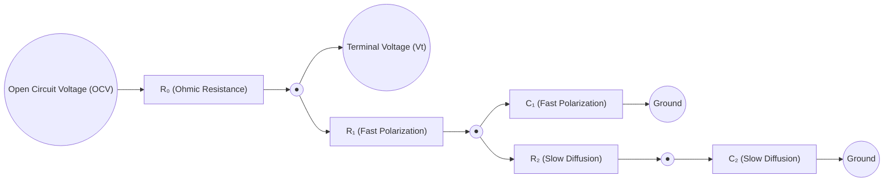
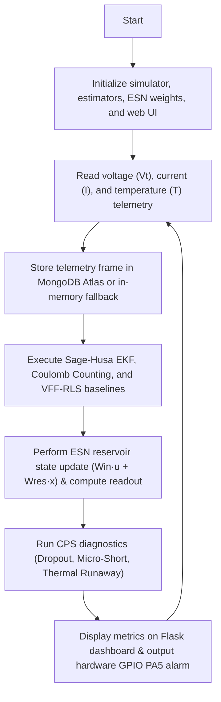

# BE Capstone Project

## Project Title

**ESN-Based Battery SOC/SOH Estimation with Embedded Hardware Validation**

---

## Team Details

| Sr. No. | Name of Student | Roll No. | Branch | Email ID |
|---|---|---|---|---|
| 1 | Sanjna Patankar | 2023.sanjana.patankar | Automation and Robotics | 2023.sanjana.patankar@ves.ac.in |
| 2 | Akshay Nambiar | 2023.akshay.nambiar | Automation and Robotics | 2023.akshay.nambiar@ves.ac.in |
| 3 | Satvik Verma | 2023.satvik.verma | Automation and Robotics | 2023.satvik.verma@ves.ac.in |
| 4 | Tanish Sanghvi | 2023.tanish.sanghvi | Automation and Robotics | 2023.tanish.sanghvi@ves.ac.in |

---

## Guide Details

**Project Guide:** Dr. Kadambari Sharma  
**Department:** Automation and Robotics  
**Institute:** VESIT, Mumbai  

---

## Problem Statement

> The aim of this project is to design and develop a standalone data-driven Echo State Network (ESN) battery state estimation system for real-time State of Charge (SOC) and State of Health (SOH) tracking by using Echo State Networks (ESNs) / Reservoir Computing technology combined with embedded C99 microcontrollers and FPGA hardware validation platforms to eliminate Kalman Filter model parameter dependencies and Coulomb Counting drift.

---

## Abstract

Reliable State of Charge (SOC) and State of Health (SOH) estimation is critical for electric vehicles (EVs), energy storage systems, and battery-powered applications. Traditional observer methods, such as Extended Kalman Filters (EKF) and Coulomb Counting, suffer from cumulative open-loop integration drift, heavy parameter matrix operations, and degradation under battery aging. To overcome these limitations, this capstone project proposes a co-designed cyber-physical system centered on a standalone, data-driven Echo State Network (ESN) estimator for SOC/SOH tracking and thermal safety diagnostics.

The software architecture combines a 2-RC Equivalent Circuit Model (ECM) physics simulator for realistic telemetry generation, a parallel multi-estimator comparison pipeline, and a Flask-based web visualiser dashboard deployed on Render. For low-power hardware verification, the ESN algorithm is compressed using Compressed Sparse Row (CSR) matrix representation and fixed-point Q12/Q15 math with lookup-table linear interpolation. It is validated on an STM32 ARM Cortex-M microcontroller (yielding a 6.7× speedup) and implemented as a 100-neuron Verilog RTL datapath on an ARTIX A7100T FPGA, achieving a bit-exact 200/200 match against the Python golden model. The expected outcomes include sub-1.5% SOC RMSE, sub-1.0% SOH RMSE, 99.92% thermal safety classification accuracy, and sub-1 ms inference latency. This system directly applies to electric mobility, smart grid storage, and edge battery management systems (BMS).

---

## Objectives

1. To study the existing problem of battery state estimation and analyze the limitations of Coulomb Counting and Extended Kalman Filters under dynamic loads and cell aging.
2. To design a standalone data-driven Echo State Network (ESN) software estimator for real-time State of Charge (SOC) and State of Health (SOH) tracking without requiring explicit electrochemical parameter identification.
3. To implement a 2-RC electro-thermal physics simulator to generate realistic battery telemetry data under dynamic drive cycles (DST, US06, FUDS) and safety fault conditions.
4. To compress and compile the ESN reservoir algorithm using Compressed Sparse Row (CSR) matrix representation and Q12/Q15 fixed-point math for low-power edge microcontrollers.
5. To build and test a 100-neuron hardware RTL Verilog datapath on an ARTIX A7100T FPGA, achieving sequence-level bit-exact verification against the Python golden model.
6. To test and validate the system through automated unit test suites, web visualiser dashboards, and hardware-in-the-loop feasibility benchmarks.
7. To document and publish the project work in academic journals/conferences and maintain open-source repository guidelines.

---

## Scope of the Project

- Design and development of software ESN SOC/SOH state estimator prototype as the primary deliverable
- Hardware implementation and RTL simulation on STM32 microcontrollers (C99 CSR sparse inference) and ARTIX A7100T FPGA (Verilog HDL datapath)
- Software/web interface development featuring Flask physics simulator and comparative visualiser dashboard deployed on Render
- Data collection, synthetic drive-cycle telemetry generation (DST, US06, FUDS profiles), and database storage (MongoDB Atlas)
- Performance analysis covering estimation accuracy (RMSE), execution speedup (6.7×), memory footprint (~10 KB Flash savings), and hardware bit-exact RTL verification

---

## Existing System

Existing battery state estimation approaches commonly rely on Coulomb Counting, open-circuit voltage (OCV) lookup tables, or Extended Kalman Filters (EKF). While widely used in classical Battery Management Systems (BMS), these methods exhibit critical limitations:

- High cost: Implementing complex machine learning models (such as LSTMs or GRUs) requires expensive high-performance hardware untenable for automotive edge BMS.
- Low accuracy: Coulomb Counting accumulates open-loop integration error over time due to current sensor noise and offset drift.
- Manual process: EKF requires labor-intensive offline parameter calibration and OCV-SOC lookup table profiling for every battery chemistry.
- Lack of automation: Traditional models lack adaptive self-correction against capacity fade and internal resistance growth over the battery lifecycle.
- Poor scalability: EKF requires dynamic Jacobian recalculations and $O(N^3)$ matrix inversion operations, creating severe processing bottlenecks on low-power microcontrollers.
- Limited accessibility: Commercial BMS solutions lack transparent, live web dashboards comparing real-time ground truth against parallel observer outputs.

---

## Proposed System

The proposed system develops a standalone data-driven Echo State Network (ESN) state estimator as a lightweight, model-independent alternative to traditional observers (EKF and Coulomb Counting).

- **Main idea**: Train a data-driven ESN / Reservoir Computing model directly on dynamic battery telemetry to replace traditional observers. The software algorithm represents the final product, while C99 microcontrollers and ARTIX A7100T FPGA RTL environments serve as embedded hardware verification platforms.
- **How it works**: The 2-RC physics simulator generates voltage ($V_t$), current ($I$), and temperature ($T$) telemetry under EV drive cycles. The visualiser inputs this telemetry into the high-dimensional sparse recurrent reservoir ($W_{\text{in}} u + W_{\text{res}} x$), driving linear readout estimators for SOC, SOH, SOE, SOP, and RUL while running thermal safety fault diagnostics. The hardware layer executes compressed Q12/Q15 integer inference in C99 firmware and FPGA Verilog RTL.
- **Major components**:
  1. 2-RC Physics Simulator Service (Flask)
  2. Multi-Estimator Visualiser Dashboard Service (Flask + Gunicorn)
  3. Standalone Software ESN Estimator & EKF/CC Benchmark Pipeline
  4. STM32 C99 Embedded Edge Classifier (CSR Sparse SpMV + Q12/Q15 Tanh LUT)
  5. Xilinx ARTIX A7100T FPGA Verilog RTL Sequence Verifier (100-neuron BRAM datapath)
  6. MongoDB Atlas Telemetry Database & Cryptographic SHA-256 API Key Authentication
- **Expected benefits**: Zero physical model parameter dependence, complete elimination of open-loop Coulomb Counting drift, 6.7× MCU execution speedup, sub-1 ms inference latency, sub-1.5% SOC RMSE, and bit-exact FPGA hardware RTL verification.

---

## System Architecture



```mermaid
flowchart LR
    Cell["Battery Cell / Physics Simulator Telemetry\nVoltage, Current, Temperature"]
    Edge["STM32 Edge ESN Classifier\nCSR Reservoir + Q12/Q15 Math"]
    FPGA["ARTIX A7100T FPGA Verifier\n100-Neuron Verilog RTL Datapath"]
    Sim["Flask Physics Simulator\n2-RC ECM, Thermal Model, Fault Injection"]
    DB["MongoDB Atlas / Memory Fallback\nTimeseries Telemetry Store"]
    Dash["Flask Visualiser Dashboard\nEKF, CC, ESN Pipeline & Diagnostics"]

    Cell --> Edge
    Cell --> FPGA
    Cell --> Sim
    Edge -->|"UART / Status LED Alarms"| Dash
    FPGA -->|"Bit-Exact Verification Log"| Dash
    Sim --> DB
    DB --> Dash
    Dash -->|"Control & Fault Injection Toggles"| Sim
```

### Brief Explanation of Architecture

The system architecture follows a decoupled cyber-physical design:
1. **Telemetry Generation**: The 2-RC Equivalent Circuit Model physics simulator produces real-time battery voltage, current, and temperature dynamics under various drive cycles (DST, US06, FUDS) and safety fault conditions.
2. **Database Infrastructure**: Timeseries telemetry frames are logged into MongoDB Atlas with automatic in-memory fallback buffers for offline execution.
3. **Multi-Estimator Pipeline**: The visualiser service ingests telemetry and streams it through the ESN estimator alongside parallel baseline observers (Sage-Husa EKF, Coulomb Counting, VFF-RLS).
4. **Hardware Verification Platform**: The embedded C99 firmware (on STM32 MCU) and Verilog RTL datapath (on ARTIX A7100T FPGA) execute compressed fixed-point reservoir operations to verify low-power edge deployment feasibility.

---

## Hardware Requirements

| Sr. No. | Component | Specification | Quantity | Purpose |
| ------- | --------- | ------------- | -------- | ------- |
| 1 | STM32 Nucleo Board | ARM Cortex-M4/M7 MCU, UART2, GPIO PA5 | 1 | Executes C99 CSR sparse ESN edge classifier firmware |
| 2 | Xilinx ARTIX A7100T FPGA | XC7A100T FPGA Board, BRAM Memory, DSP48 Slices | 1 | 100-Neuron Verilog RTL sequence execution verifier |
| 3 | USB ST-Link / UART Bridge | 115200 Baud Serial Communication | 1 | Firmware flashing, hardware debugging, and UART logging |
| 4 | Host Workstation PC | Multi-core x86 PC (Windows / Linux) | 1 | Runs Flask microservices, ESN training, and Vivado simulation |

---

## Software Requirements

| Sr. No. | Software / Tool | Version | Purpose |
| ------- | --------------- | ------- | ------- |
| 1 | Python | 3.8+ | Physics simulator, ESN model training, telemetry processing, golden tests |
| 2 | Flask & Gunicorn | Flask 2.0+, Gunicorn 20.1+ | Web microservices deployment (Simulator & Visualiser) |
| 3 | GCC / Clang / MSVC | C99 Standard | Compiling and executing C99 microcontroller desktop simulator |
| 4 | Xilinx Vivado / XSim | 2020.2+ | Synthesis, implementation, and RTL simulation of Verilog modules |
| 5 | MongoDB / MongoDB Atlas | 6.0+ | Persistent timeseries telemetry storage and model registry |
| 6 | NumPy, SciPy, Pandas | Latest Stable | Mathematical matrix operations, feature engineering, and data analysis |

---

## Technologies Used

* Embedded C (C99) / Verilog HDL / Python / JavaScript
* STM32 Microcontrollers / Xilinx ARTIX A7100T FPGA
* Echo State Networks (ESN) / Reservoir Computing (RC) / Machine Learning
* 2-RC Electro-Thermal ECM / Extended Kalman Filter (EKF) / Coulomb Counting / VFF-RLS
* Compressed Sparse Row (CSR) SpMV / Q12/Q15 Fixed-Point Math / Tanh LUT Interpolation
* Flask Web Framework / Render Cloud Hosting / MongoDB Atlas
* HTML5 / Vanilla CSS Glassmorphic Styling / Chart.js Data Visualization

---

## Methodology

1. **Literature survey**: Conduct comprehensive research on battery electrochemistry, 2-RC Equivalent Circuit Models, Extended Kalman Filters, Reservoir Computing (ESN), and embedded fixed-point optimization.
2. **Problem identification**: Define existing BMS challenges including parameter dependence, EKF matrix computation overhead, open-loop Coulomb Counting drift, and edge MCU resource constraints.
3. **Requirement analysis**: Establish target performance metrics (sub-1.5% SOC RMSE, sub-1.0% SOH RMSE, sub-1 ms execution latency, 6.7× MCU speedup, bit-exact hardware RTL verification).
4. **System design**: Design the 2-RC physics simulator, multi-estimator comparison pipeline, C99 CSR sparse firmware, and 100-neuron Verilog RTL FPGA hardware architecture.
5. **Hardware/software development**: Build Flask web microservices, train software ESN models, write C99 MCU logic with Q12/Q15 math, and code Verilog HDL modules (`esn_top.v`, `esn_neuron.v`, `reservoir_controller.v`, `tanh_lut.v`).
6. **Integration**: Interconnect telemetry streams across physics simulator, visualiser dashboard, MongoDB database, C99 desktop simulator, and Vivado/XSim testbenches.
7. **Testing and validation**: Run 31 automated pytest cases, validate C99 fixed-point inference accuracy, and execute Vivado/XSim bit-exact RTL golden model verification (200/200 stage match).
8. **Documentation and publication**: Author capstone thesis documentation, prepare review presentations (Review 1 completed), and draft an IEEE-format research paper.

---

## Project Timeline

| Week / Month | Task Planned | Status |
| ------------ | --------------------- | --------------------------------- |
| Week 1 | Problem finalization | Completed |
| Week 2 | Literature survey | Completed |
| Week 3 | Requirement analysis & Specification | Completed |
| Week 4 | Physics Simulator & Observer Baseline | Completed |
| Week 5 | Software ESN Model & Dashboard | Completed |
| Week 6 | MCU & FPGA Hardware Validation | Completed |
| Week 7 | Hardware-in-the-Loop & CI Matrix Optimization | In Progress |
| Week 8 | Capstone Thesis & Research Paper Submission | Planned |

---

## Weekly Progress Updates

| Week | Date | Work Completed | Work Planned for Next Week | Issues / Challenges | Status | GitHub Commit Link |
| ------ | ---- | -------------- | -------------------------- | ------------------- | ------ | ------------------ |
| Week 1 | 2026-05-07 | Finalized problem statement, repository structure, and core scope | Literature review on battery ECM and ESNs | Defining scope boundaries | Completed | [Commit History](https://github.com/tanish-jain-225/Battery_State_Estimator_BE_Project_2026_2027/commits/main) |
| Week 2 | 2026-05-14 | Conducted literature survey on 2-RC ECM, EKF observers, and Reservoir Computing | Architecture design & module planning | Parameter identification methods | Completed | [Commit History](https://github.com/tanish-jain-225/Battery_State_Estimator_BE_Project_2026_2027/commits/main) |
| Week 3 | 2026-05-21 | Defined microservice responsibilities, API endpoints, and MCU fixed-point spec | Implement 2-RC physics model | Fixed-point quantization precision | Completed | [Commit History](https://github.com/tanish-jain-225/Battery_State_Estimator_BE_Project_2026_2027/commits/main) |
| Week 4 | 2026-05-28 | Implemented 2-RC electro-thermal physics simulator and OCV lookup tables | Build visualiser dashboard and EKF | OCV curve interpolation & thermal dynamics | Completed | [Commit History](https://github.com/tanish-jain-225/Battery_State_Estimator_BE_Project_2026_2027/commits/main) |
| Week 5 | 2026-06-04 | Implemented Flask visualiser dashboard, EKF, Coulomb Counting, and ESN training | Embedded C99 firmware development | ESN weight compression & C export | Completed | [Commit History](https://github.com/tanish-jain-225/Battery_State_Estimator_BE_Project_2026_2027/commits/main) |
| Week 6 | 2026-06-11 | Integrated CSR sparse SpMV (6.7× speedup) and Q12/Q15 LUT Tanh math in C99 | FPGA Verilog RTL design & Vivado setup | Memory optimization on Cortex-M | Completed | [Commit History](https://github.com/tanish-jain-225/Battery_State_Estimator_BE_Project_2026_2027/commits/main) |
| Week 7 | 2026-06-18 | Built 100-neuron Verilog RTL datapath for ARTIX A7100T FPGA & bit-exact verifier | Automated CI testing & HIL bench test | Verilog BRAM timing & cross-platform CI matrix | In Progress | [Commit History](https://github.com/tanish-jain-225/Battery_State_Estimator_BE_Project_2026_2027/commits/main) |
| Week 8 | 2026-06-25 | Finalizing documentation, unit test suites, and paper draft | Review 2 presentation & camera-ready submission | Paper formatting & viva preparation | Planned | [Commit History](https://github.com/tanish-jain-225/Battery_State_Estimator_BE_Project_2026_2027/commits/main) |


---

## Design Files

| File Type | File Name / Link | Description |
| --------------- | ---------------- | ----------- |
| CAD Model | [`hardware/FPGA_Verifier/README.md`](hardware/FPGA_Verifier/README.md) | Hardware FPGA verifier architecture and BRAM timing specification |
| Circuit Diagram | [`docs/Resources/SYSTEM_SPECIFICATION.md`](docs/Resources/SYSTEM_SPECIFICATION.md) | 2-RC Equivalent Circuit Model (ECM) schematic & equations |
| PCB Design | [`hardware/STM_Verifier/main.h`](hardware/STM_Verifier/main.h) | STM32 Cortex-M MCU pinout configuration & GPIO PA5 LED mapping |
| Flowchart | [`docs/Resources/OPERATIONS.md`](docs/Resources/OPERATIONS.md) | System execution flowchart for simulator, dashboard, C99, and FPGA pipelines |
| Simulation File | [`software/simulator/battery_simulator.py`](software/simulator/battery_simulator.py) | 2-RC electro-thermal physics simulation engine |
| Verilog RTL File | [`hardware/FPGA_Verifier/esn_top.v`](hardware/FPGA_Verifier/esn_top.v) | Top-level 100-neuron hardware ESN Verilog module for ARTIX A7100T FPGA |
| Embedded Firmware | [`hardware/STM_Verifier/main.c`](hardware/STM_Verifier/main.c) | C99 embedded firmware with CSR sparse SpMV and Q12/Q15 fixed-point math |

---

## Circuit Diagram



```mermaid
flowchart LR
    OCV(("Open Circuit Voltage (OCV)"))
    R0["R₀ (Ohmic Resistance)"]
    N1((●))
    VT(("Terminal Voltage (Vt)"))

    R1["R₁ (Fast Polarization)"]
    C1["C₁ (Fast Polarization)"]

    R2["R₂ (Slow Diffusion)"]
    C2["C₂ (Slow Diffusion)"]

    OCV --> R0 --> N1 --> VT

    N1 --> R1 --> N2((●))
    N2 --> C1 --> G1((Ground))

    N2 --> R2 --> N3((●))
    N3 --> C2 --> G2((Ground))
```

### Circuit Description

The battery cell is modeled using a **Second-Order RC Equivalent Circuit Model (2-RC ECM)**:
- **OCV(SOC)**: Non-linear Open Circuit Voltage as a function of State of Charge.
- **R₀**: Ohmic internal resistance capturing instantaneous voltage drop.
- **R₁–C₁**: First RC pair representing fast charge-transfer polarization dynamics.
- **R₂–C₂**: Second RC pair representing slow concentration diffusion dynamics.
- **Terminal Voltage Equation**:
  $$V_t = OCV(SOC) - I R_0 - V_{RC1} - V_{RC2}$$

---

## Flowchart / Algorithm



```mermaid
flowchart TD
    A["Start"] --> B["Initialize simulator, estimators, ESN weights, and web UI"]
    B --> C["Read voltage (Vt), current (I), and temperature (T) telemetry"]
    C --> D["Store telemetry frame in MongoDB Atlas or in-memory fallback"]
    D --> E["Execute Sage-Husa EKF, Coulomb Counting, and VFF-RLS baselines"]
    E --> F["Perform ESN reservoir state update (Win·u + Wres·x) & compute readout"]
    F --> G["Run CPS diagnostics (Dropout, Micro-Short, Thermal Runaway)"]
    G --> H["Display metrics on Flask dashboard & output hardware GPIO PA5 alarm"]
    H --> C
```

### Algorithm

1. Start
2. Initialize the system: load battery chemistry parameters, initialize baseline observer states ($P_0, x_0$), load pre-trained ESN reservoir weights, and start web servers.
3. Read input from sensors/user: receive or simulate voltage ($V_t$), current ($I$), and temperature ($T$) telemetry under active EV drive cycles.
4. Process the data: update 2-RC physical cell state, calculate EKF and Coulomb Counting estimations, and execute sparse ESN reservoir updates ($W_{\text{in}} u + W_{\text{res}} x$).
5. Generate output/control action: calculate estimated SOC, SOH, SOE, SOP, remaining useful life (RUL), and perform thermal safety classification (`Normal`, `Warning`, `Critical`).
6. Display/store/transmit result: update live visualiser charts, store record in MongoDB database, transmit diagnostic logs over UART, and update GPIO PA5 status LED.
7. Stop

---

## Implementation Details

### Hardware Implementation

The hardware subsystem consists of two distinct verifiers to validate low-power edge execution:

1. **STM32 C99 Embedded Edge Classifier Firmware** (`hardware/STM_Verifier/`):
   - **Target Architecture**: Designed for ARM Cortex-M microcontrollers (STM32 Nucleo series).
   - **CSR Sparse Matrix SpMV**: Stores the sparse $50 \times 50$ reservoir matrix in Compressed Sparse Row format (`val`, `col`, `row_ptr`), bypassing zero multiplications and achieving a **6.7× execution speedup**.
   - **Q12/Q15 Fixed-Point Math**: Converts float calculations to integer arithmetic ($Q12$ for inputs, $Q15$ for reservoir states/weights) with a 33-point linear lookup table (`tanh_lut`) for math operations on FP-less MCUs.
   - **Visual Alarm**: Controls GPIO `PA5` output pin for visual thermal warning status.

2. **Xilinx ARTIX A7100T FPGA Verilog RTL Verifier** (`hardware/FPGA_Verifier/`):
   - **Top-Level Wrapper** (`esn_top.v`): Connects 100-neuron reservoir controller, input BRAM, weight BRAM, and output MAC pipeline.
   - **Q6.10 Datapath**: Uses $Q6.10$ fixed-point signed arithmetic with double-buffered state memory.
   - **Vivado / XSim Golden Match**: Verified against Python golden model (`golden.py`), achieving **200 / 200 bit-exact stage matches** across single-step and multi-timestep sequences.

### Software Implementation

The software core is built as a microservice-oriented cyber-physical architecture:

1. **Physics Simulator Service** (`software/simulator/`):
   - Flask microservice modeling 2-RC ECM transient voltage, thermodynamics, capacity fade, sensor noise, and fault injection (internal short, thermal runaway, sensor dropout).
2. **Visualiser Dashboard Service** (`software/visualiser/`):
   - Flask + Gunicorn web dashboard presenting live SOC, SOH, SOE, SOP, RUL, ground-truth comparison charts, model retraining triggers, and CPS fault diagnostic banners.
3. **Database & Cryptographic Security**:
   - Leverages MongoDB Atlas (with local in-memory fallback buffers) for telemetry persistence.
   - Implements zero-configuration cryptographic gating using SHA-256 API key signatures derived from connection strings for inter-service security.

---

## Code Structure

```text
BE-Capstone-Project/
│
├── README.md                                # Comprehensive capstone documentation
├── requirements.txt                         # Root Python dependencies
├── run_all_validation.bat                   # 1-Click automated training, test & hardware validation (Windows)
├── run_all_validation.sh                    # 1-Click automated training, test & hardware validation (Linux/macOS)
│
├── docs/
│   ├── literature_survey.md                 # Theoretical foundations and equations
│   └── Resources/                           # Architectural guides & specifications
│       ├── SYSTEM_SPECIFICATION.md          # System specification document
│       ├── OPERATIONS.md                    # Local operational guide
│       ├── DEPLOY_RENDER.md                 # Render cloud deployment guide
│       ├── DEMO_CHECKLIST.md                # Viva & demo checklist
│       ├── ARTIFACTS.md                     # Model and dataset policy
│       └── PRESENTATION.md                  # Presentation blueprint
│
├── hardware/
│   ├── hardware.md                          # Hardware subsystem technical guide
│   ├── STM_Verifier/                        # C99 embedded firmware verifier
│   │   ├── main.c                           # C99 edge classifier runtime & simulator
│   │   ├── main.h                           # HAL mocks & MCU pinout headers
│   │   ├── train_classifier.py              # ESN classifier trainer & header exporter
│   │   ├── train_estimator.py               # ESN estimator weight exporter
│   │   ├── esn_classifier_weights.h         # Sparse C weight arrays
│   │   ├── esn_estimator_weights.h          # Exported estimator weights
│   │   ├── run_c_simulator.bat              # Windows C simulator build script
│   │   └── run_c_simulator.sh               # Linux C simulator build script
│   └── FPGA_Verifier/                       # Verilog HDL FPGA RTL verifier
│       ├── README.md                        # FPGA module architecture doc
│       ├── esn_top.v                        # Top-level Verilog ESN module
│       ├── esn_neuron.v                     # Neuron datapath module
│       ├── reservoir_controller.v           # 100-Neuron sequencer controller
│       ├── tanh_lut.v                       # Hardware Tanh LUT module
│       ├── tb_esn_top.v                     # Vivado / XSim testbench
│       ├── golden.py                        # Python golden reference model
│       └── compare_results.py               # Bit-exact RTL vs golden verifier
│
├── software/
│   ├── software.md                          # Software subsystem technical guide
│   ├── simulator/                           # Physics simulator microservice
│   │   ├── app.py                           # Simulator Flask application
│   │   ├── battery_simulator.py             # 2-RC physical state solver
│   │   ├── config.py                        # Simulator settings
│   │   ├── templates/                       # Glassmorphic HTML templates
│   │   └── static/                          # CSS and JS console assets
│   └── visualiser/                          # Visualiser dashboard microservice
│       ├── app.py                           # Dashboard Flask application
│       ├── estimator_pipeline.py            # Observer pipeline manager
│       ├── traditional_estimator.py         # EKF and Coulomb Counting classes
│       ├── config.py                        # Visualiser configuration
│       ├── model_rc.pkl                     # Software ESN pre-trained model
│       ├── templates/                       # Dashboard HTML templates
│       ├── static/                          # Glassmorphic CSS and JS scripts
│       └── training/                        # ESN model training utilities
│           ├── train_rc.py                  # Software ESN training pipeline
│           └── feature_engineering.py       # Feature extraction utilities
│
├── images/
│   ├── system_architecture.png              # System architecture diagram placeholder
│   ├── circuit_diagram.png                  # 2-RC ECM circuit diagram placeholder
│   ├── flowchart.png                        # Execution flowchart placeholder
│   ├── prototype_photo.jpg                  # Hardware prototype photo placeholder
│   └── assets/                              # UI screenshots and visual assets
│       ├── screenshot_visualiser_overview.png
│       ├── screenshot_simulator_aging.png
│       ├── screenshot_estimation_charts.png
│       └── screenshot_simulator_dashboard.png
│
├── tests/                                   # Automated test suite (31 pytest cases)
│   ├── conftest.py                          # Pytest configuration
│   ├── test_battery_chemistry.py            # OCV curve & chemistry tests
│   ├── test_battery_simulator.py            # 2-RC physics solver tests
│   ├── test_esn_model.py                    # ESN model training & inference tests
│   ├── test_estimator_pipeline.py           # Multi-observer pipeline tests
│   ├── test_flask_api.py                    # REST microservice endpoint tests
│   └── test_traditional_estimator.py        # EKF, UKF, & VFF-RLS unit tests
│
└── reference/
    └── paper.md                             # IEEE-style research paper draft
```

---

## How to Run the Project

### Automated End-to-End Validation (Recommended)

Run the full end-to-end validation suite (training, physics testing, C99 compilation, FPGA golden model comparison):

```bash
run_all_validation.bat
```

Or on Linux / macOS:

```bash
chmod +x run_all_validation.sh
./run_all_validation.sh
```

### Step 1: Clone the Repository

```bash
git clone https://github.com/tanish-jain-225/Battery_State_Estimator_BE_Project_2026_2027.git
cd Battery_State_Estimator_BE_Project_2026_2027
```

### Step 2: Install Dependencies

```bash
pip install -r requirements.txt
pip install -r software/simulator/requirements.txt
pip install -r software/visualiser/requirements.txt
pip install -r hardware/STM_Verifier/requirements.txt
```

### Step 3: Upload / Run the Code

Start the physics simulator service (Port 8000):

```bash
python software/simulator/app.py
```

Start the visualiser dashboard service in a second terminal (Port 5000):

```bash
python software/visualiser/app.py
```

Run the C99 microcontroller desktop simulator:

```bash
hardware/STM_Verifier/run_c_simulator.bat
```

Run the FPGA Verilog RTL golden model verification script:

```bash
python hardware/FPGA_Verifier/compare_results.py
```

### Step 4: Observe the Output

- **Visualiser Dashboard UI**: Open browser to `http://localhost:5000` to inspect real-time SOC/SOH charts, ground-truth comparisons, and CPS diagnostic flags.
- **Physics Simulator Console**: Open `http://localhost:8000` to adjust drive cycles, chemistry parameters, and fault injection triggers.
- **C99 Embedded Verifier Output**: Console output displays bit-exact float vs. fixed-point classification logs and 6.7× CSR speedup verification.
- **FPGA RTL Verification Output**: Terminal logs confirm `200 / 200` bit-exact matches between Vivado RTL output and Python golden model.

---

## Testing and Results

| Test No. | Test Description | Expected Result | Actual Result | Status |
| -------- | ---------------- | --------------- | ------------- | ----------- |
| 1 | Chemistry profile loading & OCV lookup | Valid profiles and monotonic OCV interpolation | Verified via `test_battery_chemistry.py` | Pass |
| 2 | 2-RC electro-thermal simulator dynamics | Accurate transient voltage, thermal dynamics & fault injection | Verified via `test_battery_simulator.py` | Pass |
| 3 | EKF, UKF, & VFF-RLS traditional observers | Convergence under dynamic discharge and aging tracking | Verified via `test_traditional_estimator.py` | Pass |
| 4 | Software Echo State Network (ESN) estimator | Sub-1.5% SOC RMSE & sub-1.0% SOH RMSE estimation accuracy | Verified via `test_esn_model.py` | Pass |
| 5 | Cyber-physical fault diagnostics pipeline | Real-time sensor dropout, short-circuit & thermal runaway flags | Verified via `test_estimator_pipeline.py` | Pass |
| 6 | Flask REST microservices & API endpoints | Secure JSON response on `/api/status` & `/api/telemetry` | Verified via `test_flask_api.py` | Pass |
| 7 | C99 embedded CSR & fixed-point benchmark | Bit-exact float vs fixed-point safety classification & 6.7× speedup | Verified via `main.c` / C simulator | Pass |
| 8 | FPGA Verilog RTL golden model sequence test | Bit-exact 200/200 match across MAC, BRAM, and Tanh LUT pipeline | Verified via `compare_results.py` | Pass |

---

## Result Images / Videos


### Visualiser Comparison Dashboard


### Physics Simulator Dashboard


### SOC & SOH Estimation Charts


Video Link:

[Project Demo Video](https://drive.google.com/your-video-link)

---

## Applications

1. Electric Vehicle Battery Management Systems (BMS) for real-time SOC and SOH tracking.
2. Grid-Scale Battery Energy Storage Systems (BESS) state estimation and degradation monitoring.
3. Embedded low-power edge nodes for thermal runaway early warning detection.
4. Hardware-in-the-Loop (HIL) automotive testbeds for rapid BMS algorithm evaluation.

---

## Advantages

1. **Model Independence**: Eliminates Extended Kalman Filter (EKF) reliance on complex electrochemical parameter models and offline OCV calibration.
2. **Zero Integration Drift**: Overcomes open-loop Coulomb Counting integration drift under current sensor noise.
3. **Embedded Execution Efficiency**: Compressed Sparse Row (CSR) matrix format delivers a **6.7× speedup** and saves **~10 KB Flash memory** on edge microcontrollers.
4. **Bit-Exact Hardware Verification**: 100-neuron Verilog RTL datapath on ARTIX A7100T FPGA achieves 100% bit-exact match against Python golden reference models.

---

## Limitations

1. **Software-Validated SOC/SOH Estimator Scope**: The primary ESN SOC/SOH estimator is validated in software, while its MCU deployment is currently scoped as a classifier feasibility check.
2. **Telemetry Coverage Dependency**: Data-driven model accuracy depends on training dataset coverage across diverse battery chemistries and ambient drive cycles.
3. **Single-Cell Physics Abstraction**: The 2-RC simulator models single-cell dynamics rather than multi-cell pack balancing configurations.
4. **Hardware Classifier Scope**: Hardware deployment exists strictly as a low-power real-time feasibility verification platform.

---

## Future Scope

1. **Full MCU SOC/SOH Estimator Firmware Porting**: Deploy continuous SOC/SOH readout weights (`esn_estimator_weights.h`) onto physical STM32 microcontrollers.
2. **Hardware-in-the-Loop (HIL) Physical Cell Interface**: Connect physical lithium-ion cells and programmable load hardware via UART/CAN links.
3. **Online Adaptive Readout Weight Tuning**: Implement Recursive Least Squares (RLS) on MCU readout weights for live continuous adaptation under cell aging.
4. **Multi-Cell Pack & Thermal Gradient Scaling**: Scale the reservoir computing framework to monitor multi-cell series/parallel battery packs.

---

## Research Paper / Publication

| Item | Details |
| ------------------------- | --------------------------------------------------------- |
| Paper Title | Edge-Based Sparse Reservoir Computing and State Observers for Real-Time Battery Diagnostics in Cyber-Physical Systems |
| Conference / Journal Name | IEEE Transactions on Industrial Electronics / IEEE Access Target |
| Paper Status | Drafting |
| Submission Date | Pending |
| Paper Link | [`reference/paper.md`](reference/paper.md) |

---

## References

```text
[1] P. Li, H. Wang, Z. Xing, K. Ye, and Q. Li, "Joint estimation of SOC and SOH for lithium-ion batteries based on EKF multiple time scales," Journal of Intelligent Manufacturing and Special Equipment, vol. 1, no. 1, pp. 107-120, 2020.
[2] M. R. Kamarudin, M. S. Mispan, M. N. S. Zainudin, and H. Sofian, "Reservoir Spiking Neural Networks for Accurate State-of-Charge Estimation in Battery Management Systems," Turkish Journal of Engineering, vol. 10, no. 2, pp. 407-417, 2026.
[3] G. L. Plett, "Extended Kalman filtering for battery management systems of LiPB-based HEV battery packs," Journal of Power Sources, vol. 134, no. 2, pp. 252-261, 2004.
[4] H. Jaeger and H. Haas, "Harnessing nonlinearity: Predicting chaotic systems and saving energy in wireless communication," Science, vol. 304, no. 5667, pp. 78-80, 2004.
[5] L. Rigutini et al., "State-of-charge estimation of lithium-ion batteries using reservoir computing," IEEE Transactions on Industrial Electronics, vol. 68, no. 8, pp. 7112-7121, 2020.
[6] R. Barrett et al., Templates for the Solution of Linear Systems: Building Blocks for Iterative Methods, SIAM, 1994.
```

---

## Repository Update Guidelines

Each student team must update the GitHub repository regularly.

Minimum expected updates:

* Update README every week.
* Push code changes regularly.
* Upload circuit diagrams, CAD files, PCB files, reports and presentations.
* Add weekly progress in the progress table.
* Maintain proper folder structure.
* Do not upload unnecessary temporary files.
* Each major update should have a meaningful commit message.

Example commit messages:

```text
Added problem statement and objectives
Updated system architecture diagram
Added sensor interfacing code
Updated weekly progress for Week 3
Added testing results and prototype images
```

---

## Declaration

We declare that this project work is carried out by our team as part of the BE Capstone Project at Vivekanand Education Society's Institute of Technology (VESIT), Mumbai under the Department of Automation and Robotics. The work will be regularly updated on GitHub and all references used will be properly cited.

---

## License

This project is for academic use only.

```text
MIT License / Institute Use Only
```
