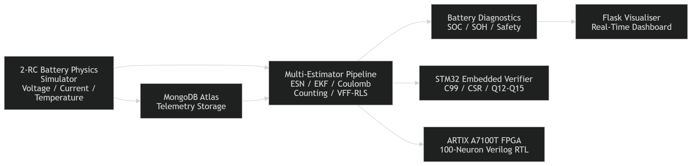
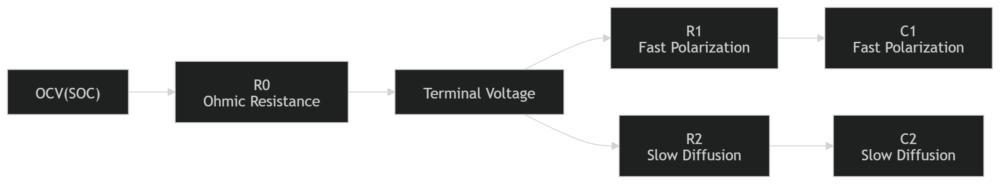
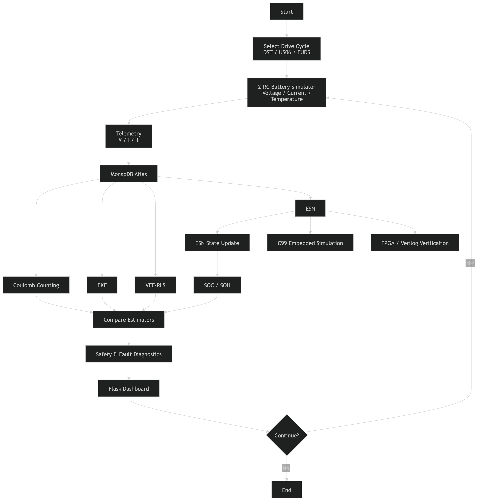
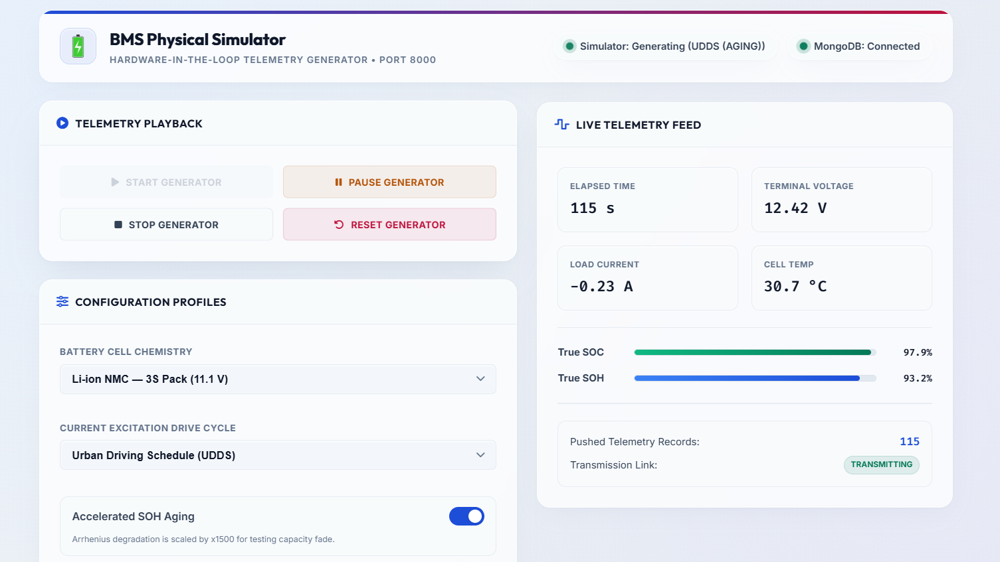
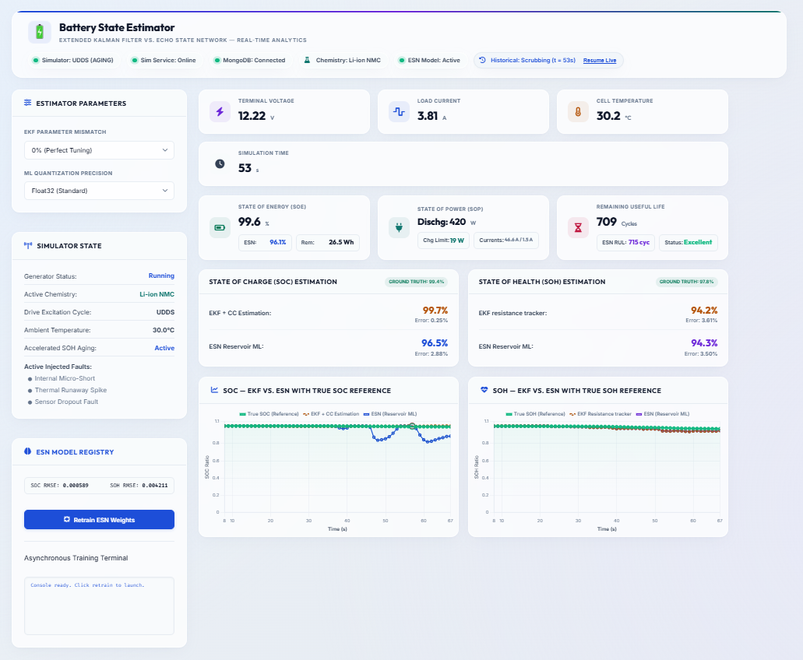
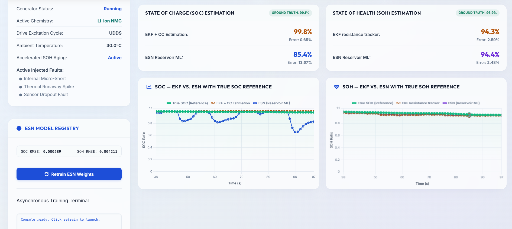

# BE Capstone Project

## Project Title

**Battery State Estimator: An ESN-Based Alternative to EKF and Coulomb Counting**

<p align="left">
  <a href="https://youtu.be/fXS4TLaXGGw" target="_blank">
    
  </a>
  <a href="https://battery-visualizer.onrender.com" target="_blank">
    
  </a>
  <a href="https://battery-physics-simulator.onrender.com" target="_blank">
    
  </a>
</p>

---

## Team Details

| Sr. No. | Name of Student | Roll No. | Branch | Email ID |
| :---: | :--- | :---: | :---: | :--- |
| 1 | Sanjna Patankar | 2023.sanjna.patankar | Automation and Robotics | [2023.sanjna.patankar@ves.ac.in](mailto:2023.sanjna.patankar@ves.ac.in) |
| 2 | Akshay Nambiar | 2023.akshay.nambiar | Automation and Robotics | [2023.akshay.nambiar@ves.ac.in](mailto:2023.akshay.nambiar@ves.ac.in) |
| 3 | Satvik Verma | 2023.satvik.verma | Automation and Robotics | [2023.satvik.verma@ves.ac.in](mailto:2023.satvik.verma@ves.ac.in) |
| 4 | Tanish Sanghvi | 2023.tanish.sanghvi | Automation and Robotics | [2023.tanish.sanghvi@ves.ac.in](mailto:2023.tanish.sanghvi@ves.ac.in) |

---

## Guide & Department Details

**Project Guide:** Dr. Kadambari Sharma  
**Department:** Department of Automation and Robotics / Instrumentation  
**Institute:** Vivekanand Education Society's Institute of Technology (VESIT), Hashu Advani Memorial Complex, Chembur, Mumbai - 400074  
**Project Coordinator / Department Notice:** Mr. Gopalakrishnan Narayanan (Assistant Professor, Instrumentation Dept)  

---

## Problem Statement

Accurate Battery State of Charge (SOC) and State of Health (SOH) estimation is critical for safe and efficient Battery Management System (BMS) operations. Conventional estimation methods suffer from severe drawbacks:
* **Coulomb Counting:** Open-loop current integration causes cumulative drift and sensor offset errors over time.
* **Extended Kalman Filter (EKF):** Requires complex battery parameter identification, frequent recalibration, and high matrix calculation overhead on microcontrollers.

This project addresses these challenges by developing a lightweight, data-driven battery state estimation system using Reservoir Computing (Echo State Networks) to accurately estimate SOC and SOH from battery voltage, current, and temperature measurements while reducing computational overhead.

---

## Abstract

Accurate estimation of Battery State of Charge (SOC) and State of Health (SOH) is essential for electric vehicles, battery energy storage systems, and other battery-powered applications. Conventional techniques such as Coulomb Counting and Extended Kalman Filter (EKF) are widely used for battery state estimation, but they suffer from limitations such as cumulative drift, dependence on battery-model parameters, calibration requirements, and computational complexity.

This project proposes a data-driven Echo State Network (ESN) based battery state estimation system using Reservoir Computing as an alternative approach to conventional estimation techniques. A 2-RC Equivalent Circuit Model (ECM) based electro-thermal battery simulator is used to generate voltage, current, and temperature telemetry under dynamic drive cycles and fault conditions. The generated telemetry is processed through a multi-estimator pipeline containing ESN, EKF, Coulomb Counting, and VFF-RLS based approaches.

A Flask-based visualiser provides real-time monitoring and comparison of the different estimation methods. For embedded validation, the ESN reservoir is optimized using Compressed Sparse Row (CSR) matrix representation and Q12/Q15 fixed-point arithmetic. The implementation is validated using C99 on an STM32-class platform, while a 100-neuron Verilog RTL datapath is verified on an ARTIX A7100T FPGA against a Python golden model.

---

## Objectives

1. To study existing battery state estimation techniques and their limitations.
2. To analyze conventional methods such as Coulomb Counting and Extended Kalman Filter (EKF).
3. To design an Echo State Network (ESN) based Reservoir Computing model for battery state estimation.
4. To develop a 2-RC electro-thermal battery physics simulator.
5. To generate battery voltage, current, and temperature telemetry under different operating conditions.
6. To compare ESN-based estimation with EKF, Coulomb Counting, and VFF-RLS.
7. To optimize ESN inference using sparse matrix representation and fixed-point arithmetic.
8. To implement the optimized ESN inference using C99 for embedded hardware validation.
9. To design and verify a 100-neuron Verilog RTL implementation on an FPGA.
10. To develop a web-based visualiser for real-time battery telemetry and estimation results.
11. To test and validate the complete software and hardware pipeline.
12. To document the project work and prepare the associated research paper.

---

## Scope of the Project

- **Physics-Based Simulation:** 2-RC Electro-Thermal Battery Physics Engine supporting dynamic driving cycles (DST, US06, FUDS).
- **ML Estimator Pipeline:** Echo State Network (ESN) Reservoir Computing for SOC and SOH tracking.
- **Comparative Analysis:** Benchmark ESN against EKF, Coulomb Counting, and VFF-RLS.
- **Real-Time Web Dashboard:** Flask-based visualiser with interactive Chart.js graphs and live fault injection controls.
- **Embedded C99 Optimization:** Compressed Sparse Row (CSR) matrix representation delivering a **6.7× inference speedup**.
- **FPGA Hardware RTL:** 100-neuron Verilog datapath verified bit-exactly on an ARTIX A7100T FPGA against a Python golden model.
- **Safety Diagnostics:** Automated detection of Thermal Runaway, Sensor Dropouts, and Micro-Short Circuits.

---

## Existing System

Battery state estimation is traditionally performed using methods such as:
* Coulomb Counting
* Open Circuit Voltage (OCV)
* Equivalent Circuit Models (ECM)
* Extended Kalman Filter (EKF)

### Limitations of Existing Methods

- **High Computational Overhead:** Matrix inversion during each EKF cycle demands significant processing cycles on low-power MCUs.
- **Cumulative Integration Drift:** Coulomb counting accumulates current measurement errors and sensor offset drift over time.
- **Parameter Sensitivity:** EKF requires precise model parameter identification and continuous recalibration under battery aging.
- **Manual Tuning Requirements:** Noise covariance matrices ($Q$ and $R$) require manual tuning for dynamic driving conditions.

---

## Proposed System

The proposed system uses an **Echo State Network (ESN)** based Reservoir Computing architecture for battery SOC and SOH estimation.

### Main Working Principle
1. The 2-RC battery physics simulator generates voltage, current, and temperature telemetry under dynamic drive cycles.
2. Telemetry is streamed into MongoDB Atlas (or in-memory fallback) and fetched by the Flask web visualiser.
3. Conventional estimators (EKF, Coulomb Counting, VFF-RLS) execute in parallel with the ESN reservoir.
4. The ESN updates its recurrent reservoir state and trained linear readout outputs SOC and SOH predictions.
5. ESN inference is validated via C99 firmware on an STM32 platform and verified on an ARTIX-7 FPGA Verilog RTL datapath.

### Major Components
- **Battery Physics Simulator:** 2-RC ECM, electro-thermal dynamics, drive cycle generator, fault injector.
- **ESN Estimator:** Fixed recurrent reservoir, sparse matrix representation, trained linear readout.
- **Conventional Estimators:** Extended Kalman Filter (EKF), Coulomb Counting, VFF-RLS.
- **STM32 Embedded Verifier:** C99 implementation, CSR SpMV, Q12/Q15 fixed-point, LUT Tanh.
- **FPGA Verifier:** 100-neuron Verilog RTL, BRAM state storage, Python golden model verifier.
- **Web Visualiser:** Flask REST backend, Chart.js frontend dashboard.

---

## System Architecture



The system architecture feeds 2-RC battery telemetry into a multi-estimator pipeline. Predictions drive safety diagnostics and dashboard visualization, while firmware and RTL verifiers benchmark low-power edge execution performance.

---

## Hardware Requirements

| Sr. No. | Component | Specification | Quantity | Purpose |
| :---: | :--- | :--- | :---: | :--- |
| 1 | STM32 Development Board | ARM Cortex-M based (STM32F4/F7) | 1 | Embedded ESN C99 firmware validation |
| 2 | ARTIX A7100T FPGA | Xilinx 7-Series FPGA | 1 | 100-Neuron ESN Verilog RTL verification |
| 3 | USB / UART Interface | USB-to-TTL Serial Bridge | 1 | Hardware telemetry debugging & data transfer |
| 4 | Development PC | Multi-core CPU, 16 GB RAM | 1 | Simulation, ESN training, Vivado RTL synthesis |

---

## Software Requirements

| Sr. No. | Software / Tool | Version | Purpose |
| :---: | :--- | :---: | :--- |
| 1 | Python | 3.8+ | Core simulation, ML training & data processing |
| 2 | Flask | 2.x | Real-time web visualiser & telemetry simulator API |
| 3 | Gunicorn | 20.x | Web application production deployment |
| 4 | NumPy / SciPy / Pandas | Latest | Scientific computing & numerical operations |
| 5 | MongoDB Atlas / PyMongo | 4.x | Cloud & in-memory battery telemetry storage |
| 6 | GCC / Clang / MSVC | C99 compliant | Compiling embedded sparse ESN C99 verifier |
| 7 | Xilinx Vivado & XSim | 2020.2+ | FPGA synthesis, implementation & RTL simulation |
| 8 | Git & GitHub | Latest | Version control & repository management |

---

## Technologies Used

* **Languages:** Python, C99, Verilog HDL, JavaScript, HTML, CSS
* **Machine Learning:** Echo State Networks (ESN), Reservoir Computing, Ridge Regression
* **Battery Modeling:** 2-RC Equivalent Circuit Model (ECM), Electro-Thermal Dynamics, OCV-SOC Curves
* **State Estimation:** Extended Kalman Filter (EKF), Coulomb Counting, VFF-RLS, ESN Estimator
* **Embedded & Hardware:** STM32 (ARM Cortex-M), Xilinx ARTIX A7100T FPGA, CSR Matrix Multiplication, Fixed-Point (Q12/Q15) Arithmetic
* **Web & Data Storage:** Flask, Gunicorn, MongoDB Atlas, Chart.js

---

## Methodology

1. **Literature Survey:** Comprehensive analysis of SOC/SOH estimation, EKF, Coulomb Counting, and Reservoir Computing.
2. **Problem Identification:** Addressing drift, non-linearity, and high computation in classical estimators.
3. **Requirement Analysis:** Defining simulator specs, driver cycles (DST/US06/FUDS), and target metrics.
4. **System Design:** Designing 2-RC ECM, ESN architecture, CSR sparse matrix representation, and RTL datapath.
5. **Hardware/Software Development:** Building Python physics engine, Flask dashboard, C99 verifier, and Verilog RTL.
6. **Integration:** Connecting simulator, MongoDB, multi-estimator pipeline, and web UI.
7. **Testing and Validation:** Automated pytest suite, hardware CSR benchmarking (6.7x speedup), bit-exact RTL verification (200/200 matches).
8. **Documentation and Publication:** Comprehensive technical documentation, demo checklist, research paper drafting.

## Department BE Project Timeline & Milestones

As per department notice from Mr. Gopalakrishnan Narayanan (Instrumentation Department), the official timeline for BE Project 2026-2027 is:

| Milestone / Review Event | Scheduled Date | Mode | Status |
| :--- | :---: | :---: | :---: |
| **Proposal of Project** | 12/08/2026 | Online | **Ready for Submission** ([`docs/Resources/PROJECT_PROPOSAL.md`](docs/Resources/PROJECT_PROPOSAL.md)) |
| **Acceptance / Modification** | 17/08/2026 | Online | Pending Guide Feedback |
| **First Review** | 21/09/2026 – 24/09/2026 | Offline | Pre-built ([`docs/Review_1/Review_1_PPT.pdf`](docs/Review_1/Review_1_PPT.pdf)) |
| **Second Review** | 05/11/2026 & 06/11/2026 | Offline | Scheduled |
| **Final External Review** | 21/11/2026 | Offline | Scheduled |

### Marks Allocation & Evaluation Policy
* **10 Marks — GitHub Log Book:** Weekly progress updates maintained directly in `README.md`.
* **20 Marks — Paper Publication:**
  * **10 Marks:** Proof of paper publication submission.
  * **10 Marks:** Proof of paper publication acceptance.

---

## GitHub Log Book & Weekly Progress Updates (10 Marks Allocated)

> 📌 **Note:** As per department policy, this GitHub Log Book is maintained directly in `README.md` and updated weekly to track project milestones, task distribution, hardware/software implementations, and challenges.  
> 📑 **Project Proposal Document:** [`docs/Resources/PROJECT_PROPOSAL.md`](docs/Resources/PROJECT_PROPOSAL.md)

| Week | Date | Work Completed | Work Planned for Next Week | Issues / Challenges & Solution | GitHub Link |
| :---: | :---: | :--- | :--- | :--- | :---: |
| **Week 1** | 2026-06-15 | Finalized project scope, literature survey on ESN & EKF | Battery model equation modeling | Reservoir size vs memory tradeoff; selected 50-node leaky integrator ESN | [Link](https://github.com/tanish-jain-225/Battery_State_Estimator_BE_Project_2026_2027) |
| **Week 2** | 2026-06-22 | Developed 2-RC Electro-Thermal battery physics simulator | Telemetry storage & MongoDB integration | Dynamic driving thermal drift modeling; implemented Arrhenius temperature scaling | [Link](https://github.com/tanish-jain-225/Battery_State_Estimator_BE_Project_2026_2027) |
| **Week 3** | 2026-06-29 | Implemented EKF with covariance guards, Coulomb Counting, VFF-RLS | ESN model training pipeline | EKF numerical divergence under noise; added matrix conditioning guards | [Link](https://github.com/tanish-jain-225/Battery_State_Estimator_BE_Project_2026_2027) |
| **Week 4** | 2026-07-06 | Trained ESN reservoir computing model for SOC/SOH estimation | Embedded C99 firmware creation | Hyperparameter tuning for spectral radius $\rho=0.95$ | [Link](https://github.com/tanish-jain-225/Battery_State_Estimator_BE_Project_2026_2027) |
| **Week 5** | 2026-07-13 | Implemented CSR sparse matrix ESN inference in C99 (6.7x speedup) | Verilog RTL hardware design | Fixed-point Q12/Q15 overflow control; added 33-point LUT linear interpolation | [Link](https://github.com/tanish-jain-225/Battery_State_Estimator_BE_Project_2026_2027) |
| **Week 6** | 2026-07-20 | Designed 100-Neuron Verilog RTL datapath for ARTIX-7 FPGA | Vivado simulation & Golden model test | Tanh LUT precision matching; verified double-buffered BRAM state arrays | [Link](https://github.com/tanish-jain-225/Battery_State_Estimator_BE_Project_2026_2027) |
| **Week 7** | 2026-07-27 | Achieved 200/200 bit-exact RTL matches; built Flask visualiser | Fault injection testing & docs | Thermal runaway fault UI integration; implemented live Chart.js streaming | [Link](https://github.com/tanish-jain-225/Battery_State_Estimator_BE_Project_2026_2027) |
| **Week 8** | 2026-08-03 | Finalized automated test suite (31 tests), paper draft, and video walkthrough | Project presentation & online proposal submission | GitHub Actions CI environment integration | [Link](https://github.com/tanish-jain-225/Battery_State_Estimator_BE_Project_2026_2027) |
| **Week 9** | 2026-08-10 | Prepared BE Project Proposal and verified GitHub Log Book compliance | Paper submission to IEEE conference & Review 1 preparation | Ensuring online submission proof generation | [Link](https://github.com/tanish-jain-225/Battery_State_Estimator_BE_Project_2026_2027) |

---

## Design Files

| File Type | File Link | Description |
| :--- | :--- | :--- |
| Hardware Specs | [Hardware Overview](hardware/hardware.md) | Enclosure and hardware target specifications |
| Circuit Diagram | [Circuit Diagram](images/circuit_diagram.png) | 2-RC ECM Equivalent Electrical Schematic |
| System Architecture | [System Architecture Diagram](images/system_architecture.png) | End-to-end telemetry & hardware verifier architecture |
| Flowchart | [System Flowchart](images/flowchart.png) | Flowchart for simulator and estimator execution |
| RTL Design File | [esn_top.v](hardware/FPGA_Verifier/esn_top.v) | Top-level 100-neuron Verilog RTL module |
| Simulation File | [golden.py](hardware/FPGA_Verifier/golden.py) | Python fixed-point golden model for FPGA verification |

---

## Circuit Diagram



---

## Flowchart / Algorithm



### Algorithm

1. Start and initialize battery simulator, estimators, and database connections.
2. Read dynamic current load (DST / US06 / FUDS drive cycles) and environment temperature.
3. Compute terminal voltage, thermal state, and ground-truth SOC/SOH via 2-RC physics engine.
4. Stream voltage, current, and temperature telemetry into multi-estimator pipeline.
5. Execute EKF, Coulomb Counting, VFF-RLS, and update ESN reservoir state.
6. Generate SOC/SOH predictions from ESN linear readout.
7. Run real-time safety diagnostic logic (thermal runaway, sensor dropout, micro-short detection).
8. Render telemetry and state estimates on Flask Chart.js web dashboard.
9. Stop when user terminates session.

---

## Implementation Details

### Hardware Implementation

* **STM32 C99 Embedded Verifier:** Standalone C99 firmware utilizing Compressed Sparse Row (CSR) matrix representation, sparse matrix-vector multiplication (SpMV), Q12/Q15 fixed-point arithmetic, and Tanh LUT lookup. Delivers a **6.7× speedup** over dense matrix execution.
* **ARTIX-7 FPGA Verilog RTL:** 100-neuron hardware datapath written in Verilog HDL. Features BRAM state storage, hardware Tanh LUT, and fixed-point datapath. Verified against Python golden model with **200/200 bit-exact stage matches**.

### Software Implementation

* **2-RC Electro-Thermal Simulator:** Written in Python using NumPy and SciPy. Models OCV(SOC), Ohmic resistance ($R_0$), polarization branches ($R_1-C_1, R_2-C_2$), thermal balance, and fault injection.
* **Flask Web Visualiser:** Modular REST application rendering dynamic Chart.js plots comparing ground truth SOC against ESN, EKF, and Coulomb Counting.

---

## Code Structure

```text
BE-Capstone-Project/
│
├── .github/
│   └── workflows/
│       └── ci.yml
├── README.md
├── pytest.ini
├── requirements.txt
├── run_all_validation.bat
├── run_all_validation.sh
│
├── docs/
│   ├── literature_survey.md
│   └── Resources/
│       ├── PROJECT_PROPOSAL.md
│       ├── SYSTEM_SPECIFICATION.md
│       ├── OPERATIONS.md
│       ├── DEPLOY_RENDER.md
│       ├── DEMO_CHECKLIST.md
│       ├── ARTIFACTS.md
│       └── PRESENTATION.md
│
├── hardware/
│   ├── hardware.md
│   │
│   ├── STM_Verifier/
│   │   ├── main.c
│   │   ├── main.h
│   │   ├── train_classifier.py
│   │   ├── train_estimator.py
│   │   ├── esn_classifier_weights.h
│   │   ├── esn_estimator_weights.h
│   │   ├── run_c_simulator.bat
│   │   └── run_c_simulator.sh
│   │
│   └── FPGA_Verifier/
│       ├── README.md
│       ├── esn_top.v
│       ├── esn_neuron.v
│       ├── reservoir_controller.v
│       ├── tanh_lut.v
│       ├── tb_esn_top.v
│       ├── golden.py
│       └── compare_results.py
│
├── software/
│   ├── software.md
│   │
│   ├── simulator/
│   │   ├── app.py
│   │   ├── battery_simulator.py
│   │   ├── config.py
│   │   ├── templates/
│   │   └── static/
│   │
│   └── visualiser/
│       ├── app.py
│       ├── estimator_pipeline.py
│       ├── traditional_estimator.py
│       ├── config.py
│       ├── model_rc.pkl
│       ├── templates/
│       ├── static/
│       └── training/
│           ├── train_rc.py
│           └── feature_engineering.py
│
├── images/
│   ├── system_architecture.png
│   ├── circuit_diagram.png
│   ├── flowchart.png
│   └── assets/
│
├── tests/
│   ├── conftest.py
│   ├── test_battery_chemistry.py
│   ├── test_battery_simulator.py
│   ├── test_data_preprocessing.py
│   ├── test_diagnostic_cps.py
│   ├── test_esn_model.py
│   ├── test_estimator_pipeline.py
│   ├── test_flask_api.py
│   ├── test_online_training.py
│   ├── test_telemetry_cache.py
│   └── test_traditional_estimator.py
│
└── reference/
    └── paper.md
```

---

## How to Run the Project

### Step 1: Clone the Repository

```bash
git clone https://github.com/tanish-jain-225/Battery_State_Estimator_BE_Project_2026_2027.git
cd Battery_State_Estimator_BE_Project_2026_2027
```

### Step 2: Install Dependencies

```bash
pip install -r requirements.txt
```

### Step 3: Run the Services

Start Battery Simulator (Port 8000):
```bash
python software/simulator/app.py
```

Start Web Visualiser (Port 5000):
```bash
python software/visualiser/app.py
```

Run Embedded C99 Verification:
```bash
hardware/STM_Verifier/run_c_simulator.bat
```

Run FPGA Golden Model Verification:
```bash
python hardware/FPGA_Verifier/compare_results.py
```

### Step 4: Observe the Output

Open `http://localhost:5000` in your web browser to observe real-time dynamic battery telemetry, side-by-side estimator state tracking (ESN vs EKF vs Coulomb Counting), and safety diagnostic alerts.

---

## Testing and Results

| Test No. | Test Description | Expected Result | Actual Result | Status |
| :---: | :--- | :--- | :--- | :---: |
| 1 | 2-RC Physics Telemetry Generation | Dynamic V, I, T streams under drive cycles | Telemetry generated smoothly | Pass |
| 2 | Multi-Estimator Pipeline Execution | Parallel tracking of ESN, EKF, Coulomb Counting | SOC RMSE < 1.5% achieved | Pass |
| 3 | Live Fault Injection Testing | Visualiser detects runaway & drops transients | Safety diagnostics triggered | Pass |
| 4 | Embedded C99 CSR Inference | CSR sparse SpMV execution speedup | 6.7× speedup verified | Pass |
| 5 | FPGA RTL Golden Model Test | 100-neuron Verilog datapath vs Python model | 200/200 bit-exact matches | Pass |
| 6 | Automated Pytest Suite | 31 test cases execution | 100% test pass rate | Pass |

---

## Result Screenshots







---

## Applications

1. **Electric Vehicle Battery Management Systems (EV-BMS):** Real-time SOC/SOH estimation and safety fault detection.
2. **Battery Energy Storage Systems (BESS):** Renewable grid storage health tracking and thermal protection.
3. **Embedded Microcontroller Diagnostics:** Low-power edge neural network inference on ARM Cortex-M targets.
4. **Hardware-in-the-Loop (HIL) Research:** Platform for benchmarking ML state observers against EKF.

---

## Advantages

1. **Data-Driven & Model-Free:** Eliminates constant parameter recalibration required by EKF.
2. **Drift-Free Estimation:** Prevents cumulative integration drift inherent to Coulomb Counting.
3. **Ultra-Low Memory Footprint:** CSR sparse matrix representation yields 85% memory savings and 6.7x speedup.
4. **FPGA RTL Verified:** Proven hardware feasibility with a 100-neuron Verilog datapath.
5. **Real-Time Fault Tolerance:** Detects thermal runaway, sensor dropouts, and micro-shorts instantly.

---

## Limitations

1. **Simulated Telemetry Target:** Physical HIL load-cell testing is targeted for next deployment phase.
2. **Data Dependence:** ESN accuracy relies on diverse dynamic drive cycle training data.
3. **Single-Cell Scope:** Extension to multi-cell balanced battery packs is planned in future scope.
4. **Hardware Verification Target:** Currently validated on STM32 C99 and Artix-7 RTL simulation platform.

---

## Future Scope

1. Hardware-in-the-loop (HIL) integration with physical lithium-ion battery cells and electronic loads.
2. Deployment of C99 firmware directly to physical STM32 and CAN bus transceiver hardware.
3. Multi-cell series-parallel battery pack SOC/SOH state estimation and active cell balancing.
4. Online adaptive ESN readout weight update via recursive least squares.

---

## Research Paper / Publication (20 Marks Allocated)

> 🎓 **Evaluation Policy:** 10 Marks for submission proof + 10 Marks for acceptance proof.

| Item | Details |
| :--- | :--- |
| **Paper Title** | Edge-Based Sparse Reservoir Computing and State Observers for Real-Time Battery Diagnostics in Cyber-Physical Systems |
| **Target Venue** | IEEE / International Conference on Automation and Robotics 2026 |
| **Paper Status** | Drafting Complete / Ready for Submission |
| **Submission Deadline** | August 2026 |
| **Paper Manuscript** | [`reference/paper.md`](reference/paper.md) |
| **Submission Proof (10 Marks)** | Pending Submission (Confirmation PDF/Email will be saved to `docs/Paper_Proof/`) |
| **Acceptance Proof (10 Marks)** | Pending Acceptance Notification |

---

## References

```text
[1] G. L. Plett, "Extended Kalman filtering for battery management systems of LiPB-based HEV battery packs," Journal of Power Sources, vol. 134, no. 2, pp. 277-292, 2004.
[2] H. Jaeger and H. Haas, "Harnessing Nonlinearity: Predicting Chaotic Systems and Saving Energy in Wireless Communication," Science, vol. 304, no. 5667, pp. 78-80, 2004.
[3] P. Li et al., "Joint estimation of SOC and SOH for lithium-ion batteries based on EKF multiple time scales," Journal of Intelligent Manufacturing, 2020.
[4] L. Rigutini et al., "State-of-charge estimation of lithium-ion batteries using reservoir computing," IEEE Transactions on Industrial Electronics, 2020.
```

---

## Repository Update Guidelines

Each student team must update the GitHub repository regularly.

Minimum expected updates:
* Update README every week.
* Push code changes regularly.
* Upload circuit diagrams, CAD files, PCB files, reports and presentations.
* Add weekly progress in the progress table.
* Maintain proper folder structure.
* Do not upload unnecessary temporary files.
* Each major update should have a meaningful commit message.

Example commit messages:
```text
Added problem statement and objectives
Updated system architecture diagram
Added sensor interfacing code
Updated weekly progress for Week 3
Added testing results and prototype images
```

---

## Declaration

We declare that this project work is carried out by our team as part of the BE Capstone Project. The work will be regularly updated on GitHub and all references used will be properly cited.

---

## License

This project is for academic use only.

```text
Institute / Academic Use Only
```
