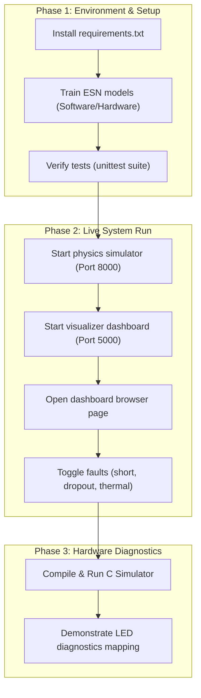

# Demo Checklist

Use this interactive checklist to prepare for a review, viva, project exhibition, or pull request verification.

---

## 🗺️ Demonstration Workflow

The flowchart below outlines the recommended sequence for setting up, running and concluding the live demonstration:

---

## 📋 Checklist Steps

### 1. Pre-Run Verification
- [ ] **Install Prerequisites**: Run `python -m pip install -r requirements.txt`.
- [ ] **Clean Configuration**: Confirm `.env` files contain only local config values and are excluded from Git tracking.
- [ ] **Train ESN Estimator Model**: Execute `python software/visualiser/training/train_rc.py` and confirm `model_rc.pkl` is exported.
- [ ] **Train Hardware Classifier**: Execute `python hardware/train_classifier.py` and confirm [`hardware/esn_classifier_weights.h`](../hardware/esn_classifier_weights.h) is created.
- [ ] **Train Hardware Estimator**: Execute `python hardware/train_estimator.py` and check [`hardware/esn_estimator_weights.h`](../hardware/esn_estimator_weights.h).
- [ ] **Execute Test Suite**: Run `python -m unittest discover -s software/tests -t .` (verify that all unit tests pass).
- [ ] **Build C Simulator**: Execute `hardware/run_c_simulator.bat` (Windows) or `hardware/run_c_simulator.sh` (Unix) and confirm compile success.

### 2. Live Interactive Demo
- [ ] **Boot Simulator**: Run `python software/simulator/app.py` in a separate terminal.
- [ ] **Boot Visualiser**: Run `python software/visualiser/app.py` in another terminal.
- [ ] **Open Browser Tabs**:
  - Visualiser UI: `http://localhost:5000`
  - Simulator status: `http://localhost:8000/api/status`
- [ ] **Telemetry Playback**: Trigger playback from the dashboard and watch live data updating.
- [ ] **Observe Estimators**: Compare ground truth SOC against EKF (physics-based), Coulomb Counting and ESN (machine learning).
- [ ] **Inject Faults**:
  - **Thermal Runaway**: Toggle on and watch the temperature graph spike, triggering the "Thermal Warning" status.
  - **Sensor Dropout**: Toggle on and watch voltage/current drop to zero; check that estimators filter the transient.
  - **Micro-Short**: Toggle on and watch the deviation grow between EKF SOC and Coulomb Counting SOC under low currents.
- [ ] **Run C Classifier**: Launch the desktop C simulation and demonstrate real-time classification updates matching the simulator temperature.

---

## 🎓 Viva Review & Technical Talking Points

Prepare for evaluator questions with the key design answers below:

| Question / Topic | Theoretical Rationale & Engineering Answers |
| :--- | :--- |
| **Why use a 2-RC ECM instead of a 1-RC ECM?** | A **2-RC model** includes two resistor-capacitor branches. Branch 1 ($R_1, C_1$) represents fast charge transfer and double-layer capacitance dynamics, while Branch 2 ($R_2, C_2$) captures slower concentration polarization diffusion. This provides higher accuracy under highly dynamic EV-style driving cycle current loads compared to a simple 1-RC branch. |
| **How does the EKF handle divergence and parameter drift?** | To prevent divergence under high-current spikes or model mismatch, the **EKF includes Covariance guards** (resets covariance $P$ if the trace exceeds $10.0$ or if diagonal entries become negative, preventing floating-point blowup). Additionally, instead of using static tables, the EKF operates in a closed loop with the **Variable Forgetting Factor RLS (VFF-RLS)** which identifies parameters ($R_0, R_1, C_1$) dynamically. |
| **What is the benefit of ESNs over LSTMs for edge nodes?** | Echo State Networks (ESNs) belong to the **Reservoir Computing** paradigm. The recurrent weight matrix $\mathbf{W}_{\text{res}}$ is randomly initialized and kept fixed; only the linear readout layer $\mathbf{W}_{\text{out}}$ is trained via simple Ridge Regression. This avoids backpropagation-through-time (BPTT), making training extremely fast and execution lightweight enough to run on small microcontrollers without floating-point units. |
| **How does CSR compression yield a 6.7× speedup?** | A dense $50 \times 50$ reservoir matrix requires $2,500$ multiplications. By introducing $85\%$ sparsity during training, we keep only $375$ non-zero elements. Storing these in **Compressed Sparse Row (CSR)** format (`val`, `col`, `row_ptr` arrays) allows the microcontroller to bypass multiplication by zero entirely, saving computation cycles and memory. |
| **How does Q12/Q15 fixed-point arithmetic avoid float logic?** | Inputs are scaled by $2^{12}$ (Q12) and weights/states are scaled by $2^{15}$ (Q15). All math runs via standard 32-bit integer arithmetic. The transcendental activation function ($\tanh$) is evaluated via a 33-point lookup table (LUT) and linear interpolation: $$\tanh(x) \approx \text{LUT}[i] + \text{frac} \cdot (\text{LUT}[i+1] - \text{LUT}[i])$$ avoiding execution-heavy float divisions and library calls. |
| **What are the limitations of this system?** | It runs on a simulated equivalent cell/pack abstraction. Full production deployment requires **Hardware-in-the-Loop (HIL)** testing with physical cells, battery management ICs, active balancing hardware and formal ISO 26262 functional safety validation. |
