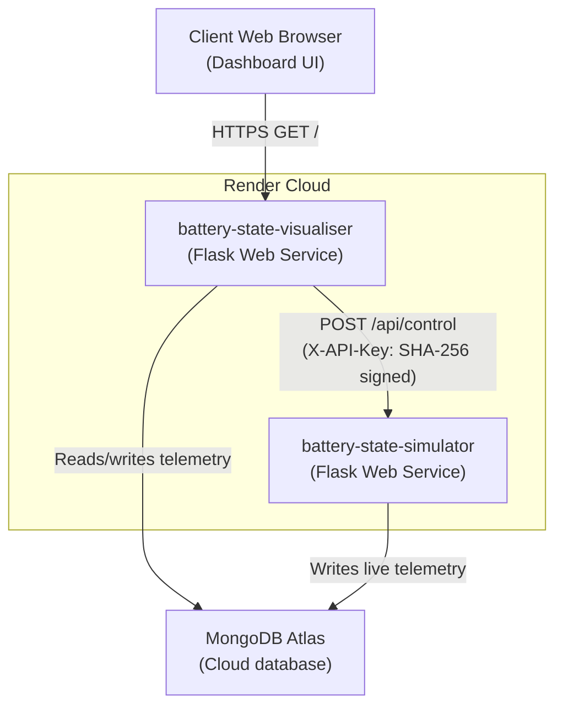

# Deploying on Render

This document describes how to deploy the Physics Simulator and the Visualiser Dashboard as standalone web services on the Render cloud hosting platform.

---

## 🌐 Deployed Service Topology

The diagram below illustrates the communication flow between the operator's web browser, the deployed Render services, the shared MongoDB database and the cryptographic API security keys validation:



---

## 🛠️ Infrastructure-as-Code: Render Blueprint (`render.yaml`)

You can deploy the entire stack using Render Blueprints. Create a `render.yaml` file in your repository root, or apply the configuration below in your Render dashboard:

```yaml
services:
  # 1. Physics Simulator Service
  - type: web
    name: battery-state-simulator
    env: python
    repo: https://github.com/your-username/Battery_State_Estimator_BE_Project_2026_2027
    rootDir: software/simulator
    buildCommand: pip install -r ../../requirements.txt
    startCommand: gunicorn -b 0.0.0.0:$PORT --timeout 300 --workers 1 app:app
    envVars:
      - key: FLASK_DEBUG
        value: "False"
      - key: MONGODB_URI
        sync: false # Set your MongoDB connection string in the Render Dashboard
      - key: MONGODB_DB_NAME
        value: battery_estimation_db
      - key: MONGODB_READINGS_COLLECTION
        value: readings
      - key: MONGODB_STATE_COLLECTION
        value: sim_state

  # 2. Visualiser Dashboard Service
  - type: web
    name: battery-state-visualiser
    env: python
    repo: https://github.com/your-username/Battery_State_Estimator_BE_Project_2026_2027
    rootDir: software/visualiser
    buildCommand: pip install -r ../../requirements.txt
    startCommand: gunicorn -b 0.0.0.0:$PORT --timeout 300 --workers 1 app:app
    envVars:
      - key: FLASK_DEBUG
        value: "False"
      - key: SIMULATOR_URL
        fromService:
          name: battery-state-simulator
          type: web
          property: host
      - key: MONGODB_URI
        sync: false # Set your MongoDB connection string in the Render Dashboard
      - key: MONGODB_DB_NAME
        value: battery_estimation_db
      - key: MONGODB_READINGS_COLLECTION
        value: readings
      - key: MODEL_PATH
        value: model_rc.pkl
      - key: TELEMETRY_RESPONSE_LIMIT
        value: "150"
      - key: GRAPH_SLICE_LIMIT
        value: "120"
      - key: TELEMETRY_FALLBACK_LIMIT
        value: "1000"
```

---

## 📋 Environment Variables Reference

Set these variables in the Render environment settings for each service:

| Variable Name | Service Context | Required? | Default Value | Description |
| :--- | :--- | :--- | :--- | :--- |
| `MONGODB_URI` | Both | **Yes** | None | The connection URI to your MongoDB Atlas cluster. |
| `MONGODB_DB_NAME` | Both | **Yes** | `battery_estimator_db` | Target database name in MongoDB. |
| `MONGODB_READINGS_COLLECTION`| Both | **Yes** | `telemetry` | Collection name storing raw timeseries readings. |
| `MONGODB_STATE_COLLECTION` | Simulator | **Yes** | `sim_state` | Collection storing active simulation settings. |
| `SIMULATOR_URL` | Visualiser | **Yes** | None | The public URL of the deployed simulator service (e.g. `https://battery-state-simulator.onrender.com`). |
| `FLASK_DEBUG` | Both | No | `False` | Disables debug mode for production runs. |
| `MODEL_PATH` | Visualiser | No | `model_rc.pkl` | Path to the local reservoir weight fallback file. |
| `TELEMETRY_RESPONSE_LIMIT` | Visualiser | No | `150` | Maximum points returned per visualizer API request. |
| `GRAPH_SLICE_LIMIT` | Visualiser | No | `120` | Maximum points to display in front-end plots. |

---

## 🚀 Manual Deployment Walkthrough

If you prefer to deploy the services manually through the Render UI, follow these steps:

### Step 1: Deploy the Physics Simulator
1. In the Render Dashboard, click **New +** and select **Web Service**.
2. Connect your Git repository.
3. Configure the following details:
   - **Name**: `battery-state-simulator`
   - **Root Directory**: `software/simulator`
   - **Runtime**: `Python 3`
   - **Build Command**: `pip install -r requirements.txt` (or if paths differ, `pip install -r ../../requirements.txt`)
   - **Start Command**: `gunicorn -b 0.0.0.0:$PORT --timeout 300 --workers 1 app:app`
4. Add the required Environment Variables listed in the table above.
5. Click **Create Web Service** and wait for the build to complete. Note the public URL.

### Step 2: Deploy the Visualiser Dashboard
1. Click **New +** and select **Web Service**.
2. Connect the same repository.
3. Configure the following details:
   - **Name**: `battery-state-visualiser`
   - **Root Directory**: `software/visualiser`
   - **Runtime**: `Python 3`
   - **Build Command**: `pip install -r requirements.txt`
   - **Start Command**: `gunicorn -b 0.0.0.0:$PORT --timeout 300 --workers 1 app:app`
4. Add the Environment Variables, ensuring `SIMULATOR_URL` is set to the URL of the simulator service deployed in Step 1.
5. Click **Create Web Service**.

---

## 💡 Important Deployment Considerations

> [!WARNING]
> **Use Only One Gunicorn Worker (`--workers 1`)**
> The physics simulator runs a background telemetry loop on an active thread. Spawning multiple workers will duplicate this thread, causing multiple overlapping simulations to execute in parallel and corrupting the database state.

> [!IMPORTANT]
> **Persistent Model Registry**
> Render filesystems are ephemeral; any files saved locally will be lost when the service restarts. If you retrain your ESN model from the dashboard UI, make sure a MongoDB connection is active so the model parameters are stored persistently in the database registry rather than writing only to `model_rc.pkl`.

> [!NOTE]
> **Render Free-Tier Spin Up**
> If you deploy on the free tier, services will sleep after 15 minutes of inactivity. The first request to a sleeping service can take 30–60 seconds to spin up. This is normal behavior.
