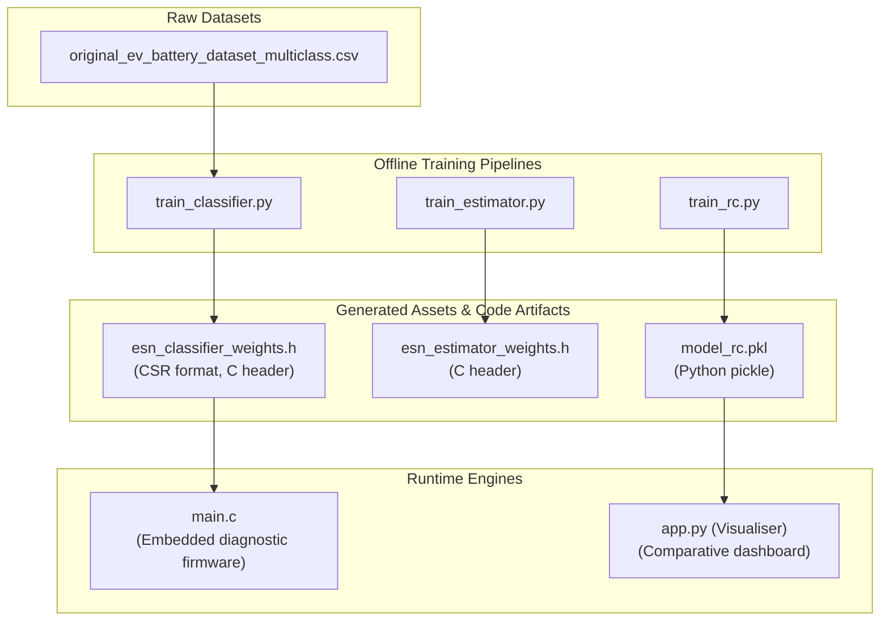

[← Back to README](../../README.md)

# Artifact Policy

This document outlines the versioning, maintenance and generation guidelines for the dataset and model weights stored within this repository. To ensure reviewers and evaluators can immediately run the visualization and edge diagnostic demonstrations, a pre-compiled set of model parameters is tracked.

---

## Artifact Generation & Deployment Flow

The diagram below details how source datasets feed into the training scripts to produce the serialized model assets and embedded C headers:

---

## Tracked Repository Artifacts

The table below catalogs all model parameters, datasets and generated headers tracked in Git:

| File path | Format | Typical Size | Role | Source / Generator | Versioning Policy |
| :--- | :--- | :--- | :--- | :--- | :--- |
| [`hardware/STM_Verifier/original_ev_battery_dataset_multiclass.csv`](../../hardware/STM_Verifier/original_ev_battery_dataset_multiclass.csv) | CSV | ~360 KB | Training and validation data for thermal state classification. | Synthesized battery sensor logs. | Immutable. Only updated on structural schema shifts. |
| [`software/visualiser/model_rc.pkl`](../../software/visualiser/model_rc.pkl) | PKL | ~140 KB | Local fallback model for the visualiser ESN estimator (used when MongoDB is offline). | Trained via [`train_rc.py`](../../software/visualiser/training/train_rc.py). | Regenerated upon tuning model hyperparameters. |
| [`hardware/STM_Verifier/esn_classifier_weights.h`](../../hardware/STM_Verifier/esn_classifier_weights.h) | H (C Header) | ~13 KB | Generated sparse classifier weights consumed by [`main.c`](../../hardware/STM_Verifier/main.c). | Exported via [`train_classifier.py`](../../hardware/STM_Verifier/train_classifier.py). | Re-exported whenever the classifier ESN is retrained. |
| [`hardware/STM_Verifier/esn_estimator_weights.h`](../../hardware/STM_Verifier/esn_estimator_weights.h) | H (C Header) | ~5.8 MB | Generated estimator weights for embedded testing. | Exported via [`train_estimator.py`](../../hardware/STM_Verifier/train_estimator.py). | Updated on observer pipeline refinements. |
| [`hardware/FPGA_Verifier/input_bram.coe`](../../hardware/FPGA_Verifier/input_bram.coe) | COE | ~2.5 KB | NASA B0005 battery dataset quantized to Q6.10 for 64-step RTL simulation. | Derived from NASA Ames battery dataset. | Locked reference dataset for FPGA simulation. |
| [`hardware/FPGA_Verifier/golden_results.csv`](../../hardware/FPGA_Verifier/golden_results.csv) | CSV | ~12 KB | Bit-exact Python golden reference outputs across all 200 neuron evaluation stages. | Generated via [`golden_model.py`](../../hardware/FPGA_Verifier/golden_model.py). | Verified golden parity reference. |
| [`hardware/FPGA_Verifier/golden_tiny.csv`](../../hardware/FPGA_Verifier/golden_tiny.csv) | CSV | ~1 KB | Sequential 3-timestep tiny test golden reference output. | Generated via [`golden_model.py --tiny`](../../hardware/FPGA_Verifier/golden_model.py). | Verified sequence parity reference. |
| [`hardware/FPGA_Verifier/vivado_esn_results.csv`](../../hardware/FPGA_Verifier/vivado_esn_results.csv) | CSV | ~12 KB | Vivado XSim RTL simulation output logged from [`tb_esn_top.v`](../../hardware/FPGA_Verifier/tb_esn_top.v). | Vivado XSim simulator testbench dump. | Matches golden_results.csv bit-exactly (200/200). |
| [`docs/Review_2/Outcomes/FPGA-Based-Echo-State-Network-for-Battery-SOC-SOH-Estimation-Outcomes.pdf`](../Review_2/Outcomes/FPGA-Based-Echo-State-Network-for-Battery-SOC-SOH-Estimation-Outcomes.pdf) | PDF | ~150 KB | Official outcomes evaluation report for 32 NASA cycles, synthesis & timing closure. | Verified via [`eval_fpga_outcomes.py`](../../hardware/FPGA_Verifier/eval_fpga_outcomes.py). | Formal Review 2 outcome deliverable. |
| [`docs/Review_2/Outcomes/Neuromorphic-BMS-Review-Paper-Draft.pdf`](../Review_2/Outcomes/Neuromorphic-BMS-Review-Paper-Draft.pdf) | PDF | ~500 KB | 29-page comprehensive review paper draft on Neuromorphic BMS & Reservoir Computing. | Compiled academic manuscript. | Review 2 deliverable (Review 3 submission scope). |
| [`docs/Review_2/Review_2_PPT.pdf`](../Review_2/Review_2_PPT.pdf) | PDF | ~60 KB | Official 16:9 widescreen presentation slide deck for Review 2 defense. | Standalone 16:9 widescreen presentation deck. | Formal Review 2 defense slide deck. |

---

## 🚫 What NOT to Commit

> [!CAUTION]
> The root `.gitignore` file enforces exclusion rules. Do not bypass it to commit:
> - Local configuration scripts or `.env` files.
> - Raw local database dumps, temporary runtime logs, or telemetry playback caches.
> - Local python virtual environments (`venv`, `.venv`) and compiler outputs (`.o`, `.elf`, `.hex`, `.exe`).
> - Temp python caches (`__pycache__`, `.pytest_cache`).

---

## 🔁 Updating Artifacts

When submitting a pull request that updates any tracked model or dataset, the submitter must document the following in the commit message or PR description:

1. **Training Command**: The exact python execution script and arguments used.
2. **Dataset Version**: The source files and dataset timestamps used.
3. **Metrics Log**: The validation criteria met (e.g., classification accuracy percentage, estimator RMSE bounds).
4. **Justification**: A brief rationale explaining why the pre-trained weights need updating in Git instead of running dynamic local training.
