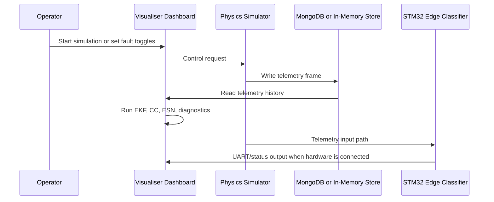

# System Specification

This document defines the interfaces, state flow, runtime modes, and validation
scope for the Battery State Estimator.

## System Goal

Estimate battery SOC and SOH while classifying thermal safety state under
dynamic load profiles. The implementation combines a physics simulator,
traditional observers, reservoir-computing estimators, and an embedded edge
classifier.

## Runtime Components

| Component | Location | Responsibility |
| --- | --- | --- |
| Physics simulator | `software/simulator` | Generates 2-RC ECM telemetry, thermal behavior, aging, and injected faults. |
| Visualiser dashboard | `software/visualiser` | Presents telemetry, estimator outputs, diagnostics, and controls. |
| Estimator pipeline | `software/*/estimator_pipeline.py` | Runs EKF, Coulomb Counting, ESN, and CPS diagnostics. |
| Hardware classifier | `hardware/main.c` | Runs sparse ESN inference for Normal/Warning/Critical classification. |
| Training/export scripts | `hardware`, `software/visualiser/training` | Train ESN models and export Python/C artifacts. |

## Data Flow



## Telemetry Schema

Telemetry frames contain:

| Field | Unit | Meaning |
| --- | --- | --- |
| `time` | seconds | Simulation time index. |
| `voltage` | volts | Noisy/measured terminal voltage. |
| `current` | amperes | Measured load current, positive for discharge in dashboard records. |
| `temperature` | Celsius | Measured cell temperature. |
| `true_soc` | ratio | Physics-model state of charge. |
| `true_soh` | ratio | Physics-model state of health. |
| `true_v1`, `true_v2` | volts | Internal RC branch polarization states. |
| `true_r0` | ohms | Internal resistance reference. |
| `fault_short` | boolean | Micro-short injection state. |
| `fault_thermal` | boolean | Thermal runaway injection state. |
| `fault_dropout` | boolean | Sensor dropout injection state. |

## Simulator API

Representative endpoints:

| Method | Endpoint | Purpose |
| --- | --- | --- |
| `GET` | `/api/status` | Health, simulator status, and state summary. |
| `POST` | `/api/start` | Start telemetry generation. |
| `POST` | `/api/pause` | Pause telemetry generation. |
| `POST` | `/api/reset` | Reset simulator state. |
| `POST` | `/api/config` | Update chemistry, cycle, aging, or fault settings. |

## Dashboard API

Representative endpoints:

| Method | Endpoint | Purpose |
| --- | --- | --- |
| `GET` | `/api/status` | Dashboard, model, database, and simulator status. |
| `GET` | `/api/telemetry` | Recent telemetry with estimator outputs. |
| `POST` | `/api/train` | Retrain ESN model and update model registry when available. |
| `POST` | `/api/config` | Update estimation and visualization parameters. |

## Estimator Outputs

The visualiser enriches each telemetry frame with:

- `ekf_soc`
- `esn_soc`
- `ekf_soh`
- `esn_soh`
- `ekf_v1`
- `ekf_v2`
- `ekf_p_diag`
- `esn_features`
- timing metrics for EKF and ESN execution
- fault diagnostics
- state of power, state of energy, and RUL estimates when available

## Edge Classifier Specification

Input:

```text
[voltage, current, temperature]
```

Network:

```text
3 inputs -> 50-node sparse ESN reservoir -> 3 safety classes
```

Classes:

| Class | Name | Condition |
| ---: | --- | --- |
| `0` | Normal | `temperature < 35 C` |
| `1` | Warning | `35 C <= temperature < 45 C` |
| `2` | Critical | `temperature >= 45 C` |

Hardware indicators:

| Class | `PA5` LED |
| --- | --- |
| Normal | Off |
| Warning | Blink |
| Critical | On |

## Fault Model

| Fault | Behavior | Validation Goal |
| --- | --- | --- |
| Thermal runaway | Adds aggressive heat generation. | Detect fast temperature growth and unsafe thermal state. |
| Sensor dropout | Forces voltage/current readings toward zero. | Preserve estimator robustness and raise diagnostics. |
| Micro-short | Adds internal leakage and heating. | Detect hidden SOC divergence under low external current. |

## Runtime Modes

| Mode | Description |
| --- | --- |
| Full local mode | Simulator, dashboard, and optional MongoDB run on the same machine. |
| In-memory mode | Simulator and dashboard run without MongoDB; data is held in local buffers. |
| Serverless-aware mode | Apps avoid long-lived filesystem assumptions and can load model state from MongoDB. |
| Embedded mode | C classifier runs on STM32 hardware or desktop simulator. |

## Validation Scope

The unit suite covers:

- chemistry loading and OCV monotonicity,
- 2-RC simulator discharge, charge, aging, and faults,
- EKF output bounds and covariance health,
- resistance-based SOH behavior,
- feature engineering output shape and gradients,
- ESN behavior and quantization paths,
- estimator pipeline and CPS fault diagnostics,
- configuration consistency.

Run:

```bash
python -m unittest discover -s software/visualiser/tests
```

## Non-Goals

This prototype is not a certified BMS, not a pack-balancing controller, and not
qualified for safety-critical field deployment without independent validation,
HIL testing, and regulatory review.
