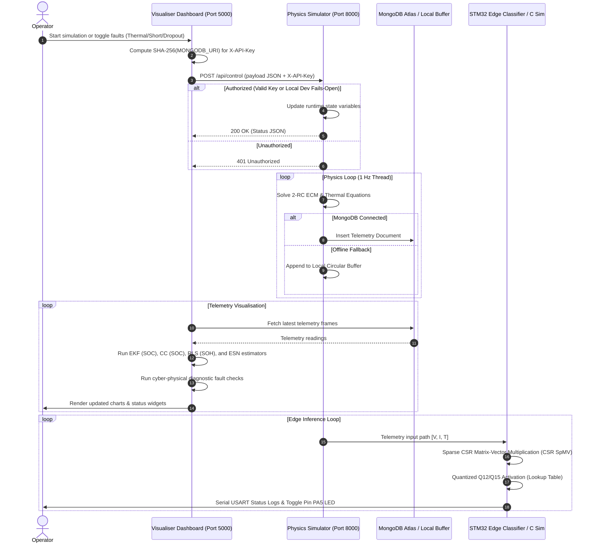

# System Specification

This document defines the interfaces, state flow, runtime modes, API payloads, and validation scope for the Battery State Estimator.

---

## System Goal

The system aims to estimate battery State of Charge (SOC) and State of Health (SOH) while classifying the thermal safety state under dynamic load profiles. The design integrates a physics-based simulator, traditional control-theoretic estimators, data-driven reservoir-computing estimators, and an optimized embedded edge classifier.

---

## Runtime Components

The table below outlines the key software and hardware components of the system:

| Component | Location | Responsibility |
| :--- | :--- | :--- |
| **Physics Simulator** | [`software/simulator/app.py`](../software/simulator/app.py) | Generates 2-RC ECM telemetry, thermal behavior, aging, and injected faults. |
| **Visualiser Dashboard** | [`software/visualiser/app.py`](../software/visualiser/app.py) | Presents telemetry, estimator outputs, diagnostics, and controls. |
| **Estimator Pipeline** | [`software/visualiser/estimator_pipeline.py`](../software/visualiser/estimator_pipeline.py) | Runs EKF, Coulomb Counting, ESN, and CPS diagnostics. |
| **Hardware Classifier** | [`hardware/main.c`](../hardware/main.c) | Runs sparse ESN inference for Normal/Warning/Critical classification. |
| **Training & Export Pipelines** | [`hardware/train_classifier.py`](../hardware/train_classifier.py)<br>[`hardware/train_estimator.py`](../hardware/train_estimator.py) | Train ESN models and export Python/C weight headers. |

---

## Data Flow & Architecture

The sequence diagram below visualizes the interactive data loops, including authentication checks and local fallback mechanisms when MongoDB is offline:


```mermaid
sequenceDiagram
    autonumber
    actor Operator
    participant Dashboard as Visualiser Dashboard (Port 5000)
    participant Simulator as Physics Simulator (Port 8000)
    participant DB as MongoDB Atlas / Local Buffer
    participant Edge as STM32 Edge Classifier / C Sim

    Operator->>Dashboard: Start simulation or toggle faults (Thermal/Short/Dropout)
    Dashboard->>Dashboard: Compute SHA-256(MONGODB_URI) for X-API-Key
    Dashboard->>Simulator: POST /api/control (payload JSON + X-API-Key)
    alt Authorized (Valid Key or Local Dev Fails-Open)
        Simulator->>Simulator: Update runtime state variables
        Simulator-->>Dashboard: 200 OK (Status JSON)
    else Unauthorized
        Simulator-->>Dashboard: 401 Unauthorized
    end
    
    loop Physics Loop (1 Hz Thread)
        Simulator->>Simulator: Solve 2-RC ECM & Thermal Equations
        alt MongoDB Connected
            Simulator->>DB: Insert Telemetry Document
        else Offline Fallback
            Simulator->>Simulator: Append to Local Circular Buffer
        end
    end

    loop Telemetry Visualisation
        Dashboard->>DB: Fetch latest telemetry frames
        DB-->>Dashboard: Telemetry readings
        Dashboard->>Dashboard: Run EKF (SOC), CC (SOC), RLS (SOH), and ESN estimators
        Dashboard->>Dashboard: Run cyber-physical diagnostic fault checks
        Dashboard->>Operator: Render updated charts & status widgets
    end

    loop Edge Inference Loop
        Simulator->>Edge: Telemetry input path [V, I, T]
        Edge->>Edge: Sparse CSR Matrix-Vector Multiplication (CSR SpMV)
        Edge->>Edge: Quantized Q12/Q15 Activation (Lookup Table)
        Edge->>Operator: Serial USART Status Logs & Toggle Pin PA5 LED
    end
```

---

## Telemetry Schema

The database document schema for each telemetry frame is detailed below:

| Field | Type | Unit | Meaning |
| :--- | :--- | :--- | :--- |
| `time` | Double | seconds | Simulation time index since start. |
| `voltage` | Double | Volts | Measured terminal voltage (with sensor noise). |
| `current` | Double | Amperes | Measured load current (positive for discharge, negative for charge). |
| `temperature` | Double | Celsius | Measured cell temperature. |
| `true_soc` | Double | Ratio [0, 1] | Physics-model state of charge. |
| `true_soh` | Double | Ratio [0, 1] | Physics-model state of health (capacity fade). |
| `true_v1` | Double | Volts | Transient polarization voltage drop (branch 1). |
| `true_v2` | Double | Volts | Transient polarization voltage drop (branch 2). |
| `true_r0` | Double | Ohms | Physics-model ohmic internal resistance (increases with aging). |
| `fault_short` | Boolean | - | Flag indicating active internal micro-short injection. |
| `fault_thermal` | Boolean | - | Flag indicating active thermal runaway simulation. |
| `fault_dropout` | Boolean | - | Flag indicating active voltage sensor dropout fault. |

---

## Detailed API Endpoints Spec

### 1. Simulator Service (`software/simulator`)

#### `GET /api/status`
Retrieves the simulator state, running configurations, active fault indicators, and latest metrics.
* **Response Payload (JSON):**
  ```json
  {
    "sim_running": true,
    "chemistry": "li_ion",
    "active_cycle": "udds",
    "accelerated_aging": false,
    "T_ambient": 25.0,
    "fault_thermal": false,
    "fault_dropout": false,
    "fault_short": false,
    "time": 320.0,
    "soc": 0.892,
    "soh": 0.999,
    "voltage": 12.14,
    "current": 1.25,
    "temperature": 27.4,
    "telemetry_count": 320,
    "mongodb_connected": true
  }
  ```

#### `POST /api/control`
Executes simulation actions or modifies active faults and system configs. Requires standard cryptographic API headers.
* **Request Payload (JSON):**
  ```json
  {
    "command": "start",
    "chemistry": "li_ion",
    "cycle_type": "udds",
    "accelerated_aging": false,
    "T_ambient": 25.0,
    "fault_thermal": false,
    "fault_dropout": false,
    "fault_short": false
  }
  ```
* **Response Payload (JSON):**
  ```json
  {
    "status": "success",
    "state": {
      "sim_running": true,
      "chemistry": "li_ion",
      "active_cycle": "udds",
      "accelerated_aging": false,
      "T_ambient": 25.0,
      "fault_thermal": false,
      "fault_dropout": false,
      "fault_short": false,
      "time": 320.0,
      "soc": 0.892,
      "soh": 0.999,
      "voltage": 12.14,
      "current": 1.25,
      "temperature": 27.4
    }
  }
  ```

#### `POST /api/chemistry/register`
Registers a new OCV curve and chemical characteristics parameter file.
* **Request Payload (JSON):**
  ```json
  {
    "name": "lfp_custom",
    "capacity_ah": 2.5,
    "r0": 0.05,
    "r1": 0.02,
    "c1": 1500,
    "r2": 0.03,
    "c2": 25000,
    "ocv_lut": [
      [0.0, 2.5], [0.1, 3.1], [0.5, 3.2], [0.9, 3.3], [1.0, 3.6]
    ]
  }
  ```
* **Response Payload (JSON):**
  ```json
  {
    "status": "success",
    "message": "Chemistry lfp_custom registered successfully"
  }
  ```

---

### 2. Visualiser Service (`software/visualiser`)

#### `GET /api/status`
Retrieves backend execution indicators, connection targets, and active ESN model state.
* **Response Payload (JSON):**
  ```json
  {
    "visualiser_status": "active",
    "simulator_url": "http://localhost:8000",
    "mongodb_status": "connected",
    "model_loaded": true,
    "model_source": "mongodb_registry"
  }
  ```

#### `GET /api/telemetry`
Retrieves time-series data augmented with the estimators pipeline outputs (EKF, Coulomb Counting, and ESN).
* **Response Payload (JSON):**
  ```json
  [
    {
      "time": 320.0,
      "voltage": 12.14,
      "current": 1.25,
      "temperature": 27.4,
      "true_soc": 0.892,
      "ekf_soc": 0.894,
      "esn_soc": 0.891,
      "cc_soc": 0.895,
      "true_soh": 0.999,
      "ekf_soh": 0.998,
      "esn_soh": 0.999,
      "diagnostic_status": "NORMAL",
      "ekf_p_diag": [0.001, 0.0, 0.0]
    }
  ]
  ```

#### `POST /api/train`
Triggers an asynchronous training pipeline run to update ESN weights.
* **Response Payload (JSON):**
  ```json
  {
    "status": "training_initiated",
    "task_id": "esn_train_20260708_1925"
  }
  ```

---

## Security & Authentication

If the `MONGODB_URI` environment variable points to a remote cluster (anything other than `localhost` or `127.0.0.1`), security endpoints are locked automatically to prevent public manipulation of simulated parameters.

### Token Derivation
A dynamic API signature key is computed at server boot to authenticate inter-service requests:
$$\text{Key} = \text{SHA-256}(\text{MONGODB\_URI})$$

### HTTP Headers Authorization
- **Header Field**: `X-API-Key`
- **Fallback URL Query**: `?api_key=<token>`
- **Unauthorized Output**: `401 Unauthorized`

---

## Estimator Pipeline Architecture

The visualiser enriches telemetry data with dynamic state observations computed in the background:
- **State of Charge (SOC)**: Runs Coulomb Counting (CC), a Sage-Husa Adaptive Extended Kalman Filter (EKF), and a trained Echo State Network (ESN) concurrently.
- **State of Health (SOH)**: Decoupled to track slowly varying capacity and internal resistance trends via Recursive Least Squares (RLS) parameter estimates and ESN model evaluations.
- **Diagnostics Outputs**: Monitors anomalies to classify faults:
  - `DIAG_DROPOUT_VOLTAGE_THRESHOLD` (< 1.0 V) -> **Sensor Dropout**.
  - `DIAG_THERMAL_TEMP_THRESHOLD` (> 60 °C) or rate of rise (> 2.0 °C/s) -> **Thermal Runaway Warning**.
  - `DIAG_SHORT_SOC_DIFF_THRESHOLD` (> 0.08 SOC divergence under low-current idle) -> **Internal Micro-Short**.

---

## Edge Classifier Specification

The embedded classifier running on the microcontroller consumes real-time telemetry inputs to flag thermal hazard classes.

* **Network Dimensions**: 3 Inputs $\rightarrow$ 50 Reservoir Nodes (CSR format) $\rightarrow$ 3 Output Classes.
* **Target Classes**:
  - `Class 0 (Normal)`: Temperature $< 35\text{ }^\circ\text{C}$ (Indicator LED Pin `PA5` Off).
  - `Class 1 (Warning)`: $35\text{ }^\circ\text{C} \le \text{Temperature} < 45\text{ }^\circ\text{C}$ (Indicator LED Pin `PA5` Blinking).
  - `Class 2 (Critical)`: Temperature $\ge 45\text{ }^\circ\text{C}$ (Indicator LED Pin `PA5` Steady On).

---

## Validation Scope

Robustness and estimation accuracy limits are verified using automated unit suites:
- Chemistry loading correctness & OCV curve monotonicity checks.
- Dynamic 2-RC transient equations solvers accuracy.
- Observer convergence bounds and covariance matrix health tests.
- High-noise and drop-out fault resilience validation.

Run the test runner locally using:
```bash
python -m unittest discover -s software/tests
```
