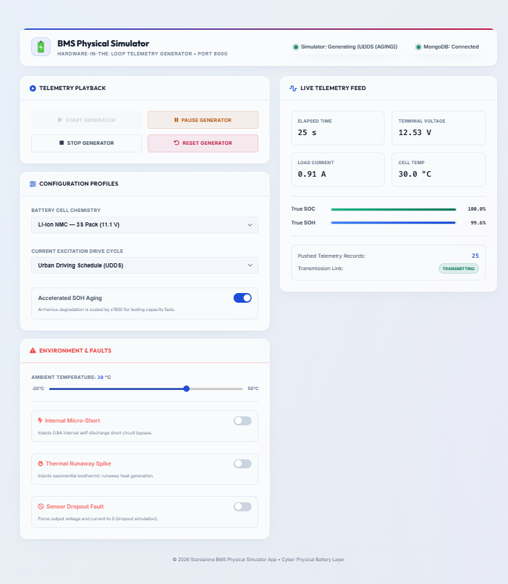
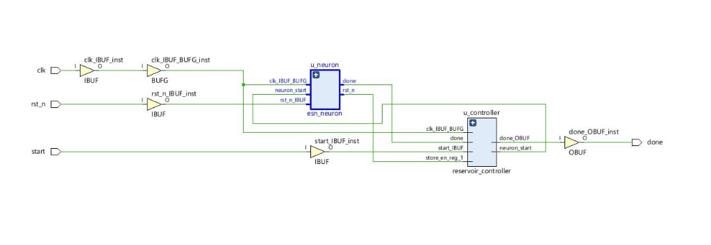
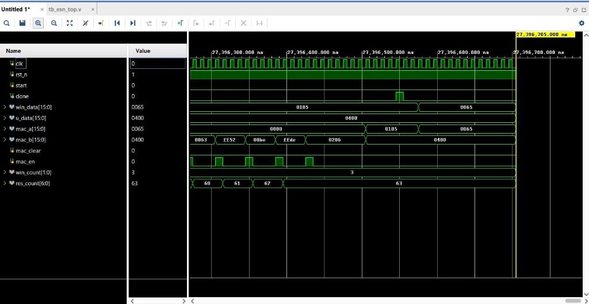

[← Back to README](../README.md)

# Image Assets

This folder stores screenshots and visual material used by the project documentation.

---

## Current Assets

### System Architecture Diagram
End-to-end multi-estimator pipeline architecture from 2-RC battery telemetry through ML/EKF observers to embedded MCU and FPGA verifiers.

---

### Circuit Diagram (2-RC ECM)
Second-order Equivalent Circuit Model schematic showing bulk OCV, ohmic resistance $R_0$, and dual polarization branches ($R_1-C_1$ and $R_2-C_2$).

---

### System Flowchart
Execution algorithm and decision flowchart for telemetry generation, observer estimation, and CPS fault detection.

---

### Physics Simulator Dashboard
Active drive-cycle playback with UDDS profile, fault injection controls and live telemetry feed.

---

### Visualiser Dashboard Overview
Full operator dashboard showing metric cards, SOC/SOH estimation panels and EKF vs ESN comparison charts.

---

### Estimation Chart View
Detailed SOC and SOH estimation comparison charts with ESN model registry and retraining terminal.

---

### Simulator After Aging & Thermal Progression
Simulator state showing capacity fade effects with accelerated aging enabled.

---

### FPGA Synthesized RTL Datapath Schematic
Xilinx Vivado post-synthesis elaborated top-level RTL schematic showing `esn_neuron` and `reservoir_controller` interconnects.

---

### FPGA Vivado XSim Simulation Waveform
Cycle-accurate behavioral simulation waveform in Vivado XSim (`tb_esn_top.v`) demonstrating MAC accumulation, ping-pong state addressing, and tanh evaluation timing.

---

## Guidelines

- Prefer screenshots that show real app state instead of decorative images.
- Keep filenames descriptive when adding new assets.
- Update README or subsystem docs when adding important new visuals.
- Use `images/assets/screenshot_...png` paths when referencing from the root README.
