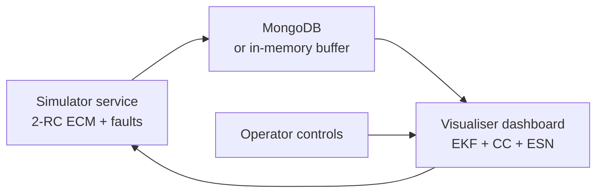

# Software Subsystem

The software subsystem contains two Flask applications that can run together or
independently with in-memory fallback storage.

## Components

| Component | Port | Purpose |
| --- | ---: | --- |
| `software/simulator` | `8000` | Physics engine, drive-cycle generator, noise, aging, and fault injection. |
| `software/visualiser` | `5000` | Operator dashboard, EKF/CC/ESN estimators, metrics, and controls. |

## Data Flow



## Run Locally

Install dependencies from the repository root:

```bash
python -m pip install -r requirements.txt
```

Start the simulator:

```bash
python software/simulator/app.py
```

Start the dashboard in another terminal:

```bash
python software/visualiser/app.py
```

Open `http://localhost:5000`.

## Test

```bash
python -m unittest discover -s software/visualiser/tests
```

## Configuration

- `software/simulator/.env.example` documents simulator settings.
- `software/visualiser/.env.example` documents dashboard settings.
- MongoDB is optional for local development; fallback buffers keep the demo
  usable when no database is running.

## Key Models

- 2-RC equivalent circuit model for terminal voltage behavior.
- Thermal and aging dynamics for safety and SOH validation.
- Extended Kalman Filter for physics-based SOC estimation.
- Resistance-based SOH observer for degradation tracking.
- Echo State Network estimator for lightweight data-driven tracking.
