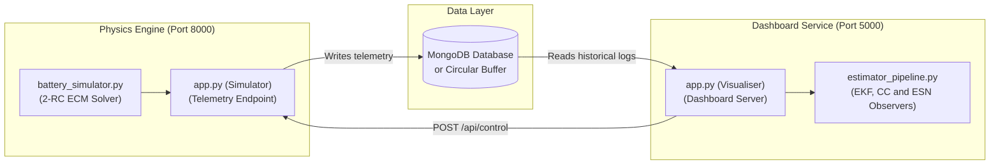

[← Back to README](../README.md)

# Software Subsystem

This document provides a technical overview of the software architecture, directories layout, service routing and core classes that implement the battery physics simulation and estimation comparative visualiser.

---

## 📑 Table of Contents
1. [Software Directory Structure](#-software-directory-structure)
2. [Software Data Flow](#-software-data-flow)
3. [Main Modules & Python Classes Reference](#️-main-modules--python-classes-reference)
4. [Running the Software Services Locally](#-running-the-software-services-locally)
5. [Verification and Testing](#-verification-and-testing)

---

## 📂 Software Directory Structure

The tree layout below maps out the key modules within the software package:

```text
software/
├── software.md                      # This architecture overview
├── simulator/                       # Physics Engine Service
│   ├── app.py                       # Simulator Flask application
│   ├── battery_simulator.py         # 2-RC transient equations solvers
│   ├── battery_chemistry.py         # Chemistry loading & OCV lookup tables
│   └── config.py                    # Environment settings for simulator
├── visualiser/                      # Visualisation & Observer Service
│   ├── app.py                       # Dashboard Flask app & thread managers
│   ├── config.py                    # Environment settings for visualizer
│   ├── battery_chemistry.py         # Visualizer OCV lookup tables
│   ├── battery_simulator.py         # Visualizer side physics classes
│   ├── traditional_estimator.py     # EKF and Coulomb Counting classes
│   ├── estimator_pipeline.py        # Joint observer and diagnostics manager
│   ├── model_rc.pkl                 # Pre-trained software ESN model
│   ├── templates/                   # HTML view layouts
│   └── training/                    # ESN training scripts
│       └── train_rc.py              # Script to build software weights
└── tests/                           # Verification test suites
    ├── test_estimators.py           # Unit tests for EKF/ESN accuracy
    ├── test_api_auth.py             # Security & API Auth checks
    └── test_production_train.py     # End-to-end training verification
```

---

## 🔄 Software Data Flow

The flowchart below traces the flow of telemetry data from the simulator, through the database, into the comparative dashboard observers and back to the simulator via operator controls:


```mermaid
flowchart LR
    subgraph "Physics Engine (Port 8000)"
        Sim["battery_simulator.py<br>(2-RC ECM Solver)"]
        SimApp["app.py (Simulator)<br>(Telemetry Endpoint)"]
    end

    subgraph "Data Layer"
        DB[("MongoDB Database<br>or Circular Buffer")]
    end

    subgraph "Dashboard Service (Port 5000)"
        VisApp["app.py (Visualiser)<br>(Dashboard Server)"]
        EstPipe["estimator_pipeline.py<br>(EKF, CC and ESN Observers)"]
    end

    Sim --> SimApp
    SimApp -->|"Writes telemetry"| DB
    DB -->|"Reads historical logs"| VisApp
    VisApp --> EstPipe
    VisApp -->|"POST /api/control"| SimApp
```

---

## 🛠️ Main Modules & Python Classes Reference

Below is a breakdown of the key files and classes implementing the battery estimator. Note that EKF, Coulomb Counting, and RLS are implemented strictly as accuracy benchmarks/baselines for comparison against the ESN:

### 1. Physics Simulator Module
- **[`simulator/battery_simulator.py`](simulator/battery_simulator.py)**: Contains the `BatterySimulator` class.
  - Updates cell states (SOC, polarization voltages $V_1, V_2$, temperature $T$) at each timestep based on current profiles and the Arrhenius thermodynamic cooling relation.
  - Handles the mathematical modeling of capacity fade (aging) and fault injections.
- **[`simulator/battery_chemistry.py`](simulator/battery_chemistry.py)**: Defines the `BatteryChemistry` class.
  - Loads chemistry-specific boundaries (e.g. Lithium-Ion, LFP, Custom) and interpolates Open Circuit Voltage ($OCV$) from state-of-charge tables.
- **[`simulator/app.py`](simulator/app.py)**: Spawns the Flask routing API and manages the background worker thread that ticks the simulator at $1\text{ Hz}$.

### 2. Visualiser Module
- **[`visualiser/traditional_estimator.py`](visualiser/traditional_estimator.py)**: Defines the mathematical observer classes.
  - `CoulombCounting`: Integrates current inputs directly.
  - `ExtendedKalmanFilter`: Implements the 3-state EKF (predicts states, computes measurement Jacobians, updates covariance and applies Kalman corrections). Includes **Trace Reset Guards** (resets covariance $P$ to initial values if trace exceeds $10.0$ or if diagonal entries become negative, preventing float overflow).
  - `RecursiveLeastSquares`: Implements online parameter identification for electrochemistry ($R_0$, $R_1$, $C_1$) running on a macro-timescale. Features a **Variable Forgetting Factor (VFF-RLS)** adjusting $\lambda$ dynamically to prediction errors.
  - `ResistanceSOH`: Computes capacity degradation and estimates state-of-health (SOH).
- **[`visualiser/estimator_pipeline.py`](visualiser/estimator_pipeline.py)**: Features the `EstimatorPipeline` and `StateEstimator` classes.
  - Integrates the EKF, Coulomb Counting, RLS and the loaded machine learning ESN estimators.
  - Evaluates real-time diagnostic safety thresholds (`DIAG_DROPOUT_VOLTAGE_THRESHOLD`, `DIAG_THERMAL_TEMP_THRESHOLD` and `DIAG_SHORT_SOC_DIFF_THRESHOLD`).
- **[`visualiser/app.py`](visualiser/app.py)**: Serves the HTML views, hosts the telemetry fetch routes, runs the comparative EKF and ESN estimation pipelines with standardized configuration parameters and manages the asynchronous ESN model retraining thread.

---

## 🚀 Running the Software Services Locally

> [!NOTE]
> Both services must be running simultaneously for the full system to operate. The visualiser (Port 5000) fetches telemetry from the simulator (Port 8000).

1. Install Python packages from the repository root:
   ```bash
   python -m pip install -r requirements.txt
   ```
2. Open terminal 1 and start the physics simulator:
   ```bash
   python software/simulator/app.py
   ```
3. Open terminal 2 and start the visualiser dashboard:
   ```bash
   python software/visualiser/app.py
   ```
4. Access the web interface at `http://localhost:5000`.

---

## 🧪 Verification and Testing

Verify code correctness and math convergence by running the unit test suite:
```bash
python -m unittest discover -s software/tests -t .
```
The test modules verify:
- **`test_estimators.py`**: Model dynamics, observer convergence thresholds and Arrhenius parameter shifts.
- **`test_api_auth.py`**: Cryptographic SHA-256 header validation and fails-open local bypassing.
- **`test_production_train.py`**: Integrity of the offline model pipeline and generated headers output shape.
